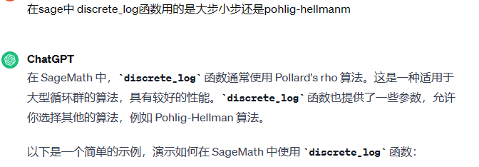
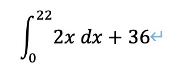
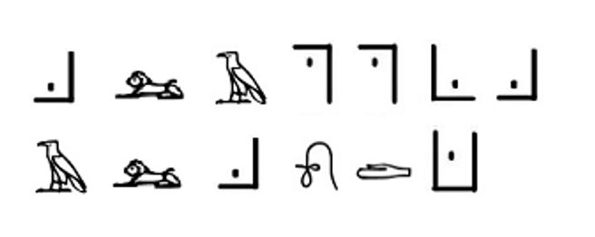
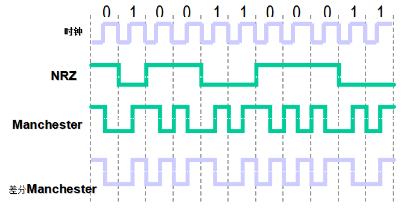

# buuctf 密码第一部分
- [buuctf 密码第一部分](#buuctf-密码第一部分)
  - [\[RoarCTF2019\]babyRSA](#roarctf2019babyrsa)
  - [\[RoarCTF2019\]RSA](#roarctf2019rsa)
  - [\[网鼎杯 2020 青龙组\]you\_raise\_me\_up](#网鼎杯-2020-青龙组you_raise_me_up)
  - [\[AFCTF2018\]Single](#afctf2018single)
  - [RSA \& what](#rsa--what)
  - [\[WUSTCTF2020\]大数计算](#wustctf2020大数计算)
  - [鸡藕椒盐味](#鸡藕椒盐味)
  - [\[NPUCTF2020\]EzRSA](#npuctf2020ezrsa)
  - [\[UTCTF2020\]basic-crypto](#utctf2020basic-crypto)
  - [\[WUSTCTF2020\]情书](#wustctf2020情书)
  - [救世捷径](#救世捷径)
  - [\[NPUCTF2020\]Classical Cipher](#npuctf2020classical-cipher)
  - [\[MRCTF2020\]Easy\_RSA](#mrctf2020easy_rsa)
  - [\[HDCTF2019\]together](#hdctf2019together)
  - [\[INSHack2017\]rsa16m](#inshack2017rsa16m)
  - [\[WUSTCTF2020\]dp\_leaking\_1s\_very\_d@angerous](#wustctf2020dp_leaking_1s_very_dangerous)
  - [\[BJDCTF2020\]Polybius](#bjdctf2020polybius)
  - [四面八方](#四面八方)
  - [\[BJDCTF2020\]编码与调制](#bjdctf2020编码与调制)
  - [坏蛋是雷宾](#坏蛋是雷宾)
  - [\[ACTF新生赛2020\]crypto-classic1](#actf新生赛2020crypto-classic1)
  - [\[De1CTF2019\]babyrsa](#de1ctf2019babyrsa)
  - [\[INSHack2019\]Yet Another RSA Challenge - Part 1](#inshack2019yet-another-rsa-challenge---part-1)
  - [\[AFCTF2018\]你听过一次一密么？](#afctf2018你听过一次一密么)
  - [\[NPUCTF2020\]共 模 攻 击](#npuctf2020共-模-攻-击)

## [RoarCTF2019]babyRSA
题目附件下载得到
```python
import sympy
import random

def myGetPrime():
    A= getPrime(513)
    print(A)
    B=A-random.randint(1e3,1e5)
    print(B)
    return sympy.nextPrime((B!)%A)
p=myGetPrime()
#A1=21856963452461630437348278434191434000066076750419027493852463513469865262064340836613831066602300959772632397773487317560339056658299954464169264467234407
#B1=21856963452461630437348278434191434000066076750419027493852463513469865262064340836613831066602300959772632397773487317560339056658299954464169264467140596

q=myGetPrime()
#A2=16466113115839228119767887899308820025749260933863446888224167169857612178664139545726340867406790754560227516013796269941438076818194617030304851858418927
#B2=16466113115839228119767887899308820025749260933863446888224167169857612178664139545726340867406790754560227516013796269941438076818194617030304851858351026

r=myGetPrime()

n=p*q*r
#n=85492663786275292159831603391083876175149354309327673008716627650718160585639723100793347534649628330416631255660901307533909900431413447524262332232659153047067908693481947121069070451562822417357656432171870951184673132554213690123308042697361969986360375060954702920656364144154145812838558365334172935931441424096270206140691814662318562696925767991937369782627908408239087358033165410020690152067715711112732252038588432896758405898709010342467882264362733
c=pow(flag,e,n)
#e=0x1001
#c=75700883021669577739329316795450706204502635802310731477156998834710820770245219468703245302009998932067080383977560299708060476222089630209972629755965140317526034680452483360917378812244365884527186056341888615564335560765053550155758362271622330017433403027261127561225585912484777829588501213961110690451987625502701331485141639684356427316905122995759825241133872734362716041819819948645662803292418802204430874521342108413623635150475963121220095236776428
#so,what is the flag?
```
从代码可以看出，获得素数的过程是先生成一个素数参数，然后通过这个参数A减去一个小随机数得到参数B，最后寻找B在模A下的阶乘结果的下一个素数。p和q都给出了生成的参数，问题在于大数阶乘计算非常的耗时，几乎不可能通过直接计算阶乘得到结果。这个时候可以考虑到参数B其实是参数A减去一个小随机数的结果，容易猜测出这道题目就要求倒过来遍历，这样循环可以控制在十万次以内，时间耗时很短。
需要用到的知识点是威尔逊定理：当且仅当p为素数时：`( p -1 )! ≡ -1 ( mod p )`
利用威尔逊定理可以得到`(A-1)！mod A`，同时由于A是素数，素数域所有非零元素都有乘法逆元，可以直接求逆。
那么就可写脚本完成了
```python
import gmpy2
import libnum
def factab(a,b):
    x=a-1
    result=-1
    while 1:
        if x==b:
            return result
        result=(gmpy2.invert(x,a)*result) %a
        x-=1
A1=21856963452461630437348278434191434000066076750419027493852463513469865262064340836613831066602300959772632397773487317560339056658299954464169264467234407
B1=21856963452461630437348278434191434000066076750419027493852463513469865262064340836613831066602300959772632397773487317560339056658299954464169264467140596

p=gmpy2.next_prime(factab(A1,B1))
A2=16466113115839228119767887899308820025749260933863446888224167169857612178664139545726340867406790754560227516013796269941438076818194617030304851858418927
B2=16466113115839228119767887899308820025749260933863446888224167169857612178664139545726340867406790754560227516013796269941438076818194617030304851858351026

q=gmpy2.next_prime(factab(A2,B2))
n=85492663786275292159831603391083876175149354309327673008716627650718160585639723100793347534649628330416631255660901307533909900431413447524262332232659153047067908693481947121069070451562822417357656432171870951184673132554213690123308042697361969986360375060954702920656364144154145812838558365334172935931441424096270206140691814662318562696925767991937369782627908408239087358033165410020690152067715711112732252038588432896758405898709010342467882264362733
# print(n//p//q*p*q-n)
r=n//q//p
phi=(r-1)*(p-1)*(q-1)
e=0x1001
d=gmpy2.invert(e,phi)
c=75700883021669577739329316795450706204502635802310731477156998834710820770245219468703245302009998932067080383977560299708060476222089630209972629755965140317526034680452483360917378812244365884527186056341888615564335560765053550155758362271622330017433403027261127561225585912484777829588501213961110690451987625502701331485141639684356427316905122995759825241133872734362716041819819948645662803292418802204430874521342108413623635150475963121220095236776428
m=gmpy2.powmod(c,d,n)
print(libnum.n2s(int(m)))
```
运行后得到falg:`RoarCTF{wm-CongrAtu1ation4-1t4-ju4t-A-bAby-R4A}`


## [RoarCTF2019]RSA
```
A=(((y%x)**5)%(x%y))**2019+y**316+(y+1)/x
p=next_prime(z*x*y)
q=next_prime(z)
A =  2683349182678714524247469512793476009861014781004924905484127480308161377768192868061561886577048646432382128960881487463427414176114486885830693959404989743229103516924432512724195654425703453612710310587164417035878308390676612592848750287387318129424195208623440294647817367740878211949147526287091298307480502897462279102572556822231669438279317474828479089719046386411971105448723910594710418093977044179949800373224354729179833393219827789389078869290217569511230868967647963089430594258815146362187250855166897553056073744582946148472068334167445499314471518357535261186318756327890016183228412253724
n =  117930806043507374325982291823027285148807239117987369609583515353889814856088099671454394340816761242974462268435911765045576377767711593100416932019831889059333166946263184861287975722954992219766493089630810876984781113645362450398009234556085330943125568377741065242183073882558834603430862598066786475299918395341014877416901185392905676043795425126968745185649565106322336954427505104906770493155723995382318346714944184577894150229037758434597242564815299174950147754426950251419204917376517360505024549691723683358170823416757973059354784142601436519500811159036795034676360028928301979780528294114933347127
c =  41971850275428383625653350824107291609587853887037624239544762751558838294718672159979929266922528917912189124713273673948051464226519605803745171340724343705832198554680196798623263806617998072496026019940476324971696928551159371970207365741517064295956376809297272541800647747885170905737868568000101029143923792003486793278197051326716680212726111099439262589341050943913401067673851885114314709706016622157285023272496793595281054074260451116213815934843317894898883215362289599366101018081513215120728297131352439066930452281829446586562062242527329672575620261776042653626411730955819001674118193293313612128
```
观察公式和A的数值，很明显A的第一项是0,1中的一个数字，不然的话直接超过A的数值了，考虑到A的位数和n差不多，最后一项应该也不会是非常大的数字，可以直接爆破，把A附近的数字开316次方，能开出来就是y。
写脚本爆y：
```python
import gmpy2
import libnum
A =  2683349182678714524247469512793476009861014781004924905484127480308161377768192868061561886577048646432382128960881487463427414176114486885830693959404989743229103516924432512724195654425703453612710310587164417035878308390676612592848750287387318129424195208623440294647817367740878211949147526287091298307480502897462279102572556822231669438279317474828479089719046386411971105448723910594710418093977044179949800373224354729179833393219827789389078869290217569511230868967647963089430594258815146362187250855166897553056073744582946148472068334167445499314471518357535261186318756327890016183228412253724
for i in range(100000):
    result=gmpy2.iroot(A+i,316)
    if result[1]:
        print(result)
        break
    result=gmpy2.iroot(A-i,316)
    if result[1]:
        print(result)
        break
```
得到y是83，然后假设第一项是0或者1，计算x，得到x是2
考虑到next_prime一般不会距离输入参数太远，可以尝试爆破
> $p=166z+a$
> $q=z+b$
> $n=pq$
> $166z^2+(a+166b)+ab-n $ 
利用求根公式算结果
```python
y=83
x=2
n =  117930806043507374325982291823027285148807239117987369609583515353889814856088099671454394340816761242974462268435911765045576377767711593100416932019831889059333166946263184861287975722954992219766493089630810876984781113645362450398009234556085330943125568377741065242183073882558834603430862598066786475299918395341014877416901185392905676043795425126968745185649565106322336954427505104906770493155723995382318346714944184577894150229037758434597242564815299174950147754426950251419204917376517360505024549691723683358170823416757973059354784142601436519500811159036795034676360028928301979780528294114933347127
c =  41971850275428383625653350824107291609587853887037624239544762751558838294718672159979929266922528917912189124713273673948051464226519605803745171340724343705832198554680196798623263806617998072496026019940476324971696928551159371970207365741517064295956376809297272541800647747885170905737868568000101029143923792003486793278197051326716680212726111099439262589341050943913401067673851885114314709706016622157285023272496793595281054074260451116213815934843317894898883215362289599366101018081513215120728297131352439066930452281829446586562062242527329672575620261776042653626411730955819001674118193293313612128
e=0x10001
for a in range(10000):
    for b in range(10000):
        x=(a+166*b)**2-4*166*(a*b-n)
        root=gmpy2.iroot(x,2)
        if root[1]:
            z1=-(a+166*b)+root[0]
            z2=-(a+166*b)-root[0]
            if z1%(2*166)==0:
                z=z1//(2*166)
                p=gmpy2.gmpy2.next_prime(z*166)
                q=gmpy2.next_prime(z)
                if n//p==q:
                    print(p,'\n',q)
            if z2%(2*166)==0:
                z=z2//(2*166)
                p=gmpy2.gmpy2.next_prime(z*166)
                q=gmpy2.next_prime(z)
                if n//p==q:
                    print(p,'\n',q)
```
得到
>p=139916095583110895133596833227506693679306709873174024876891023355860781981175916446323044732913066880786918629089023499311703408489151181886568535621008644997971982182426706592551291084007983387911006261442519635405457077292515085160744169867410973960652081452455371451222265819051559818441257438021073941183
> 
>q=842868045681390934539739959201847552284980179958879667933078453950968566151662147267006293571765463137270594151138695778986165111380428806545593588078365331313084230014618714412959584843421586674162688321942889369912392031882620994944241987153078156389470370195514285850736541078623854327959382156753458569
没给e，猜测是最常用的65537，然后正常解密得到flag：`RoarCTF{wm-l1l1ll1l1l1l111ll}`

## [网鼎杯 2020 青龙组]you_raise_me_up
下载附件
```python
#!/usr/bin/env python
# -*- coding: utf-8 -*-
from Crypto.Util.number import *
import random

n = 2 ** 512
m = random.randint(2, n-1) | 1
c = pow(m, bytes_to_long(flag), n)
print 'm = ' + str(m)
print 'c = ' + str(c)

# m = 391190709124527428959489662565274039318305952172936859403855079581402770986890308469084735451207885386318986881041563704825943945069343345307381099559075
# c = 6665851394203214245856789450723658632520816791621796775909766895233000234023642878786025644953797995373211308485605397024123180085924117610802485972584499
```
可以看到题目给出的不是标准rsa，公式是
> $$m^{flag} =c \quad mod\ n  $$

其实就是一个离散对数问题，看网上有writeup直接用的是`flag=sympy.discrete_log(2**512,c,m)`，哥们这复杂度你是怎么跑出结果的。
有一个writeup提到了[pohlig-hellman算法](https://www.ruanx.net/pohlig-hellman/)，因此学习一下
[这是前置知识](https://oi-wiki.org/math/number-theory/discrete-logarithm/#%E6%89%A9%E5%B1%95%E7%AF%87%E6%89%A9%E5%B1%95-bsgs)
问了一下gpt
<br><br>
那就试试看sage能不能解决，做这道题目的电脑没有sage，去了[在线网站](https://sagecell.sagemath.org/)
```
m = 391190709124527428959489662565274039318305952172936859403855079581402770986890308469084735451207885386318986881041563704825943945069343345307381099559075
c = 6665851394203214245856789450723658632520816791621796775909766895233000234023642878786025644953797995373211308485605397024123180085924117610802485972584499
n=2**512
flag=discrete_log(c,mod(m,n))
flag
```
两秒得到结果，sage太快啦
$56006392793405651552924479293096841126763872290794186417054288110043102953612574215902230811593957757$
然后转一下得到flag：`flag{5f95ca93-1594-762d-ed0b-a9139692cb4a}`

## [AFCTF2018]Single
这道题目难度倒是不高，但不是那种无脑丢quipquip的题目，题目给了一个加密脚本和密文。
脚本
```c++
#include <bits/stdc++.h>
using namespace std;
int main()
{
	freopen("Plain.txt","r",stdin);
	freopen("Cipher.txt","w",stdout);
	map<char, char> f;
	int arr[26];
	for(int i=0;i<26;++i){
		arr[i]=i;
	}
	random_shuffle(arr,arr+26);
	for(int i=0;i<26;++i){
		f['a'+i]='a'+arr[i];
		f['A'+i]='A'+arr[i];
	}
	char ch;
	while((ch=getchar())!=EOF){
		if(f.count(ch)){
			putchar(f[ch]);
		}else{
			putchar(ch);
		}
	}
	return 0;
}
```
可以看到设置了一个映射关系f，然后产生了一个随机的映射表，再用这个表去置换明文，很普通的经典加密，送到quipquip里面爆一下得到flag:`afctf{Oh_U_found_it_nice_tRy}`


## RSA & what
附件是个压缩包，一个脚本两个参数文件
脚本
```python

from Crypto.Util.number import bytes_to_long, getPrime
from random import randint
from gmpy2 import powmod

p = getPrime(2048)
q = getPrime(2048)
N = p*q
Phi = (p-1)*(q-1)
def get_enc_key(N,Phi):
    e = getPrime(N)
    if Phi % e == 0:
        return get_enc_key(N, Phi)
    else:
        return e
e1 = get_enc_key(randint(10, 12), Phi)
e2 = get_enc_key(randint(10, 12), Phi)

fr = open(r"./base64", "rb")#flag is in this file
f1 = open(r"./HUB1", "wb")
f2 = open(r"./HUB2", "wb")
base64 = fr.read(255)
f1.write("%d\n%d\n" % (N, e1))
f2.write("%d\n%d\n" % (N, e2))
while len(base64)>0:
    pt = bytes_to_long(base64)
    ct1 = powmod(pt, e1, N)
    ct2 = powmod(pt, e2, N)
    f1.write("\n%d" % ct1)
    f2.write("\n%d" % ct2)
    base64 = fr.read(255)
fr.close()
f1.close()
f2.close()


```
HUB1
```
785095419718268286866508214304816985447077293766819398728046411166917810820484759314291028976498223661229395009474063173705162627037610993539617751905443039278227583504604808251931083818909467613277587874545761074364427549966555519371913859875313577282243053150056274667798049694695703660313532933165449312949725581708965417273055582216295994587600975970124811496270080896977076946000102701030260990598181466447208054713391526313700681341093922240317428173599031624125155188216489476825606191521182034969120343287691181300399683515414809262700457525876691808180257730351707673660380698973884642306898810000633684878715402823143549139850732982897459698089649561190746850698130299458080255582312696873149210028240898137822888492559957665067936573356367589784593119016624072433872744537432005911668494455733330689385141214653091888017782049043434862620306783436169856564175929871100669913438980899219579329897753233450934770193915434791427728636586218049874617231705308003720066269312729135764175698611068808404054125581540114956463603240222497919384691718744014002554201602395969312999994159599536026359879060218056496345745457493919771337601177449899066579857630036350871090452649830775029695488575574985078428560054253180863725364147
1697

412629526163150748619328091306742267675740578011800062477174189782151273970783531227579758540364970485350157944321579108232221072397135934034064481497887079641131808838242743811511451355024436983050572020925065644355566434625618133203024215941534926113892937988520918939061441606915556516246057349589921494351383160036280826024605351878408056180907759973804117263002554923041750587548819746346813966673034182913325507826219961923932100526305289894965216608254252188398580139545189681875824089456195044984585824938384521905334289906422454152976834867304693292466676355760173232407753256256317546190171995276258924613533179898467683358934751999655196790168438343198229183747091108262988777659858609744709324571850262293294975336628234767258858873839342596887193772615000676401522431518310648303975593582965021189182246986957349253156736526071639973844039068996404290548474640668851856078201093335425412842295604919065487301340901573809617549185106072798799159726375235125260509158832996701927878713084753334549129580912412168594170659605421750204835970231909591063407612779337478065175988365401590396247576709343727196106058477166945670117868989025903023998142850338956985816131805349549059377047477131270847579095628384569645636821650
494644347943710545224678831941589086572700792465459558770782213550069709458568349686998660541810166872034041584767487150140111151788221460027897193248273461607411027815984883969396220626358625041781558277804930212654296704055890683796941327712758797770820006623289146990000114915293539639766846910274034245607746230740851938158390562286057002223177609606376329007676845450142537930798148258428701466415483232670659815791064681384406494388237742330786225557303988025468036820082959712050733095860546860468575857084616069132051094882919253745234762029759124776348047587755897123575123506976140900565238840752841856713613368250071926171873213897914794115466890719123299469964019450899291410760762179836946570945555295288184698184555018368687708432612286248476073758067175481771199066581572870175460016017100414479346437034291784837132240891321931601494414908927713208448927221095745802380014441841139882391378410438764884597938773868771896252329517440068673532468372840830510218585255432000690265226016573313570977945083879214961394087065558376158826938257664840570952233832852869328785568175434516247720356520242602299510374317488182738732700078879665745909603766482100138001417023680647717824323143388857817595766172152883484274718248
152942283599728307168144137370127212672611894072038732126041098102628831053000986759260271210671922070555948023688596575415822984026159010574404359474670428678518262175033880513984372909748992727828381694416776740981021730545374002974037896534944567124543272737618380646771071804878796585983783360553761828325817820260204820004421979881871027255562690952334900616675606524933557440263648233514757200263521499508373975003431306847453046714027687108396945719803444444954079308404947126216395526551292104722047878178373207886033071857277857997932255251315982837892164421298202073945919187779856785892717251746704537315003771369737854896595170485152591013676942418134278534037654467840633528916812275267230155352077736583130992587670941654695382287023971261529987384520843829695778029311786431227409189019205818351911572757145556993606643464336196802350204616056286497246016800105003143046120608673496196758720552776772796609670537056331996894322779267635281472481559819839042424017171718303214059720568484939239370144038161541354254182769979771948759413102933987773401644506930205164891773826513161783736386604783484446345744957119469799231796368324927570694496679453313927562345656690240414624431304646248599226046524702364131095964335
79717988936247951265489157583697956031893477858854186991051529161879478488281744062318600470906120960002282886511477294555606503083169449335174864424180701080203993329996226566203834693869525797695969610065991941396723959032680019082506816443041598300477625793433080664346470586416385854692124426348587211026568667694805849554780794033764714016521711467557284846737236374990121316809833819996821592832639024026411520407330206281265390130763948165694574512140518775603040182029818771866749548761938870605590174330887949847420877829240131490902432602005681085180807294176837646062568094875766945890382971790015490163385088144673549085079635083262975154206269679142412897438231719704933258660779310737302680265445437771977749959110744959368586293082016067927548564967400845992380076107522755566531760628823374519718763740378295585535591752887339222947397184116326706799921515431185636740825707782742373783475781052674257292910213843986132987466810027275052416774693363446184518901899202502828670309452622347532932678874990809930682575738653876289384151496807194146308614368821006660626870989784697045160231069428458961107751207771093777394616856305293335603892178327520756554333365975114235981173451368131680404850832773147333013716920
123111353650401158556639983459870663057297871992927053886971224773529636525110628183715748795987525113177540092814119928708272290370336537110381023134637759740716140969662183269370676630325583385284994943164692397459103195434968057377474610500216801375394703781249039351368816958227409657934091741509357152328382960684515093945552479461382281913961956745154260686029997827565075768703774895750561575155143606297116391666385705899138085693913246313778033627210312268959737394553510894720099165193981333775907531107232556909478156441457899797515694348816961762796703443502856101079430585547997496001098926600499728389113862894833789669213630332988693669889340482430613291490613803204484751470676686041002772556117213612152322606737150858116122936539131795111263513114569794532805886643087299918196635113037777138666914296986040549274559835214505300618256105508764026461518876579387159881983544667258537064954616097750399839661065797883103731694314852301848272092388637114950059216922969842082648527035538090054093890365647676119748995243416337805666557501345234056968476142608491830438065401219751688687373709390057521910942736632126729711606256158399963682990881473178216060827021373776598901281958527655543318413664277921492723185984
36869806815936046911848195817405817350259890871483063184373728397968909458432625046025376290214729914038387534731762237978339011724858818860181178811639468996206294711495853807311240013786226884265118119546377272154555615363105236192878292703331473547623021744317034819416624562896226194523639793573028006666236271812390759036235867495803255905843636447252225413871038762657801345647584493917576263471587347202664391908570140389126903204602391093990827188675090199750617303773574821926387194478875191828814971296674530519321530805302667925998711835019806761133078403281404889374663875077339168901297819436499920958268483684335998301056068380228873524800383911402490807139268964095165069610454677558808756444381542173782815227920906224931028457073652453777424387873533280455944646592996920617956675786286711447540353883400282402551158169958389450168079568459656526911857835375748015814860506707921852997096156275804955989964215077733621769938075413007804223217091604613132253046399456747595300404564172224333936405545921819654435437072133387523533568472443532200069133022979195685683508297337961701169394794966256415112246587706103819620428258245999539040721929317130088874161577093962579487428358736401687123174207198251449851429295
```

HUB2
```
785095419718268286866508214304816985447077293766819398728046411166917810820484759314291028976498223661229395009474063173705162627037610993539617751905443039278227583504604808251931083818909467613277587874545761074364427549966555519371913859875313577282243053150056274667798049694695703660313532933165449312949725581708965417273055582216295994587600975970124811496270080896977076946000102701030260990598181466447208054713391526313700681341093922240317428173599031624125155188216489476825606191521182034969120343287691181300399683515414809262700457525876691808180257730351707673660380698973884642306898810000633684878715402823143549139850732982897459698089649561190746850698130299458080255582312696873149210028240898137822888492559957665067936573356367589784593119016624072433872744537432005911668494455733330689385141214653091888017782049043434862620306783436169856564175929871100669913438980899219579329897753233450934770193915434791427728636586218049874617231705308003720066269312729135764175698611068808404054125581540114956463603240222497919384691718744014002554201602395969312999994159599536026359879060218056496345745457493919771337601177449899066579857630036350871090452649830775029695488575574985078428560054253180863725364147
599

592169079372093727306100216011395857825646323934289480976073629037543922902098120901138454462177159996376654176248238979132528728327590301098966139983157980612320563496546128644967731000716697705104079039156276714872147463350811303393260622707024952543509891692246246277965823414460326811240048060543656588688604452353899779068825120910282167004715339763187734797180326976132213325054697165320479166356562518029805927741656605174809726397565772271562066078076105491745903986597877400370206718954975288721072048333678609055008135809089304229015364348490924974097403734627265297637171818849461766523691595241613878709865506436588268999163342945070495338153600520537498539457396582804692959296612715752573140296135784933206146091436617979599749774330699946637591406356289409716084034451049094715202196203486088368791744107629271647320273259836915312794297246589501008666299165717722507702866033454215783240025504356157664454861755286285777763585177751796252655008206383024707883077513745863312079349790275094080707502392866946325796914450602264462588722052297430827681750827349094323968337670311272933785838850649376115667223821665435911506351891489985627506615492005617098615432522564204152887767244129985681083657783356557756654335186
373940646416832740878733255707567753033716583448402000789202767511920210382830343955553654111486728333980557319799362514960627879016797491389812007768832730979916230647641872759001906846747977631675704310179448857128160385701185892914523053669366534408863734305635222625590986006420486092550427301086984563126480814987024980594613542978310129247678826691418335300577577527951623696426435497835228167084738007750914270251001921329521479047662848650808989996085600197309361410863238526802127877523767262921515150984998560136647154865791163316503073285223966216441025637452229043510097323724381056976302288136843260163922706692913035222445496716008888946581535004546355744211680390731257309941902587303353139951102244865270295414474488798335404630458489706639805186573874814586736746232358849677477533671968344154242963289415569487579895910660999043578737461300406937828924818002658292769882181668784501439254131996848948120781562158861495883827848139425862249576454689133681009549361314460818658995959098228995702202268649635363105549975932395335076521137604288520082040121286614922986554652700056148966514178935952363036963217619879899671383604638416567950421350546204434902113156720006282720889591288850271076074941927715678306057176
527630926460622936571385649841758214453416849039412401087443444317101857090904711485538107058823056085840539073345920792871368232355475394571098380596835468509997340505604333730547799560998822989747473780307779717715522787724471724766494090783971030594671013168209717686720448579582618378459567979027822271918653169622428153856198907810040224340270362413432495029672123261375400927159831537760709974778708160583252613784358234858583174544777979242887938827573604837766801998381379999076416444683891078093889686055482709838668356120916040352123019019255084513769603803814947774554028717814638951416291274696771515474086351482107953150253616922787262398450376249126999644026382478413080973933173079111305142716133389111399235545279259017424722601848670061556859163943895466553927946412523750166582734005733378328468250568944945912238495877929717101722314678120172228493787964904072583905721074766711732215815561012960394537195757832959268603775112932862105945720853959285187521763557915356428113876893276879775603217718981852114599706699524551973934242045743122744146361596971245034059345915315495232135483464496114770357536576200511490922413208178149869347802988786513451486411409887164516065062084917556120712465074206435831498113605
8786437178698940322877889807009957616777351844979869726962356553244050911283984280960665761649310895230455072977431415102053987735969326553978994853162483051544656873294555116009995592043183070208706258164840540599577072097104139505857517663273929851202628854185356185647194933800084230503413037858893307713037149307477830536758283681093517617820169181420796105338681582230788318108428132051793761014952837330456262272828627355701464740578197966332613127307037255647286823496355917642353327912440019621838870388091824748629637425759125214639885130163183752378908729773517053259212525494555880921052679512582051516604297098204363525081039382358483926727008679327719083138865969291911863630382097160230960738043575559330264018212774424527719153248563876760067931499029384228993253862501939337758514377472011933279273181144830381169849387893799390755052093069179605579485710343655570028592595882436632426527654452895431758715126580164902410286422637215098476316042367916779431052267545769495994723721129943616294879642305545894912914632980455031755879087401575310699765408473606166727137934224515998416625122213056208800095077933103150699272650116151674702438463062734472714004926103668378506804002740045547964716693536349447660850580
205314962204511500352858372254132533167549960825498949618514841570703199264867431580754674275990554478140637041427842111391746883257447120035947621456863890934062044010795443059281736346976175772415034838334682726635263432655537852942177334888025283748611576171534251461847349566505628290587224150869640386437623371249743165260396675220683302142805646368906930575140628610003919131999295855501215111393294818218799982703289304596989070475000081175510085432290264502023736899104746316830742226946395027029820825791831870857382647221322734605026210073093918331247494307555600335550942340526536281372036612138713881098866303169425501998978400008829873080965592009371176208668290074288903681417933657472279670688597862835627506340169978450918788539270346340385928840299573889292189531738082166408734046381423516467694328971385421907314814283489322619386570046183556572383980777277173349209330683424343658179781015072259378576130442222984963071166207642585589822061597282467850868050737957726423713761694231879497037175627546427449730638216214828463003483408928375620315193290871300316930139260521382533279767663839278693750409419493280753368451508802658272220767624766390639285308433607255253282702383762149755935518922075584637512494819
271453634732502613378948161256470991260052778799128789839624515809143527363206813219580098196957510291648493698144497567392065251244844074992734669490296293997386198359280316655904691639367482203210051809125904410431506925238374843856343243276508280641059690938930957474434518308646618959004216831130099873532714372402117796666560677624822509159287675432413016478948594640872091688482149004426363946048517480052906306290126242866034249478040406351940088231081456109195799442996799641647167552689564613346415247906852055588498305665928450828756152103096629274760601528737639415361467941349982213641454967962723875032638267311935042334584913897338553953961877439389588793074211502597238465542889335363559052368180212013206172712561221352833891640659020253527584706465205486408990762759230842192028381048563437724528409174790022752557512795782713125166158329880702730769957185428522011430144840232256419113631679343171680631630775266488738173707357123139368825087043785842169049943237537188129367275730984789479909103397937113837824575137021012333461552176687570010445744268373840742899299977372834041925102853718964831225250407279578465008537542659673685686242773379131904890865110699190451534445434533919127658976874721029586168106207
```
还有个提示
> 素数生成算法太麻烦了，有没有取巧的方法呢？
诶，这里好像有个不错的想法哟。
看起来节约了不少时间呢，嘿嘿嘿……
顺便问问，应该大家都知道base64吧，用来编码还是很方便的呢！

我是没看出什么素数生成算法麻烦和这道题目的关系，看加密脚本是非常明显的共模攻击，只不过把密文拆成了六段，扩欧得到结果然后各自求幂相乘得到明文，发现是很多段base64，编码后写入文件，是非常明显的base64隐写，
```python
import libnum
import gmpy2
n=785095419718268286866508214304816985447077293766819398728046411166917810820484759314291028976498223661229395009474063173705162627037610993539617751905443039278227583504604808251931083818909467613277587874545761074364427549966555519371913859875313577282243053150056274667798049694695703660313532933165449312949725581708965417273055582216295994587600975970124811496270080896977076946000102701030260990598181466447208054713391526313700681341093922240317428173599031624125155188216489476825606191521182034969120343287691181300399683515414809262700457525876691808180257730351707673660380698973884642306898810000633684878715402823143549139850732982897459698089649561190746850698130299458080255582312696873149210028240898137822888492559957665067936573356367589784593119016624072433872744537432005911668494455733330689385141214653091888017782049043434862620306783436169856564175929871100669913438980899219579329897753233450934770193915434791427728636586218049874617231705308003720066269312729135764175698611068808404054125581540114956463603240222497919384691718744014002554201602395969312999994159599536026359879060218056496345745457493919771337601177449899066579857630036350871090452649830775029695488575574985078428560054253180863725364147
e1=1697

c11=412629526163150748619328091306742267675740578011800062477174189782151273970783531227579758540364970485350157944321579108232221072397135934034064481497887079641131808838242743811511451355024436983050572020925065644355566434625618133203024215941534926113892937988520918939061441606915556516246057349589921494351383160036280826024605351878408056180907759973804117263002554923041750587548819746346813966673034182913325507826219961923932100526305289894965216608254252188398580139545189681875824089456195044984585824938384521905334289906422454152976834867304693292466676355760173232407753256256317546190171995276258924613533179898467683358934751999655196790168438343198229183747091108262988777659858609744709324571850262293294975336628234767258858873839342596887193772615000676401522431518310648303975593582965021189182246986957349253156736526071639973844039068996404290548474640668851856078201093335425412842295604919065487301340901573809617549185106072798799159726375235125260509158832996701927878713084753334549129580912412168594170659605421750204835970231909591063407612779337478065175988365401590396247576709343727196106058477166945670117868989025903023998142850338956985816131805349549059377047477131270847579095628384569645636821650
c12=494644347943710545224678831941589086572700792465459558770782213550069709458568349686998660541810166872034041584767487150140111151788221460027897193248273461607411027815984883969396220626358625041781558277804930212654296704055890683796941327712758797770820006623289146990000114915293539639766846910274034245607746230740851938158390562286057002223177609606376329007676845450142537930798148258428701466415483232670659815791064681384406494388237742330786225557303988025468036820082959712050733095860546860468575857084616069132051094882919253745234762029759124776348047587755897123575123506976140900565238840752841856713613368250071926171873213897914794115466890719123299469964019450899291410760762179836946570945555295288184698184555018368687708432612286248476073758067175481771199066581572870175460016017100414479346437034291784837132240891321931601494414908927713208448927221095745802380014441841139882391378410438764884597938773868771896252329517440068673532468372840830510218585255432000690265226016573313570977945083879214961394087065558376158826938257664840570952233832852869328785568175434516247720356520242602299510374317488182738732700078879665745909603766482100138001417023680647717824323143388857817595766172152883484274718248
c13=152942283599728307168144137370127212672611894072038732126041098102628831053000986759260271210671922070555948023688596575415822984026159010574404359474670428678518262175033880513984372909748992727828381694416776740981021730545374002974037896534944567124543272737618380646771071804878796585983783360553761828325817820260204820004421979881871027255562690952334900616675606524933557440263648233514757200263521499508373975003431306847453046714027687108396945719803444444954079308404947126216395526551292104722047878178373207886033071857277857997932255251315982837892164421298202073945919187779856785892717251746704537315003771369737854896595170485152591013676942418134278534037654467840633528916812275267230155352077736583130992587670941654695382287023971261529987384520843829695778029311786431227409189019205818351911572757145556993606643464336196802350204616056286497246016800105003143046120608673496196758720552776772796609670537056331996894322779267635281472481559819839042424017171718303214059720568484939239370144038161541354254182769979771948759413102933987773401644506930205164891773826513161783736386604783484446345744957119469799231796368324927570694496679453313927562345656690240414624431304646248599226046524702364131095964335
c14=79717988936247951265489157583697956031893477858854186991051529161879478488281744062318600470906120960002282886511477294555606503083169449335174864424180701080203993329996226566203834693869525797695969610065991941396723959032680019082506816443041598300477625793433080664346470586416385854692124426348587211026568667694805849554780794033764714016521711467557284846737236374990121316809833819996821592832639024026411520407330206281265390130763948165694574512140518775603040182029818771866749548761938870605590174330887949847420877829240131490902432602005681085180807294176837646062568094875766945890382971790015490163385088144673549085079635083262975154206269679142412897438231719704933258660779310737302680265445437771977749959110744959368586293082016067927548564967400845992380076107522755566531760628823374519718763740378295585535591752887339222947397184116326706799921515431185636740825707782742373783475781052674257292910213843986132987466810027275052416774693363446184518901899202502828670309452622347532932678874990809930682575738653876289384151496807194146308614368821006660626870989784697045160231069428458961107751207771093777394616856305293335603892178327520756554333365975114235981173451368131680404850832773147333013716920
c15=123111353650401158556639983459870663057297871992927053886971224773529636525110628183715748795987525113177540092814119928708272290370336537110381023134637759740716140969662183269370676630325583385284994943164692397459103195434968057377474610500216801375394703781249039351368816958227409657934091741509357152328382960684515093945552479461382281913961956745154260686029997827565075768703774895750561575155143606297116391666385705899138085693913246313778033627210312268959737394553510894720099165193981333775907531107232556909478156441457899797515694348816961762796703443502856101079430585547997496001098926600499728389113862894833789669213630332988693669889340482430613291490613803204484751470676686041002772556117213612152322606737150858116122936539131795111263513114569794532805886643087299918196635113037777138666914296986040549274559835214505300618256105508764026461518876579387159881983544667258537064954616097750399839661065797883103731694314852301848272092388637114950059216922969842082648527035538090054093890365647676119748995243416337805666557501345234056968476142608491830438065401219751688687373709390057521910942736632126729711606256158399963682990881473178216060827021373776598901281958527655543318413664277921492723185984
c16=36869806815936046911848195817405817350259890871483063184373728397968909458432625046025376290214729914038387534731762237978339011724858818860181178811639468996206294711495853807311240013786226884265118119546377272154555615363105236192878292703331473547623021744317034819416624562896226194523639793573028006666236271812390759036235867495803255905843636447252225413871038762657801345647584493917576263471587347202664391908570140389126903204602391093990827188675090199750617303773574821926387194478875191828814971296674530519321530805302667925998711835019806761133078403281404889374663875077339168901297819436499920958268483684335998301056068380228873524800383911402490807139268964095165069610454677558808756444381542173782815227920906224931028457073652453777424387873533280455944646592996920617956675786286711447540353883400282402551158169958389450168079568459656526911857835375748015814860506707921852997096156275804955989964215077733621769938075413007804223217091604613132253046399456747595300404564172224333936405545921819654435437072133387523533568472443532200069133022979195685683508297337961701169394794966256415112246587706103819620428258245999539040721929317130088874161577093962579487428358736401687123174207198251449851429295

e2=599

c21=592169079372093727306100216011395857825646323934289480976073629037543922902098120901138454462177159996376654176248238979132528728327590301098966139983157980612320563496546128644967731000716697705104079039156276714872147463350811303393260622707024952543509891692246246277965823414460326811240048060543656588688604452353899779068825120910282167004715339763187734797180326976132213325054697165320479166356562518029805927741656605174809726397565772271562066078076105491745903986597877400370206718954975288721072048333678609055008135809089304229015364348490924974097403734627265297637171818849461766523691595241613878709865506436588268999163342945070495338153600520537498539457396582804692959296612715752573140296135784933206146091436617979599749774330699946637591406356289409716084034451049094715202196203486088368791744107629271647320273259836915312794297246589501008666299165717722507702866033454215783240025504356157664454861755286285777763585177751796252655008206383024707883077513745863312079349790275094080707502392866946325796914450602264462588722052297430827681750827349094323968337670311272933785838850649376115667223821665435911506351891489985627506615492005617098615432522564204152887767244129985681083657783356557756654335186
c22=373940646416832740878733255707567753033716583448402000789202767511920210382830343955553654111486728333980557319799362514960627879016797491389812007768832730979916230647641872759001906846747977631675704310179448857128160385701185892914523053669366534408863734305635222625590986006420486092550427301086984563126480814987024980594613542978310129247678826691418335300577577527951623696426435497835228167084738007750914270251001921329521479047662848650808989996085600197309361410863238526802127877523767262921515150984998560136647154865791163316503073285223966216441025637452229043510097323724381056976302288136843260163922706692913035222445496716008888946581535004546355744211680390731257309941902587303353139951102244865270295414474488798335404630458489706639805186573874814586736746232358849677477533671968344154242963289415569487579895910660999043578737461300406937828924818002658292769882181668784501439254131996848948120781562158861495883827848139425862249576454689133681009549361314460818658995959098228995702202268649635363105549975932395335076521137604288520082040121286614922986554652700056148966514178935952363036963217619879899671383604638416567950421350546204434902113156720006282720889591288850271076074941927715678306057176
c23=527630926460622936571385649841758214453416849039412401087443444317101857090904711485538107058823056085840539073345920792871368232355475394571098380596835468509997340505604333730547799560998822989747473780307779717715522787724471724766494090783971030594671013168209717686720448579582618378459567979027822271918653169622428153856198907810040224340270362413432495029672123261375400927159831537760709974778708160583252613784358234858583174544777979242887938827573604837766801998381379999076416444683891078093889686055482709838668356120916040352123019019255084513769603803814947774554028717814638951416291274696771515474086351482107953150253616922787262398450376249126999644026382478413080973933173079111305142716133389111399235545279259017424722601848670061556859163943895466553927946412523750166582734005733378328468250568944945912238495877929717101722314678120172228493787964904072583905721074766711732215815561012960394537195757832959268603775112932862105945720853959285187521763557915356428113876893276879775603217718981852114599706699524551973934242045743122744146361596971245034059345915315495232135483464496114770357536576200511490922413208178149869347802988786513451486411409887164516065062084917556120712465074206435831498113605
c24=8786437178698940322877889807009957616777351844979869726962356553244050911283984280960665761649310895230455072977431415102053987735969326553978994853162483051544656873294555116009995592043183070208706258164840540599577072097104139505857517663273929851202628854185356185647194933800084230503413037858893307713037149307477830536758283681093517617820169181420796105338681582230788318108428132051793761014952837330456262272828627355701464740578197966332613127307037255647286823496355917642353327912440019621838870388091824748629637425759125214639885130163183752378908729773517053259212525494555880921052679512582051516604297098204363525081039382358483926727008679327719083138865969291911863630382097160230960738043575559330264018212774424527719153248563876760067931499029384228993253862501939337758514377472011933279273181144830381169849387893799390755052093069179605579485710343655570028592595882436632426527654452895431758715126580164902410286422637215098476316042367916779431052267545769495994723721129943616294879642305545894912914632980455031755879087401575310699765408473606166727137934224515998416625122213056208800095077933103150699272650116151674702438463062734472714004926103668378506804002740045547964716693536349447660850580
c25=205314962204511500352858372254132533167549960825498949618514841570703199264867431580754674275990554478140637041427842111391746883257447120035947621456863890934062044010795443059281736346976175772415034838334682726635263432655537852942177334888025283748611576171534251461847349566505628290587224150869640386437623371249743165260396675220683302142805646368906930575140628610003919131999295855501215111393294818218799982703289304596989070475000081175510085432290264502023736899104746316830742226946395027029820825791831870857382647221322734605026210073093918331247494307555600335550942340526536281372036612138713881098866303169425501998978400008829873080965592009371176208668290074288903681417933657472279670688597862835627506340169978450918788539270346340385928840299573889292189531738082166408734046381423516467694328971385421907314814283489322619386570046183556572383980777277173349209330683424343658179781015072259378576130442222984963071166207642585589822061597282467850868050737957726423713761694231879497037175627546427449730638216214828463003483408928375620315193290871300316930139260521382533279767663839278693750409419493280753368451508802658272220767624766390639285308433607255253282702383762149755935518922075584637512494819
c26=271453634732502613378948161256470991260052778799128789839624515809143527363206813219580098196957510291648493698144497567392065251244844074992734669490296293997386198359280316655904691639367482203210051809125904410431506925238374843856343243276508280641059690938930957474434518308646618959004216831130099873532714372402117796666560677624822509159287675432413016478948594640872091688482149004426363946048517480052906306290126242866034249478040406351940088231081456109195799442996799641647167552689564613346415247906852055588498305665928450828756152103096629274760601528737639415361467941349982213641454967962723875032638267311935042334584913897338553953961877439389588793074211502597238465542889335363559052368180212013206172712561221352833891640659020253527584706465205486408990762759230842192028381048563437724528409174790022752557512795782713125166158329880702730769957185428522011430144840232256419113631679343171680631630775266488738173707357123139368825087043785842169049943237537188129367275730984789479909103397937113837824575137021012333461552176687570010445744268373840742899299977372834041925102853718964831225250407279578465008537542659673685686242773379131904890865110699190451534445434533919127658976874721029586168106207

s=gmpy2.gcdext(e1,e2)[1]
t=gmpy2.gcdext(e1,e2)[2]
print(s,t)
m1=(gmpy2.powmod(c11,s,n)*gmpy2.powmod(c21,t,n)) % n
m1=libnum.n2s(int(m1))
m2=(gmpy2.powmod(c12,s,n)*gmpy2.powmod(c22,t,n)) % n
m2=libnum.n2s(int(m2))
m3=(gmpy2.powmod(c13,s,n)*gmpy2.powmod(c23,t,n)) % n
m3=libnum.n2s(int(m3))
m4=(gmpy2.powmod(c14,s,n)*gmpy2.powmod(c24,t,n)) % n
m4=libnum.n2s(int(m4))
m5=(gmpy2.powmod(c15,s,n)*gmpy2.powmod(c25,t,n)) % n
m5=libnum.n2s(int(m5))
m6=(gmpy2.powmod(c16,s,n)*gmpy2.powmod(c26,t,n)) % n
m6=libnum.n2s(int(m6))


# 打开文件并以写入模式写入数据
with open('output.txt', 'w') as file:
    file.write(m1.decode())
    file.write(m2.decode())
    file.write(m3.decode())
    file.write(m4.decode())
    file.write(m5.decode())
    file.write(m6.decode())
```

隐写解密得到字符串`7c86d8f7d6de33a87f7f9d6b005ce640`

## [WUSTCTF2020]大数计算
下载附件得到txt和图片
> flag等于 wctf2020{Part1-Part2-Part3-Part4} 每一Part都为数的十六进制形式（不需要0x)，并用 '-' 连接
> $Part1 = 2020*2019*2018* ... *3*2*1$ 的前8位
$Part2 = 520^{1314} + 2333^{666} $的前8位
$Part3 = $宇宙终极问题的答案 x,y,z绝对值和的前8位
$Part4 = $见图片附件，计算结果乘上1314
>
<br><br>
part1:
直接用python跑阶乘会长度爆炸，但是sage没这个问题
```python
# 计算 2020 的阶乘
factorial_result = factorial(2020)

# 将阶乘结果转换为字符串，取前八位数
result_str = str(factorial_result)[:8]

print("2020! 的前八位数是:", result_str)

```
38609695
part2:
同样的，sage
```python
# 计算表达式的值
result = 520^1314 + 2333^666

# 将结果转换为字符串，取前八位数
result_str = str(result)[:8]

print("结果的前八位数是:", result_str)

```
67358675
part3:
宇宙终极问题的答案是42，这是银河系漫游指南的老梗了，xyz不知道是啥玩意，搜了一下发现其实是要计算$x^3+y^3+z^3=k$，k指定为42，结果可以直接搜到，别人用超算算的
$（-80538738812075974）^3+80435758145817515^3+12602123297335631^3=42$
计算得到结果前八位
17357662
part4:
不会有人做crypto不会这么简单的定积分吧
683280
合并得到flag
转16进制连接得到flag:`24d231f-403cfd3-108db5e-a6d10`

## 鸡藕椒盐味
叫小明就是海明码？不想做，[别人的writeup](https://www.cnblogs.com/Yuh1n/p/15477189.html)


##[MRCTF2020]babyRSA
下载附件
```python
import sympy
import random
from gmpy2 import gcd, invert
from Crypto.Util.number import getPrime, isPrime, getRandomNBitInteger, bytes_to_long, long_to_bytes
from z3 import *
flag = b"MRCTF{xxxx}"
base = 65537


def GCD(A):
    B = 1
    for i in range(1, len(A)):
        B = gcd(A[i-1], A[i])
    return B


def gen_p():
    P = [0 for i in range(17)]
    P[0] = getPrime(128)
    for i in range(1, 17):
        P[i] = sympy.nextprime(P[i-1])
    print("P_p :", P[9])
    n = 1
    for i in range(17):
        n *= P[i]
    p = getPrime(1024)
    factor = pow(p, base, n)
    print("P_factor :", factor)
    return sympy.nextprime(p)


def gen_q():
    sub_Q = getPrime(1024)
    Q_1 = getPrime(1024)
    Q_2 = getPrime(1024)
    Q = sub_Q ** Q_2 % Q_1
    print("Q_1: ", Q_1)
    print("Q_2: ", Q_2)
    print("sub_Q: ", sub_Q)
    return sympy.nextprime(Q)


if __name__ == "__main__":
    _E = base
    _P = gen_p()
    _Q = gen_q()
    assert (gcd(_E, (_P - 1) * (_Q - 1)) == 1)
    _M = bytes_to_long(flag)
    _C = pow(_M, _E, _P * _Q)
    print("Ciphertext = ", _C)
'''
P_p : 206027926847308612719677572554991143421
P_factor : 213671742765908980787116579976289600595864704574134469173111790965233629909513884704158446946409910475727584342641848597858942209151114627306286393390259700239698869487469080881267182803062488043469138252786381822646126962323295676431679988602406971858136496624861228526070581338082202663895710929460596143281673761666804565161435963957655012011051936180536581488499059517946308650135300428672486819645279969693519039407892941672784362868653243632727928279698588177694171797254644864554162848696210763681197279758130811723700154618280764123396312330032986093579531909363210692564988076206283296967165522152288770019720928264542910922693728918198338839
Q_1:  103766439849465588084625049495793857634556517064563488433148224524638105971161051763127718438062862548184814747601299494052813662851459740127499557785398714481909461631996020048315790167967699932967974484481209879664173009585231469785141628982021847883945871201430155071257803163523612863113967495969578605521
Q_2:  151010734276916939790591461278981486442548035032350797306496105136358723586953123484087860176438629843688462671681777513652947555325607414858514566053513243083627810686084890261120641161987614435114887565491866120507844566210561620503961205851409386041194326728437073995372322433035153519757017396063066469743
sub_Q:  168992529793593315757895995101430241994953638330919314800130536809801824971112039572562389449584350643924391984800978193707795909956472992631004290479273525116959461856227262232600089176950810729475058260332177626961286009876630340945093629959302803189668904123890991069113826241497783666995751391361028949651
Ciphertext =  1709187240516367141460862187749451047644094885791761673574674330840842792189795049968394122216854491757922647656430908587059997070488674220330847871811836724541907666983042376216411561826640060734307013458794925025684062804589439843027290282034999617915124231838524593607080377300985152179828199569474241678651559771763395596697140206072537688129790126472053987391538280007082203006348029125729650207661362371936196789562658458778312533505938858959644541233578654340925901963957980047639114170033936570060250438906130591377904182111622236567507022711176457301476543461600524993045300728432815672077399879668276471832
'''
```
可以发现给出了p和q的生成过程，反向计算出p和q就可以解密了
首先是p：
观察函数，可以发现可以发现是一个rsa加密过程，首先生成了十七个相邻的素数，然后给我们了第十个，简单写脚本就可以得到所有素数，然后把真实使用的p的上一个素数用这十七个素数来做rsa加密，并给出了密文，解密之后寻找下一个素数就是真实的p
脚本
```python
import gmpy2


P_p=206027926847308612719677572554991143421
P_factor=213671742765908980787116579976289600595864704574134469173111790965233629909513884704158446946409910475727584342641848597858942209151114627306286393390259700239698869487469080881267182803062488043469138252786381822646126962323295676431679988602406971858136496624861228526070581338082202663895710929460596143281673761666804565161435963957655012011051936180536581488499059517946308650135300428672486819645279969693519039407892941672784362868653243632727928279698588177694171797254644864554162848696210763681197279758130811723700154618280764123396312330032986093579531909363210692564988076206283296967165522152288770019720928264542910922693728918198338839

def is_prime(n):
    # 判断一个数是否是素数
    return gmpy2.is_prime(n)
def find_previous_prime(n):
    # 寻找给定整数 n 的上一个素数
    if n <= 2:
        return None  # 2 是第一个素数，没有上一个素数
    while True:
        n -= 1
        if is_prime(n):
            return n
P = [0 for i in range(17)]
P[9]=P_p
for i in range(9):
    P[8-i]=find_previous_prime(P[9-i])
for i in range(10,17):
    P[i]=gmpy2.next_prime(P[i-1])
n = 1
for i in range(17):
    n *= P[i]

e=65537
phi = 1
for i in range(17):
    phi *= P[i]-1
d=gmpy2.invert(e,phi)
p=gmpy2.powmod(P_factor,d,n)
p=gmpy2.next_prime(p)
print(p)
#160735380264118564161835536782782924160005620631679929855445290207351945863258282088265202232862202180668844947205806261323713945818872852303248590355632665886900928520533421774721590935485773234619558181513033385642711706205607543347313747616062185115981201425568780146693758544521883683953378438266703113683
```

q没什么好说的，直接运行一下得到结果，最后解密得到flag:`MRCTF{sti11_@_b@by_qu3st10n}`


## [NPUCTF2020]EzRSA
下载附件
```python
from gmpy2 import lcm , powmod , invert , gcd , mpz
from Crypto.Util.number import getPrime
from sympy import nextprime
from random import randint
p = getPrime(1024)
q = getPrime(1024)
n = p * q
gift = lcm(p - 1 , q - 1)
e = 54722
flag = b'NPUCTF{******************}'
m = int.from_bytes(flag , 'big')
c = powmod(m , e , n)
print('n: ' , n)
print('gift: ' , gift)
print('c: ' , c)

#n:  17083941230213489700426636484487738282426471494607098847295335339638177583685457921198569105417734668692072727759139358207667248703952436680183153327606147421932365889983347282046439156176685765143620637107347870401946946501620531665573668068349080410807996582297505889946205052879002028936125315312256470583622913646319779125559691270916064588684997382451412747432722966919513413709987353038375477178385125453567111965259721484997156799355617642131569095810304077131053588483057244340742751804935494087687363416921314041547093118565767609667033859583125275322077617576783247853718516166743858265291135353895239981121
#gift:  2135492653776686212553329560560967285303308936825887355911916917454772197960682240149821138177216833586509090969892419775958406087994054585022894165950768427741545736247918410255804894522085720642952579638418483800243368312702566458196708508543635051350999572787188236243275631609875253617015664414032058822919469443284453403064076232765024248435543326597418851751586308514540124571309152787559712950209357825576896132278045112177910266019741013995106579484868768251084453338417115483515132869594712162052362083414163954681306259137057581036657441897428432575924018950961141822554251369262248368899977337886190114104
#c:  3738960639194737957667684143565005503596276451617922474669745529299929395507971435311181578387223323429323286927370576955078618335757508161263585164126047545413028829873269342924092339298957635079736446851837414357757312525158356579607212496060244403765822636515347192211817658170822313646743520831977673861869637519843133863288550058359429455052676323196728280408508614527953057214779165450356577820378810467527006377296194102671360302059901897977339728292345132827184227155061326328585640019916328847372295754472832318258636054663091475801235050657401857262960415898483713074139212596685365780269667500271108538319
```
gift是p-q和q-1的最小公倍数，很显然$phi=(p-1)*(q-1)$是gift的整数倍，再观察n和gift的位数只差了一位，应该不会是很大倍数，直接爆破
不出来
因为e和gift有公约数2，求逆失败。
针对e和phi不互素这里有[一篇文章](https://tttang.com/archive/1504/)写的挺好，用这里面的方法解决。
```python
import gmpy2
import libnum
n=   17083941230213489700426636484487738282426471494607098847295335339638177583685457921198569105417734668692072727759139358207667248703952436680183153327606147421932365889983347282046439156176685765143620637107347870401946946501620531665573668068349080410807996582297505889946205052879002028936125315312256470583622913646319779125559691270916064588684997382451412747432722966919513413709987353038375477178385125453567111965259721484997156799355617642131569095810304077131053588483057244340742751804935494087687363416921314041547093118565767609667033859583125275322077617576783247853718516166743858265291135353895239981121
gift=2135492653776686212553329560560967285303308936825887355911916917454772197960682240149821138177216833586509090969892419775958406087994054585022894165950768427741545736247918410255804894522085720642952579638418483800243368312702566458196708508543635051350999572787188236243275631609875253617015664414032058822919469443284453403064076232765024248435543326597418851751586308514540124571309152787559712950209357825576896132278045112177910266019741013995106579484868768251084453338417115483515132869594712162052362083414163954681306259137057581036657441897428432575924018950961141822554251369262248368899977337886190114104
c= 3738960639194737957667684143565005503596276451617922474669745529299929395507971435311181578387223323429323286927370576955078618335757508161263585164126047545413028829873269342924092339298957635079736446851837414357757312525158356579607212496060244403765822636515347192211817658170822313646743520831977673861869637519843133863288550058359429455052676323196728280408508614527953057214779165450356577820378810467527006377296194102671360302059901897977339728292345132827184227155061326328585640019916328847372295754472832318258636054663091475801235050657401857262960415898483713074139212596685365780269667500271108538319
e = 54722

for i in range(1,100000):
    try:
        phi=gift*i
        t=gmpy2.gcd(e , phi)
        d=gmpy2.invert(e//t,phi)
        mt=gmpy2.powmod(c,d,n)
        root=gmpy2.iroot(mt,t)
        if root[1]:
            m=root[0]
            flag=libnum.n2s(int((m)))
            if b'NPUCTF{' in flag:
                print(flag)
                break
    except:
        continue
```
写脚本的时候还没想到会出现e和phi不互素的情况，而且其实也不需要爆破，i的数值不会影响结果，但是懒得改了，所有的i都输出一样的flag:`NPUCTF{diff1cult_rsa_1s_e@sy}`


## [UTCTF2020]basic-crypto

简单的经典加密，下载附件
```
01010101 01101000 00101101 01101111 01101000 00101100 00100000 01101100 01101111 01101111 01101011 01110011 00100000 01101100 01101001 01101011 01100101 00100000 01110111 01100101 00100000 01101000 01100001 01110110 01100101 00100000 01100001 01101110 01101111 01110100 01101000 01100101 01110010 00100000 01100010 01101100 01101111 01100011 01101011 00100000 01101111 01100110 00100000 01110100 01100101 01111000 01110100 00101100 00100000 01110111 01101001 01110100 01101000 00100000 01110011 01101111 01101101 01100101 00100000 01110011 01101111 01110010 01110100 00100000 01101111 01100110 00100000 01110011 01110000 01100101 01100011 01101001 01100001 01101100 00100000 01100101 01101110 01100011 01101111 01100100 01101001 01101110 01100111 00101110 00100000 01000011 01100001 01101110 00100000 01111001 01101111 01110101 00100000 01100110 01101001 01100111 01110101 01110010 01100101 00100000 01101111 01110101 01110100 00100000 01110111 01101000 01100001 01110100 00100000 01110100 01101000 01101001 01110011 00100000 01100101 01101110 01100011 01101111 01100100 01101001 01101110 01100111 00100000 01101001 01110011 00111111 00100000 00101000 01101000 01101001 01101110 01110100 00111010 00100000 01101001 01100110 00100000 01111001 01101111 01110101 00100000 01101100 01101111 01101111 01101011 00100000 01100011 01100001 01110010 01100101 01100110 01110101 01101100 01101100 01111001 00101100 00100000 01111001 01101111 01110101 00100111 01101100 01101100 00100000 01101110 01101111 01110100 01101001 01100011 01100101 00100000 01110100 01101000 01100001 01110100 00100000 01110100 01101000 01100101 01110010 01100101 00100000 01101111 01101110 01101100 01111001 00100000 01100011 01101000 01100001 01110010 01100001 01100011 01110100 01100101 01110010 01110011 00100000 01110000 01110010 01100101 01110011 01100101 01101110 01110100 00100000 01100001 01110010 01100101 00100000 01000001 00101101 01011010 00101100 00100000 01100001 00101101 01111010 00101100 00100000 00110000 00101101 00111001 00101100 00100000 01100001 01101110 01100100 00100000 01110011 01101111 01101101 01100101 01110100 01101001 01101101 01100101 01110011 00100000 00101111 00100000 01100001 01101110 01100100 00100000 00101011 00101110 00100000 01010011 01100101 01100101 00100000 01101001 01100110 00100000 01111001 01101111 01110101 00100000 01100011 01100001 01101110 00100000 01100110 01101001 01101110 01100100 00100000 01100001 01101110 00100000 01100101 01101110 01100011 01101111 01100100 01101001 01101110 01100111 00100000 01110100 01101000 01100001 01110100 00100000 01101100 01101111 01101111 01101011 01110011 00100000 01101100 01101001 01101011 01100101 00100000 01110100 01101000 01101001 01110011 00100000 01101111 01101110 01100101 00101110 00101001 00001010 01010100 01101101 01010110 00110011 01001001 01000111 01001110 01101111 01011001 01010111 01111000 01110011 01011010 01010111 00110101 01101110 01011010 01010011 01000101 01100111 01010001 00110010 01000110 01110101 01001001 01001000 01101100 01110110 01100100 01010011 01000010 01101101 01100001 01010111 01100100 00110001 01100011 01101101 01010101 01100111 01100010 00110011 01010110 00110000 01001001 01001000 01100100 01101111 01011001 01011000 01010001 01101110 01100011 01111001 01000010 01101110 01100010 00110010 01101100 01110101 01011010 01111001 01000010 01110110 01100010 01101001 01000010 01101111 01011010 01011000 01001010 01101100 01010000 01111001 01000010 01001010 01100100 01000011 01000010 01110011 01100010 00110010 00111001 01110010 01100011 01111001 01000010 01110011 01100001 01010111 01110100 01101100 01001001 01001000 01010010 01101111 01011010 01010011 01000010 01110011 01011010 01011000 01010010 00110000 01011010 01011000 01001010 01111010 01001001 01000111 01000110 01111001 01011010 01010011 01000010 01111010 01100001 01000111 01101100 01101101 01100100 01000111 01010110 01101011 01001001 01000111 01001010 00110101 01001001 01001000 01001110 01110110 01100010 01010111 01010101 01100111 01011001 00110010 00111001 01110101 01100011 00110011 01010010 01101000 01100010 01101110 01010001 01110101 01001001 01000011 01101000 01101111 01100001 01010111 00110101 00110000 01001111 01101001 01000010 00110101 01100010 00110011 01010101 01100111 01100010 01010111 01101100 01101110 01100001 01001000 01010001 01100111 01100100 00110010 01000110 01110101 01100100 01000011 01000010 00110000 01100010 01111001 01000010 01111010 01100100 01000111 01000110 01111001 01100100 01000011 01000010 01110011 01100010 00110010 00111001 01110010 01100001 01010111 00110101 01101110 01001001 01001000 01010110 01110111 01001001 01000110 01001010 01110110 01100010 01010111 01000110 01110101 01001001 01001000 01000010 01101100 01100010 00110011 01000010 01110011 01011010 01010011 01101011 01110101 01000011 01101101 01110100 00110010 01011001 01101110 01001110 01111000 01100011 01101101 01010001 01110011 01001001 01000111 01101100 00110101 01011010 01010011 01100100 01101001 01100010 01111001 01000010 01110010 01100100 01101110 01100100 00110101 01011001 00110010 01010001 01100111 01011010 01001000 01001010 01110110 01011001 01101101 00111000 01101000 01001001 01000110 01101000 00110101 01011010 01111001 01000010 01110111 01100101 01010111 01001001 01100111 01011010 01001000 01001010 01110110 01001001 01001000 01000010 01111010 01100101 01000111 01110100 00110010 01001001 01000011 01101000 01110010 01100101 01000111 00110100 01100111 01100100 00110010 01110100 01110000 01100010 01000111 00111000 01100111 01011010 01001000 01001010 01110110 01001001 01001000 01001010 01110010 01011001 01101101 00110101 01110110 01011001 00110010 01010001 01110101 01001100 01101001 00110100 01110000 01001001 01001000 01110000 01110010 01011001 01101101 01010001 00110110 01001001 01000111 01110011 01100111 01011001 00110010 01010110 01110011 01011001 00110010 01010010 01111010 01011010 01000111 01010110 01101011 01100011 00110011 01101100 00110100 01001001 01000111 00110001 01111010 01100101 01101110 01001010 01110110 01011001 01101001 00110100 01100111 01010101 00110011 01100111 01100111 01011010 01001000 01001010 01110110 01001001 01001000 01000010 00110101 01100100 01101110 01011010 00110101 01011010 00110011 01001110 00110100 01100011 01010011 01000010 01101011 01100010 00110010 01101000 01101011 01001100 01000011 01000010 01010100 01001010 00110010 01011010 01110110 01001001 01000111 01010010 01110010 01100100 01010111 00111001 00110100 01001001 01001000 01100100 01110000 01001001 01001000 01100100 01110110 01011001 00110010 01001110 01110010 01100011 01010111 00111000 01100111 01100001 00110011 01101000 01110101 01001001 01000111 01001010 01110110 01100101 01101110 01011010 01110010 01100010 01010111 00111001 01110101 01001001 01000111 00111001 01101101 01100010 00110010 01001010 01110000 01001001 01000111 01110100 00110010 01100101 01101110 01001010 01110010 01100010 01000111 00111001 01101011 01100011 00110010 00110000 01100111 01100010 01011000 01001010 01110010 01011001 01101101 01110100 01110100 01011010 01000111 00111001 01101001 01001001 01000111 01100100 01111010 01011010 01001000 01001001 01100111 01100001 01111001 01000010 01110100 01100101 01010111 01001010 01101001 01100010 00110010 01001110 00110110 01100101 01011000 01101000 01110101 01100010 00110011 01101000 01110100 01100010 01111001 01000010 01101011 01100101 01010011 01000010 01110010 01001001 01000111 00110101 01111010 01100011 01001000 01000010 01110110 01011001 01101101 00111001 00110100 01011010 01000011 01000010 01110100 01100011 01101101 01110100 01101001 01100001 00110010 00110001 01101011 01100010 00110010 01001001 01100111 01001100 01010011 01000010 00110001 01100101 01001000 01101100 01101110 01100101 01000011 01000010 01110010 01011001 01111001 01000010 01110010 01001001 01000111 01001110 01101100 01100010 01000111 01001110 01101011 01100011 00110010 01010010 01101100 01011010 01001000 01001110 00110101 01100101 01000011 01000010 01110100 01100011 00110011 01110000 01111001 01100010 00110010 01001001 01110101 01001001 01000101 00110001 01110010 01100101 01000011 01000010 01110000 01100101 01010111 01010101 01100111 01100011 01001000 01001110 00110100 01100010 01101001 01000010 01101011 01100011 01101101 00111000 01100111 01100011 01001000 01001110 00110100 01100001 00110011 01011001 01100111 01100011 01001000 01011010 01110010 01100011 01010100 00111000 01100111 01100011 01101110 01001110 00110100 01011010 01000100 01101111 01100111 01010010 00110010 00111000 01100111 01100100 01011000 01101000 00110101 01011010 01111001 01000010 01101011 01100011 01101101 01110100 01101011 01001001 01000111 01010010 01111001 01100010 01111001 01000010 01110111 01100100 01101101 01110100 01111000 01001001 01001000 01001110 01101010 01001001 01001000 01000110 00110101 01100011 00110011 01101000 01111000 01001001 01000111 01010010 00110101 01001001 01000111 01111000 01110110 01001001 01001000 01101100 01110111 01001001 01000111 01010010 01111001 01100010 01111001 01000010 01110111 01100101 01010111 01001010 00110011 01100001 00110010 01010001 01100111 01011010 01010111 01010010 01110111 01100100 01101101 01110100 01111000 01100101 01111001 00110100 01110101 01001100 01101110 00110000 01100111 01001100 01010011 01000010 01101110 01100011 01101110 01001110 01110100 01100011 01101001 01000010 00110011 01100010 00110010 01110100 00110100 01011001 01111001 01000010 01101011 01100011 01101101 01110100 01101011 01001001 01001000 01001110 01110111 01001001 01000111 01101100 00110101 01011010 01010011 01000010 01101010 01100010 00110010 00111000 01100111 01011010 01001000 01001010 01110010 01011010 01000011 01000010 00110110 01100001 00110010 01010010 01101011 01100010 00110010 01001010 00110100 01001100 01000011 01000010 01110000 01100101 01010111 01010101 01100111 01100100 01011000 01101000 00110101 01011010 01111001 01000010 01101110 01100011 01101101 01110100 01101011 01001001 01000111 01010010 01111001 01100010 01111001 01000010 01110100 01100101 01010111 01001010 01101001 01100010 00110010 01001110 00110110 01100101 01011000 01101000 01110101 01100010 00110011 01101000 01110100 01100010 00110010 01001101 01100111 01100011 01001000 01101100 01101001 01001001 01000111 01010101 01110011 01001001 01000111 01010001 01110011 01001001 01001000 01000001 01110011 01001001 01001000 01011001 01100111 01100001 01111001 01110111 01100111 01100001 00110011 01101000 01110101 01001001 01001000 01000101 01100111 01100001 00110010 01001010 01110110 01001100 01101001 01000010 01001010 01100101 01010111 01010101 01100111 01100010 01010111 01110100 00110100 01001001 01001000 01110000 01101001 01100101 01010111 01111000 01110010 01100010 01001000 01011010 01110000 01001001 01000111 01100100 00110101 01011001 01101110 01010101 01100111 01100101 01010111 01010110 01101011 01001001 01000111 01010010 01111001 01100010 01111001 01000010 01101001 01100010 00110011 01100100 01110010 01100011 00110011 01101000 01111010 01100101 01001000 01000101 01100111 01100010 01011000 01001010 01110010 01011001 01101101 01110100 01110100 01011010 01000111 00111001 01101001 01011001 01111001 01000010 01110011 01100001 01010011 01000010 01101001 01100010 00110011 01110000 00110010 01100001 00110010 00110001 01111010 01100101 01001000 01000101 01100111 01011010 01001000 01001010 01110110 01100100 01111001 01000010 01110010 01100101 01000111 00110100 01100111 01100011 00110011 01101000 01110111 01100010 00110010 01001010 01101001 01100011 00110011 01101000 01111000 01001001 01000111 00110001 00110101 01100100 00110011 01100100 00110101 01100101 01000011 01000010 01101110 01100101 01010111 01001010 01110101 01011001 01111001 01000010 01111010 01100101 01000011 01000010 01101011 01100011 01101101 00111000 01100111 01010100 00110011 01101000 01111000 01100100 01101110 01001110 01101010 01100011 01101001 01000010 00110010 01100001 00110011 01101000 01111000 01011010 01010111 01110100 01111000 01100010 01111001 00110100 01100111 01010011 00110011 01101000 00110101 01011010 01001000 01001010 01110110 01011001 01101001 01000010 01111000 01011001 01101101 00111001 01110010 01011010 01000011 01000010 00110011 01100010 00110010 01010010 01111001 01100101 01010111 00110100 01100111 01100011 00110010 01001101 01100111 01011010 01001000 01101011 01100111 01011010 01010111 01001110 01110110 01001001 01001000 01000010 01101001 01100010 00110010 01000110 01101100 01100010 00110011 01101000 01110100 01100001 01010011 01000010 01110010 01100101 01000111 01110100 00110010 01100001 01010111 01001110 01111010 01011001 01111010 01101111 01100111 01011010 00110010 00111000 01100111 01100100 01011000 01101000 00110101 01011010 01111001 01000010 01101011 01100011 01101101 01110100 01101011 01001001 01000011 01100100 01110110 01001010 01111001 01000010 01101010 01100011 01101110 01101100 01101110 01011001 01111001 01000010 01101100 01100101 01101001 01000010 00110011 01100101 01010111 01001110 01101011 01001001 01001000 01101100 01110111 01011010 01000111 00111001 00110100 01001001 01001000 01001110 00110100 01001001 01000111 01010010 01111001 01100010 01111001 01000010 01110010 01100100 01101110 01110000 01111001 01100001 00110010 01111000 01110110 01011010 01000011 01110111 01100111 01011001 00110011 01101011 01100111 01011010 01001000 01001010 01110010 01011010 01000011 01100100 01101010 01001001 01001000 01110000 01101001 01100101 01010111 01111000 01110010 01100010 01001000 01011010 01110000 01001001 01000111 01010010 01111001 01100010 01111001 01000010 00110011 01100101 01010111 01001110 01101011 01001001 01000111 00110001 00110101 01100100 00110011 01100100 00110101 01100101 01000011 01000010 01110100 01100011 01101101 01110100 01101001 01100001 00110010 00110001 01101011 01100010 00110010 01001001 01100111 01100011 00110011 01100111 01100111 01011010 01001000 01001010 01110110 01001001 01000111 01010010 01110110 01100001 01000111 01010001 01110011 01001001 01001000 01000010 00110101 01100100 01101110 01011010 00110101 01011010 00110010 00111001 01110101 01001001 01000111 01111000 01110000 01001001 01000011 01100100 01101011 01001010 01111001 01110111 01100111 01100001 00110011 01101000 01110101 01001001 01000111 01001110 00110101 01001001 01001000 01101100 00110100 01001100 01101001 01000010 01011010 01100101 01000111 00110001 01110110 01001001 01000111 01101100 00110101 01011010 01010011 01000010 00110001 01100101 01001000 01101100 01101110 01001001 01000111 01110011 01100111 01100011 01000111 00111001 01101110 01001001 01000111 00110001 01111001 01100001 00110010 01001010 01110010 01100010 01010111 01010010 01110110 01011001 01101101 01001101 01110011 01001001 01000111 01101100 00110101 01011010 01010011 01000010 01110100 01100001 00110011 01100111 01100111 01100011 00110011 01101000 01110111 01100010 00110010 01001001 01100111 01011010 01001000 01001010 01110110 01001001 01000111 01001010 01110110 01011001 00110010 01010001 01100111 01100101 01011000 01000001 01100111 01011010 01001000 01001010 01110110 01001001 01000111 01100100 00110101 01011001 01101101 00110101 01101010 01001001 01000111 01111000 01110010 01011001 00110010 00111001 01110101 01001001 01001000 01101100 00110100 01001001 01000111 00110001 00110101 01100100 00110011 01100100 00110101 01100101 01000011 01000010 01101110 01100101 01010111 01001010 01110101 01011001 01111001 01000010 01101011 01100011 01101101 01110100 01101011 01001001 01000111 01001110 01111001 01100101 01010111 01100011 01100111 01011010 01011000 01101111 01100111 01100011 00110011 01100111 01100111 01011010 01001000 01001010 01110110 01001001 01000101 00111001 00110100 01100011 01011000 01011010 01111010 01011001 00110011 01001001 01100111 01100100 01101101 01110100 00110100 01100011 01010111 01010110 01110010 01100011 01010111 00111000 01110101 01000011 01101110 01001010 01101110 01100001 01000111 00110101 00110100 01100011 00110010 01010010 01101101 01100101 01011000 01001110 01101011 01100100 01000111 01100100 01101111 01100100 01010011 01000101 01100111 01100011 01010111 01100100 01101101 01001001 01000111 01101100 01111010 01011001 01010111 01110011 01100111 01011001 00110011 01010010 01101111 01100100 01001000 01010110 01110000 01100001 00110010 01010101 01100111 01011010 01000111 01101100 01110010 01001001 01001000 01110000 01110010 01100010 01101110 01010010 01101111 01100001 01000111 01110100 00110100 01001001 01001000 01001010 00110100 01100011 01010111 01111000 01101011 01011010 00110010 00110101 00110100 01100011 00110010 01111000 01110000 01100011 01010011 01000010 01111001 01100001 01011000 01001110 00110101 01100101 01010111 01110100 01101111 01100010 01101101 01110011 01110101 01001001 01000111 01101100 01110010 01100101 01000111 01110011 01100111 01100100 01001000 01010101 01100111 01100011 01111001 01000010 01101010 01100101 01011000 01001110 01110101 01001001 01000111 01001110 01101110 01100101 01000011 01000010 01111010 01100101 01011000 01101011 01100111 01100011 01010111 01100100 01101101 01100101 01000011 01000010 01110000 01100011 00110011 01101000 01101100 01001001 01000111 01110100 01101010 01011001 00110010 01100100 00110100 01011010 01001000 01010101 00110110 01001001 01000111 01011010 01101011 01011001 00110011 01101100 01111010 01100010 01101110 01110100 01101111 01001101 01001000 01011010 01100110 01011010 01000111 01101011 00110000 01011010 01001000 01010110 01100110 01100100 01101101 01101011 00110000 01011010 01000110 00111001 00110000 01011000 00110011 01001001 00110000 01100101 01011000 01101100 01100110 01100011 01101110 01101000 01111000 01100010 01000111 01010001 01110111 01100110 01010011 00110100 01100111 01100011 01010111 01100100 01101101 01001001 01001000 01011010 00110000 01100101 01011000 01101011 01100111 01011001 00110011 01010010 01101111 01011010 01010011 01000010 01101011 01100001 01011000 01001110 01101011 01001001 01001000 01001101 01100111 01100101 01010111 01100100 01101011 01001001 01000111 01100100 01101010 01001001 01001000 01001010 00110100 01100011 01010111 01111000 01101011 01011010 00110010 00110101 00110100 01100011 00110010 01111000 01110000 01100011 01010011 01000010 00110000 01100100 01010011 01000010 01110111 01011010 01101110 01010110 01101011 01001001 01001000 01110000 01101101 01100100 01001000 01101100 01101100 01100100 01000111 01101000 01110101 01001001 01000111 01100100 01101010 01011001 01111001 01000010 01101011 01100001 01011000 01010010 00110001 01001001 01001000 01010110 01101110 01100101 01000111 01010001 01100111 01011010 00110010 01001101 01100111 01100101 01101110 01001110 00110001 01100100 01001000 01001001 01100111 01011001 01101101 01101000 01101110 01100100 01101110 01101100 01110010 01011010 01010111 00110101 01110010 01001100 01000011 01000010 01111010 01100001 01000111 01010101 01100111 01100100 01000111 01010001 01100111 01100101 01000111 01110100 01111010 01100101 01011000 01101100 01111000 01001001 01001000 01010010 00110001 01001001 01000111 01101000 01101110 01011010 01000011 01000010 00110001 01011010 01111001 01000010 00110110 01100011 00110010 01010101 01100111 01100011 00110010 01001110 01101011 01100001 00110011 01100111 01100111 01100011 00110011 01101100 00110101 01001100 01101001 01000010 01110000 01011010 00110010 01111000 01110010 01001001 01001000 01000110 01101110 01011010 01101001 01000010 01110010 01100001 01001000 01000010 01101110 01100011 01010111 01110100 01101100 01001001 01000111 01010010 01110000 01100001 01111001 01000010 01111001 01100001 01011000 01001110 00110101 01100101 01010111 01110100 01101111 01100010 01101101 01110011 01101000
```
八位二进制，一眼ascii，写脚本
```python
s=[0b01010101,0b01101000,0b00101101,0b01101111,0b01101000,0b00101100,0b00100000,0b01101100,0b01101111,0b01101111,0b01101011,0b01110011,0b00100000,0b01101100,0b01101001,0b01101011,0b01100101,0b00100000,0b01110111,0b01100101,0b00100000,0b01101000,0b01100001,0b01110110,0b01100101,0b00100000,0b01100001,0b01101110,0b01101111,0b01110100,0b01101000,0b01100101,0b01110010,0b00100000,0b01100010,0b01101100,0b01101111,0b01100011,0b01101011,0b00100000,0b01101111,0b01100110,0b00100000,0b01110100,0b01100101,0b01111000,0b01110100,0b00101100,0b00100000,0b01110111,0b01101001,0b01110100,0b01101000,0b00100000,0b01110011,0b01101111,0b01101101,0b01100101,0b00100000,0b01110011,0b01101111,0b01110010,0b01110100,0b00100000,0b01101111,0b01100110,0b00100000,0b01110011,0b01110000,0b01100101,0b01100011,0b01101001,0b01100001,0b01101100,0b00100000,0b01100101,0b01101110,0b01100011,0b01101111,0b01100100,0b01101001,0b01101110,0b01100111,0b00101110,0b00100000,0b01000011,0b01100001,0b01101110,0b00100000,0b01111001,0b01101111,0b01110101,0b00100000,0b01100110,0b01101001,0b01100111,0b01110101,0b01110010,0b01100101,0b00100000,0b01101111,0b01110101,0b01110100,0b00100000,0b01110111,0b01101000,0b01100001,0b01110100,0b00100000,0b01110100,0b01101000,0b01101001,0b01110011,0b00100000,0b01100101,0b01101110,0b01100011,0b01101111,0b01100100,0b01101001,0b01101110,0b01100111,0b00100000,0b01101001,0b01110011,0b00111111,0b00100000,0b00101000,0b01101000,0b01101001,0b01101110,0b01110100,0b00111010,0b00100000,0b01101001,0b01100110,0b00100000,0b01111001,0b01101111,0b01110101,0b00100000,0b01101100,0b01101111,0b01101111,0b01101011,0b00100000,0b01100011,0b01100001,0b01110010,0b01100101,0b01100110,0b01110101,0b01101100,0b01101100,0b01111001,0b00101100,0b00100000,0b01111001,0b01101111,0b01110101,0b00100111,0b01101100,0b01101100,0b00100000,0b01101110,0b01101111,0b01110100,0b01101001,0b01100011,0b01100101,0b00100000,0b01110100,0b01101000,0b01100001,0b01110100,0b00100000,0b01110100,0b01101000,0b01100101,0b01110010,0b01100101,0b00100000,0b01101111,0b01101110,0b01101100,0b01111001,0b00100000,0b01100011,0b01101000,0b01100001,0b01110010,0b01100001,0b01100011,0b01110100,0b01100101,0b01110010,0b01110011,0b00100000,0b01110000,0b01110010,0b01100101,0b01110011,0b01100101,0b01101110,0b01110100,0b00100000,0b01100001,0b01110010,0b01100101,0b00100000,0b01000001,0b00101101,0b01011010,0b00101100,0b00100000,0b01100001,0b00101101,0b01111010,0b00101100,0b00100000,0b00110000,0b00101101,0b00111001,0b00101100,0b00100000,0b01100001,0b01101110,0b01100100,0b00100000,0b01110011,0b01101111,0b01101101,0b01100101,0b01110100,0b01101001,0b01101101,0b01100101,0b01110011,0b00100000,0b00101111,0b00100000,0b01100001,0b01101110,0b01100100,0b00100000,0b00101011,0b00101110,0b00100000,0b01010011,0b01100101,0b01100101,0b00100000,0b01101001,0b01100110,0b00100000,0b01111001,0b01101111,0b01110101,0b00100000,0b01100011,0b01100001,0b01101110,0b00100000,0b01100110,0b01101001,0b01101110,0b01100100,0b00100000,0b01100001,0b01101110,0b00100000,0b01100101,0b01101110,0b01100011,0b01101111,0b01100100,0b01101001,0b01101110,0b01100111,0b00100000,0b01110100,0b01101000,0b01100001,0b01110100,0b00100000,0b01101100,0b01101111,0b01101111,0b01101011,0b01110011,0b00100000,0b01101100,0b01101001,0b01101011,0b01100101,0b00100000,0b01110100,0b01101000,0b01101001,0b01110011,0b00100000,0b01101111,0b01101110,0b01100101,0b00101110,0b00101001,0b00001010,0b01010100,0b01101101,0b01010110,0b00110011,0b01001001,0b01000111,0b01001110,0b01101111,0b01011001,0b01010111,0b01111000,0b01110011,0b01011010,0b01010111,0b00110101,0b01101110,0b01011010,0b01010011,0b01000101,0b01100111,0b01010001,0b00110010,0b01000110,0b01110101,0b01001001,0b01001000,0b01101100,0b01110110,0b01100100,0b01010011,0b01000010,0b01101101,0b01100001,0b01010111,0b01100100,0b00110001,0b01100011,0b01101101,0b01010101,0b01100111,0b01100010,0b00110011,0b01010110,0b00110000,0b01001001,0b01001000,0b01100100,0b01101111,0b01011001,0b01011000,0b01010001,0b01101110,0b01100011,0b01111001,0b01000010,0b01101110,0b01100010,0b00110010,0b01101100,0b01110101,0b01011010,0b01111001,0b01000010,0b01110110,0b01100010,0b01101001,0b01000010,0b01101111,0b01011010,0b01011000,0b01001010,0b01101100,0b01010000,0b01111001,0b01000010,0b01001010,0b01100100,0b01000011,0b01000010,0b01110011,0b01100010,0b00110010,0b00111001,0b01110010,0b01100011,0b01111001,0b01000010,0b01110011,0b01100001,0b01010111,0b01110100,0b01101100,0b01001001,0b01001000,0b01010010,0b01101111,0b01011010,0b01010011,0b01000010,0b01110011,0b01011010,0b01011000,0b01010010,0b00110000,0b01011010,0b01011000,0b01001010,0b01111010,0b01001001,0b01000111,0b01000110,0b01111001,0b01011010,0b01010011,0b01000010,0b01111010,0b01100001,0b01000111,0b01101100,0b01101101,0b01100100,0b01000111,0b01010110,0b01101011,0b01001001,0b01000111,0b01001010,0b00110101,0b01001001,0b01001000,0b01001110,0b01110110,0b01100010,0b01010111,0b01010101,0b01100111,0b01011001,0b00110010,0b00111001,0b01110101,0b01100011,0b00110011,0b01010010,0b01101000,0b01100010,0b01101110,0b01010001,0b01110101,0b01001001,0b01000011,0b01101000,0b01101111,0b01100001,0b01010111,0b00110101,0b00110000,0b01001111,0b01101001,0b01000010,0b00110101,0b01100010,0b00110011,0b01010101,0b01100111,0b01100010,0b01010111,0b01101100,0b01101110,0b01100001,0b01001000,0b01010001,0b01100111,0b01100100,0b00110010,0b01000110,0b01110101,0b01100100,0b01000011,0b01000010,0b00110000,0b01100010,0b01111001,0b01000010,0b01111010,0b01100100,0b01000111,0b01000110,0b01111001,0b01100100,0b01000011,0b01000010,0b01110011,0b01100010,0b00110010,0b00111001,0b01110010,0b01100001,0b01010111,0b00110101,0b01101110,0b01001001,0b01001000,0b01010110,0b01110111,0b01001001,0b01000110,0b01001010,0b01110110,0b01100010,0b01010111,0b01000110,0b01110101,0b01001001,0b01001000,0b01000010,0b01101100,0b01100010,0b00110011,0b01000010,0b01110011,0b01011010,0b01010011,0b01101011,0b01110101,0b01000011,0b01101101,0b01110100,0b00110010,0b01011001,0b01101110,0b01001110,0b01111000,0b01100011,0b01101101,0b01010001,0b01110011,0b01001001,0b01000111,0b01101100,0b00110101,0b01011010,0b01010011,0b01100100,0b01101001,0b01100010,0b01111001,0b01000010,0b01110010,0b01100100,0b01101110,0b01100100,0b00110101,0b01011001,0b00110010,0b01010001,0b01100111,0b01011010,0b01001000,0b01001010,0b01110110,0b01011001,0b01101101,0b00111000,0b01101000,0b01001001,0b01000110,0b01101000,0b00110101,0b01011010,0b01111001,0b01000010,0b01110111,0b01100101,0b01010111,0b01001001,0b01100111,0b01011010,0b01001000,0b01001010,0b01110110,0b01001001,0b01001000,0b01000010,0b01111010,0b01100101,0b01000111,0b01110100,0b00110010,0b01001001,0b01000011,0b01101000,0b01110010,0b01100101,0b01000111,0b00110100,0b01100111,0b01100100,0b00110010,0b01110100,0b01110000,0b01100010,0b01000111,0b00111000,0b01100111,0b01011010,0b01001000,0b01001010,0b01110110,0b01001001,0b01001000,0b01001010,0b01110010,0b01011001,0b01101101,0b00110101,0b01110110,0b01011001,0b00110010,0b01010001,0b01110101,0b01001100,0b01101001,0b00110100,0b01110000,0b01001001,0b01001000,0b01110000,0b01110010,0b01011001,0b01101101,0b01010001,0b00110110,0b01001001,0b01000111,0b01110011,0b01100111,0b01011001,0b00110010,0b01010110,0b01110011,0b01011001,0b00110010,0b01010010,0b01111010,0b01011010,0b01000111,0b01010110,0b01101011,0b01100011,0b00110011,0b01101100,0b00110100,0b01001001,0b01000111,0b00110001,0b01111010,0b01100101,0b01101110,0b01001010,0b01110110,0b01011001,0b01101001,0b00110100,0b01100111,0b01010101,0b00110011,0b01100111,0b01100111,0b01011010,0b01001000,0b01001010,0b01110110,0b01001001,0b01001000,0b01000010,0b00110101,0b01100100,0b01101110,0b01011010,0b00110101,0b01011010,0b00110011,0b01001110,0b00110100,0b01100011,0b01010011,0b01000010,0b01101011,0b01100010,0b00110010,0b01101000,0b01101011,0b01001100,0b01000011,0b01000010,0b01010100,0b01001010,0b00110010,0b01011010,0b01110110,0b01001001,0b01000111,0b01010010,0b01110010,0b01100100,0b01010111,0b00111001,0b00110100,0b01001001,0b01001000,0b01100100,0b01110000,0b01001001,0b01001000,0b01100100,0b01110110,0b01011001,0b00110010,0b01001110,0b01110010,0b01100011,0b01010111,0b00111000,0b01100111,0b01100001,0b00110011,0b01101000,0b01110101,0b01001001,0b01000111,0b01001010,0b01110110,0b01100101,0b01101110,0b01011010,0b01110010,0b01100010,0b01010111,0b00111001,0b01110101,0b01001001,0b01000111,0b00111001,0b01101101,0b01100010,0b00110010,0b01001010,0b01110000,0b01001001,0b01000111,0b01110100,0b00110010,0b01100101,0b01101110,0b01001010,0b01110010,0b01100010,0b01000111,0b00111001,0b01101011,0b01100011,0b00110010,0b00110000,0b01100111,0b01100010,0b01011000,0b01001010,0b01110010,0b01011001,0b01101101,0b01110100,0b01110100,0b01011010,0b01000111,0b00111001,0b01101001,0b01001001,0b01000111,0b01100100,0b01111010,0b01011010,0b01001000,0b01001001,0b01100111,0b01100001,0b01111001,0b01000010,0b01110100,0b01100101,0b01010111,0b01001010,0b01101001,0b01100010,0b00110010,0b01001110,0b00110110,0b01100101,0b01011000,0b01101000,0b01110101,0b01100010,0b00110011,0b01101000,0b01110100,0b01100010,0b01111001,0b01000010,0b01101011,0b01100101,0b01010011,0b01000010,0b01110010,0b01001001,0b01000111,0b00110101,0b01111010,0b01100011,0b01001000,0b01000010,0b01110110,0b01011001,0b01101101,0b00111001,0b00110100,0b01011010,0b01000011,0b01000010,0b01110100,0b01100011,0b01101101,0b01110100,0b01101001,0b01100001,0b00110010,0b00110001,0b01101011,0b01100010,0b00110010,0b01001001,0b01100111,0b01001100,0b01010011,0b01000010,0b00110001,0b01100101,0b01001000,0b01101100,0b01101110,0b01100101,0b01000011,0b01000010,0b01110010,0b01011001,0b01111001,0b01000010,0b01110010,0b01001001,0b01000111,0b01001110,0b01101100,0b01100010,0b01000111,0b01001110,0b01101011,0b01100011,0b00110010,0b01010010,0b01101100,0b01011010,0b01001000,0b01001110,0b00110101,0b01100101,0b01000011,0b01000010,0b01110100,0b01100011,0b00110011,0b01110000,0b01111001,0b01100010,0b00110010,0b01001001,0b01110101,0b01001001,0b01000101,0b00110001,0b01110010,0b01100101,0b01000011,0b01000010,0b01110000,0b01100101,0b01010111,0b01010101,0b01100111,0b01100011,0b01001000,0b01001110,0b00110100,0b01100010,0b01101001,0b01000010,0b01101011,0b01100011,0b01101101,0b00111000,0b01100111,0b01100011,0b01001000,0b01001110,0b00110100,0b01100001,0b00110011,0b01011001,0b01100111,0b01100011,0b01001000,0b01011010,0b01110010,0b01100011,0b01010100,0b00111000,0b01100111,0b01100011,0b01101110,0b01001110,0b00110100,0b01011010,0b01000100,0b01101111,0b01100111,0b01010010,0b00110010,0b00111000,0b01100111,0b01100100,0b01011000,0b01101000,0b00110101,0b01011010,0b01111001,0b01000010,0b01101011,0b01100011,0b01101101,0b01110100,0b01101011,0b01001001,0b01000111,0b01010010,0b01111001,0b01100010,0b01111001,0b01000010,0b01110111,0b01100100,0b01101101,0b01110100,0b01111000,0b01001001,0b01001000,0b01001110,0b01101010,0b01001001,0b01001000,0b01000110,0b00110101,0b01100011,0b00110011,0b01101000,0b01111000,0b01001001,0b01000111,0b01010010,0b00110101,0b01001001,0b01000111,0b01111000,0b01110110,0b01001001,0b01001000,0b01101100,0b01110111,0b01001001,0b01000111,0b01010010,0b01111001,0b01100010,0b01111001,0b01000010,0b01110111,0b01100101,0b01010111,0b01001010,0b00110011,0b01100001,0b00110010,0b01010001,0b01100111,0b01011010,0b01010111,0b01010010,0b01110111,0b01100100,0b01101101,0b01110100,0b01111000,0b01100101,0b01111001,0b00110100,0b01110101,0b01001100,0b01101110,0b00110000,0b01100111,0b01001100,0b01010011,0b01000010,0b01101110,0b01100011,0b01101110,0b01001110,0b01110100,0b01100011,0b01101001,0b01000010,0b00110011,0b01100010,0b00110010,0b01110100,0b00110100,0b01011001,0b01111001,0b01000010,0b01101011,0b01100011,0b01101101,0b01110100,0b01101011,0b01001001,0b01001000,0b01001110,0b01110111,0b01001001,0b01000111,0b01101100,0b00110101,0b01011010,0b01010011,0b01000010,0b01101010,0b01100010,0b00110010,0b00111000,0b01100111,0b01011010,0b01001000,0b01001010,0b01110010,0b01011010,0b01000011,0b01000010,0b00110110,0b01100001,0b00110010,0b01010010,0b01101011,0b01100010,0b00110010,0b01001010,0b00110100,0b01001100,0b01000011,0b01000010,0b01110000,0b01100101,0b01010111,0b01010101,0b01100111,0b01100100,0b01011000,0b01101000,0b00110101,0b01011010,0b01111001,0b01000010,0b01101110,0b01100011,0b01101101,0b01110100,0b01101011,0b01001001,0b01000111,0b01010010,0b01111001,0b01100010,0b01111001,0b01000010,0b01110100,0b01100101,0b01010111,0b01001010,0b01101001,0b01100010,0b00110010,0b01001110,0b00110110,0b01100101,0b01011000,0b01101000,0b01110101,0b01100010,0b00110011,0b01101000,0b01110100,0b01100010,0b00110010,0b01001101,0b01100111,0b01100011,0b01001000,0b01101100,0b01101001,0b01001001,0b01000111,0b01010101,0b01110011,0b01001001,0b01000111,0b01010001,0b01110011,0b01001001,0b01001000,0b01000001,0b01110011,0b01001001,0b01001000,0b01011001,0b01100111,0b01100001,0b01111001,0b01110111,0b01100111,0b01100001,0b00110011,0b01101000,0b01110101,0b01001001,0b01001000,0b01000101,0b01100111,0b01100001,0b00110010,0b01001010,0b01110110,0b01001100,0b01101001,0b01000010,0b01001010,0b01100101,0b01010111,0b01010101,0b01100111,0b01100010,0b01010111,0b01110100,0b00110100,0b01001001,0b01001000,0b01110000,0b01101001,0b01100101,0b01010111,0b01111000,0b01110010,0b01100010,0b01001000,0b01011010,0b01110000,0b01001001,0b01000111,0b01100100,0b00110101,0b01011001,0b01101110,0b01010101,0b01100111,0b01100101,0b01010111,0b01010110,0b01101011,0b01001001,0b01000111,0b01010010,0b01111001,0b01100010,0b01111001,0b01000010,0b01101001,0b01100010,0b00110011,0b01100100,0b01110010,0b01100011,0b00110011,0b01101000,0b01111010,0b01100101,0b01001000,0b01000101,0b01100111,0b01100010,0b01011000,0b01001010,0b01110010,0b01011001,0b01101101,0b01110100,0b01110100,0b01011010,0b01000111,0b00111001,0b01101001,0b01011001,0b01111001,0b01000010,0b01110011,0b01100001,0b01010011,0b01000010,0b01101001,0b01100010,0b00110011,0b01110000,0b00110010,0b01100001,0b00110010,0b00110001,0b01111010,0b01100101,0b01001000,0b01000101,0b01100111,0b01011010,0b01001000,0b01001010,0b01110110,0b01100100,0b01111001,0b01000010,0b01110010,0b01100101,0b01000111,0b00110100,0b01100111,0b01100011,0b00110011,0b01101000,0b01110111,0b01100010,0b00110010,0b01001010,0b01101001,0b01100011,0b00110011,0b01101000,0b01111000,0b01001001,0b01000111,0b00110001,0b00110101,0b01100100,0b00110011,0b01100100,0b00110101,0b01100101,0b01000011,0b01000010,0b01101110,0b01100101,0b01010111,0b01001010,0b01110101,0b01011001,0b01111001,0b01000010,0b01111010,0b01100101,0b01000011,0b01000010,0b01101011,0b01100011,0b01101101,0b00111000,0b01100111,0b01010100,0b00110011,0b01101000,0b01111000,0b01100100,0b01101110,0b01001110,0b01101010,0b01100011,0b01101001,0b01000010,0b00110010,0b01100001,0b00110011,0b01101000,0b01111000,0b01011010,0b01010111,0b01110100,0b01111000,0b01100010,0b01111001,0b00110100,0b01100111,0b01010011,0b00110011,0b01101000,0b00110101,0b01011010,0b01001000,0b01001010,0b01110110,0b01011001,0b01101001,0b01000010,0b01111000,0b01011001,0b01101101,0b00111001,0b01110010,0b01011010,0b01000011,0b01000010,0b00110011,0b01100010,0b00110010,0b01010010,0b01111001,0b01100101,0b01010111,0b00110100,0b01100111,0b01100011,0b00110010,0b01001101,0b01100111,0b01011010,0b01001000,0b01101011,0b01100111,0b01011010,0b01010111,0b01001110,0b01110110,0b01001001,0b01001000,0b01000010,0b01101001,0b01100010,0b00110010,0b01000110,0b01101100,0b01100010,0b00110011,0b01101000,0b01110100,0b01100001,0b01010011,0b01000010,0b01110010,0b01100101,0b01000111,0b01110100,0b00110010,0b01100001,0b01010111,0b01001110,0b01111010,0b01011001,0b01111010,0b01101111,0b01100111,0b01011010,0b00110010,0b00111000,0b01100111,0b01100100,0b01011000,0b01101000,0b00110101,0b01011010,0b01111001,0b01000010,0b01101011,0b01100011,0b01101101,0b01110100,0b01101011,0b01001001,0b01000011,0b01100100,0b01110110,0b01001010,0b01111001,0b01000010,0b01101010,0b01100011,0b01101110,0b01101100,0b01101110,0b01011001,0b01111001,0b01000010,0b01101100,0b01100101,0b01101001,0b01000010,0b00110011,0b01100101,0b01010111,0b01001110,0b01101011,0b01001001,0b01001000,0b01101100,0b01110111,0b01011010,0b01000111,0b00111001,0b00110100,0b01001001,0b01001000,0b01001110,0b00110100,0b01001001,0b01000111,0b01010010,0b01111001,0b01100010,0b01111001,0b01000010,0b01110010,0b01100100,0b01101110,0b01110000,0b01111001,0b01100001,0b00110010,0b01111000,0b01110110,0b01011010,0b01000011,0b01110111,0b01100111,0b01011001,0b00110011,0b01101011,0b01100111,0b01011010,0b01001000,0b01001010,0b01110010,0b01011010,0b01000011,0b01100100,0b01101010,0b01001001,0b01001000,0b01110000,0b01101001,0b01100101,0b01010111,0b01111000,0b01110010,0b01100010,0b01001000,0b01011010,0b01110000,0b01001001,0b01000111,0b01010010,0b01111001,0b01100010,0b01111001,0b01000010,0b00110011,0b01100101,0b01010111,0b01001110,0b01101011,0b01001001,0b01000111,0b00110001,0b00110101,0b01100100,0b00110011,0b01100100,0b00110101,0b01100101,0b01000011,0b01000010,0b01110100,0b01100011,0b01101101,0b01110100,0b01101001,0b01100001,0b00110010,0b00110001,0b01101011,0b01100010,0b00110010,0b01001001,0b01100111,0b01100011,0b00110011,0b01100111,0b01100111,0b01011010,0b01001000,0b01001010,0b01110110,0b01001001,0b01000111,0b01010010,0b01110110,0b01100001,0b01000111,0b01010001,0b01110011,0b01001001,0b01001000,0b01000010,0b00110101,0b01100100,0b01101110,0b01011010,0b00110101,0b01011010,0b00110010,0b00111001,0b01110101,0b01001001,0b01000111,0b01111000,0b01110000,0b01001001,0b01000011,0b01100100,0b01101011,0b01001010,0b01111001,0b01110111,0b01100111,0b01100001,0b00110011,0b01101000,0b01110101,0b01001001,0b01000111,0b01001110,0b00110101,0b01001001,0b01001000,0b01101100,0b00110100,0b01001100,0b01101001,0b01000010,0b01011010,0b01100101,0b01000111,0b00110001,0b01110110,0b01001001,0b01000111,0b01101100,0b00110101,0b01011010,0b01010011,0b01000010,0b00110001,0b01100101,0b01001000,0b01101100,0b01101110,0b01001001,0b01000111,0b01110011,0b01100111,0b01100011,0b01000111,0b00111001,0b01101110,0b01001001,0b01000111,0b00110001,0b01111001,0b01100001,0b00110010,0b01001010,0b01110010,0b01100010,0b01010111,0b01010010,0b01110110,0b01011001,0b01101101,0b01001101,0b01110011,0b01001001,0b01000111,0b01101100,0b00110101,0b01011010,0b01010011,0b01000010,0b01110100,0b01100001,0b00110011,0b01100111,0b01100111,0b01100011,0b00110011,0b01101000,0b01110111,0b01100010,0b00110010,0b01001001,0b01100111,0b01011010,0b01001000,0b01001010,0b01110110,0b01001001,0b01000111,0b01001010,0b01110110,0b01011001,0b00110010,0b01010001,0b01100111,0b01100101,0b01011000,0b01000001,0b01100111,0b01011010,0b01001000,0b01001010,0b01110110,0b01001001,0b01000111,0b01100100,0b00110101,0b01011001,0b01101101,0b00110101,0b01101010,0b01001001,0b01000111,0b01111000,0b01110010,0b01011001,0b00110010,0b00111001,0b01110101,0b01001001,0b01001000,0b01101100,0b00110100,0b01001001,0b01000111,0b00110001,0b00110101,0b01100100,0b00110011,0b01100100,0b00110101,0b01100101,0b01000011,0b01000010,0b01101110,0b01100101,0b01010111,0b01001010,0b01110101,0b01011001,0b01111001,0b01000010,0b01101011,0b01100011,0b01101101,0b01110100,0b01101011,0b01001001,0b01000111,0b01001110,0b01111001,0b01100101,0b01010111,0b01100011,0b01100111,0b01011010,0b01011000,0b01101111,0b01100111,0b01100011,0b00110011,0b01100111,0b01100111,0b01011010,0b01001000,0b01001010,0b01110110,0b01001001,0b01000101,0b00111001,0b00110100,0b01100011,0b01011000,0b01011010,0b01111010,0b01011001,0b00110011,0b01001001,0b01100111,0b01100100,0b01101101,0b01110100,0b00110100,0b01100011,0b01010111,0b01010110,0b01110010,0b01100011,0b01010111,0b00111000,0b01110101,0b01000011,0b01101110,0b01001010,0b01101110,0b01100001,0b01000111,0b00110101,0b00110100,0b01100011,0b00110010,0b01010010,0b01101101,0b01100101,0b01011000,0b01001110,0b01101011,0b01100100,0b01000111,0b01100100,0b01101111,0b01100100,0b01010011,0b01000101,0b01100111,0b01100011,0b01010111,0b01100100,0b01101101,0b01001001,0b01000111,0b01101100,0b01111010,0b01011001,0b01010111,0b01110011,0b01100111,0b01011001,0b00110011,0b01010010,0b01101111,0b01100100,0b01001000,0b01010110,0b01110000,0b01100001,0b00110010,0b01010101,0b01100111,0b01011010,0b01000111,0b01101100,0b01110010,0b01001001,0b01001000,0b01110000,0b01110010,0b01100010,0b01101110,0b01010010,0b01101111,0b01100001,0b01000111,0b01110100,0b00110100,0b01001001,0b01001000,0b01001010,0b00110100,0b01100011,0b01010111,0b01111000,0b01101011,0b01011010,0b00110010,0b00110101,0b00110100,0b01100011,0b00110010,0b01111000,0b01110000,0b01100011,0b01010011,0b01000010,0b01111001,0b01100001,0b01011000,0b01001110,0b00110101,0b01100101,0b01010111,0b01110100,0b01101111,0b01100010,0b01101101,0b01110011,0b01110101,0b01001001,0b01000111,0b01101100,0b01110010,0b01100101,0b01000111,0b01110011,0b01100111,0b01100100,0b01001000,0b01010101,0b01100111,0b01100011,0b01111001,0b01000010,0b01101010,0b01100101,0b01011000,0b01001110,0b01110101,0b01001001,0b01000111,0b01001110,0b01101110,0b01100101,0b01000011,0b01000010,0b01111010,0b01100101,0b01011000,0b01101011,0b01100111,0b01100011,0b01010111,0b01100100,0b01101101,0b01100101,0b01000011,0b01000010,0b01110000,0b01100011,0b00110011,0b01101000,0b01101100,0b01001001,0b01000111,0b01110100,0b01101010,0b01011001,0b00110010,0b01100100,0b00110100,0b01011010,0b01001000,0b01010101,0b00110110,0b01001001,0b01000111,0b01011010,0b01101011,0b01011001,0b00110011,0b01101100,0b01111010,0b01100010,0b01101110,0b01110100,0b01101111,0b01001101,0b01001000,0b01011010,0b01100110,0b01011010,0b01000111,0b01101011,0b00110000,0b01011010,0b01001000,0b01010110,0b01100110,0b01100100,0b01101101,0b01101011,0b00110000,0b01011010,0b01000110,0b00111001,0b00110000,0b01011000,0b00110011,0b01001001,0b00110000,0b01100101,0b01011000,0b01101100,0b01100110,0b01100011,0b01101110,0b01101000,0b01111000,0b01100010,0b01000111,0b01010001,0b01110111,0b01100110,0b01010011,0b00110100,0b01100111,0b01100011,0b01010111,0b01100100,0b01101101,0b01001001,0b01001000,0b01011010,0b00110000,0b01100101,0b01011000,0b01101011,0b01100111,0b01011001,0b00110011,0b01010010,0b01101111,0b01011010,0b01010011,0b01000010,0b01101011,0b01100001,0b01011000,0b01001110,0b01101011,0b01001001,0b01001000,0b01001101,0b01100111,0b01100101,0b01010111,0b01100100,0b01101011,0b01001001,0b01000111,0b01100100,0b01101010,0b01001001,0b01001000,0b01001010,0b00110100,0b01100011,0b01010111,0b01111000,0b01101011,0b01011010,0b00110010,0b00110101,0b00110100,0b01100011,0b00110010,0b01111000,0b01110000,0b01100011,0b01010011,0b01000010,0b00110000,0b01100100,0b01010011,0b01000010,0b01110111,0b01011010,0b01101110,0b01010110,0b01101011,0b01001001,0b01001000,0b01110000,0b01101101,0b01100100,0b01001000,0b01101100,0b01101100,0b01100100,0b01000111,0b01101000,0b01110101,0b01001001,0b01000111,0b01100100,0b01101010,0b01011001,0b01111001,0b01000010,0b01101011,0b01100001,0b01011000,0b01010010,0b00110001,0b01001001,0b01001000,0b01010110,0b01101110,0b01100101,0b01000111,0b01010001,0b01100111,0b01011010,0b00110010,0b01001101,0b01100111,0b01100101,0b01101110,0b01001110,0b00110001,0b01100100,0b01001000,0b01001001,0b01100111,0b01011001,0b01101101,0b01101000,0b01101110,0b01100100,0b01101110,0b01101100,0b01110010,0b01011010,0b01010111,0b00110101,0b01110010,0b01001100,0b01000011,0b01000010,0b01111010,0b01100001,0b01000111,0b01010101,0b01100111,0b01100100,0b01000111,0b01010001,0b01100111,0b01100101,0b01000111,0b01110100,0b01111010,0b01100101,0b01011000,0b01101100,0b01111000,0b01001001,0b01001000,0b01010010,0b00110001,0b01001001,0b01000111,0b01101000,0b01101110,0b01011010,0b01000011,0b01000010,0b00110001,0b01011010,0b01111001,0b01000010,0b00110110,0b01100011,0b00110010,0b01010101,0b01100111,0b01100011,0b00110010,0b01001110,0b01101011,0b01100001,0b00110011,0b01100111,0b01100111,0b01100011,0b00110011,0b01101100,0b00110101,0b01001100,0b01101001,0b01000010,0b01110000,0b01011010,0b00110010,0b01111000,0b01110010,0b01001001,0b01001000,0b01000110,0b01101110,0b01011010,0b01101001,0b01000010,0b01110010,0b01100001,0b01001000,0b01000010,0b01101110,0b01100011,0b01010111,0b01110100,0b01101100,0b01001001,0b01000111,0b01010010,0b01110000,0b01100001,0b01111001,0b01000010,0b01111001,0b01100001,0b01011000,0b01001110,0b00110101,0b01100101,0b01010111,0b01110100,0b01101111,0b01100010,0b01101101,0b01110011,0b01101000]

for i in s:
    print(chr(i),end='')
```
得到
```
TmV3IGNoYWxsZW5nZSEgQ2FuIHlvdSBmaWd1cmUgb3V0IHdoYXQncyBnb2luZyBvbiBoZXJlPyBJdCBsb29rcyBsaWtlIHRoZSBsZXR0ZXJzIGFyZSBzaGlmdGVkIGJ5IHNvbWUgY29uc3RhbnQuIChoaW50OiB5b3UgbWlnaHQgd2FudCB0byBzdGFydCBsb29raW5nIHVwIFJvbWFuIHBlb3BsZSkuCmt2YnNxcmQsIGl5ZSdibyBrdnd5Y2QgZHJvYm8hIFh5ZyBweWIgZHJvIHBzeGt2IChreG4gd2tpbG8gZHJvIHJrYm5vY2QuLi4pIHprYmQ6IGsgY2VsY2RzZGVkc3l4IG1zenJvYi4gU3ggZHJvIHB5dnZ5Z3N4cSBkb2hkLCBTJ2ZvIGRrdW94IHdpIHdvY2NrcW8ga3huIGJvenZrbW9uIG9mb2JpIGt2enJrbG9kc20gbXJrYmttZG9iIGdzZHIgayBteWJib2N6eXhub3htbyBkeSBrIG5zcHBvYm94ZCBtcmtia21kb2IgLSB1eHlneCBrYyBrIGNlbGNkc2RlZHN5eCBtc3pyb2IuIE1reCBpeWUgcHN4biBkcm8gcHN4a3YgcHZrcT8gcnN4ZDogR28gdXh5ZyBkcmtkIGRybyBwdmtxIHNjIHF5c3hxIGR5IGxvIHlwIGRybyBweWJ3a2QgZWRwdmtxey4uLn0gLSBncnNtciB3b2t4YyBkcmtkIHNwIGl5ZSBjb28gZHJrZCB6a2Rkb2J4LCBpeWUgdXh5ZyBncmtkIGRybyBteWJib2N6eXhub3htb2MgcHliIGUsIGQsIHAsIHYgaywga3huIHEga2JvLiBJeWUgbWt4IHpieWxrbHZpIGd5YnUgeWVkIGRybyBib3drc3hzeHEgbXJrYmttZG9iYyBsaSBib3p2a21zeHEgZHJvdyBreG4gc3hwb2Jic3hxIG15d3d5eCBneWJuYyBzeCBkcm8gT3hxdnNjciB2a3hxZWtxby4gS3h5ZHJvYiBxYm9rZCB3b2RyeW4gc2MgZHkgZWNvIHBib2Flb3htaSBreGt2aWNzYzogZ28gdXh5ZyBkcmtkICdvJyBjcnlnYyBleiB3eWNkIHlwZG94IHN4IGRybyBrdnpya2xvZCwgY3kgZHJrZCdjIHpieWxrbHZpIGRybyB3eWNkIG15d3d5eCBtcmtia21kb2Igc3ggZHJvIGRvaGQsIHB5dnZ5Z29uIGxpICdkJywga3huIGN5IHl4LiBZeG1vIGl5ZSB1eHlnIGsgcG9nIG1ya2JrbWRvYmMsIGl5ZSBta3ggc3hwb2IgZHJvIGJvY2QgeXAgZHJvIGd5Ym5jIGxrY29uIHl4IG15d3d5eCBneWJuYyBkcmtkIGNyeWcgZXogc3ggZHJvIE94cXZzY3Igdmt4cWVrcW8uCnJnaG54c2RmeXNkdGdodSEgcWdmIGlzYWsgY3RodHVpa2UgZGlrIHprbnRoaGt4IHJ4cWxkZ254c2xpcSByaXN5eWtobmsuIGlreGsgdHUgcyBjeXNuIGNneCBzeXkgcWdmeCBpc3hlIGtjY2d4ZHU6IGZkY3lzbntoMHZfZGk0ZHVfdmk0ZF90X3I0eXlfcnhxbGQwfS4gcWdmIHZ0eXkgY3RoZSBkaXNkIHMgeWdkIGdjIHJ4cWxkZ254c2xpcSB0dSBwZnVkIHpmdHlldGhuIGdjYyBkaXR1IHVneGQgZ2MgenN1dHIgYmhndnlrZW5rLCBzaGUgdGQgeGtzeXlxIHR1IGhnZCB1ZyB6c2Ugc2Nka3ggc3l5LiBpZ2xrIHFnZiBraHBncWtlIGRpayByaXN5eWtobmsh
```
一眼base64
```
New challenge! Can you figure out what's going on here? It looks like the letters are shifted by some constant. (hint: you might want to start looking up Roman people).
kvbsqrd, iye'bo kvwycd drobo! Xyg pyb dro psxkv (kxn wkilo dro rkbnocd...) zkbd: k celcdsdedsyx mszrob. Sx dro pyvvygsxq dohd, S'fo dkuox wi wocckqo kxn bozvkmon ofobi kvzrklodsm mrkbkmdob gsdr k mybboczyxnoxmo dy k nsppoboxd mrkbkmdob - uxygx kc k celcdsdedsyx mszrob. Mkx iye psxn dro psxkv pvkq? rsxd: Go uxyg drkd dro pvkq sc qysxq dy lo yp dro pybwkd edpvkq{...} - grsmr wokxc drkd sp iye coo drkd zkddobx, iye uxyg grkd dro mybboczyxnoxmoc pyb e, d, p, v k, kxn q kbo. Iye mkx zbylklvi gybu yed dro bowksxsxq mrkbkmdobc li bozvkmsxq drow kxn sxpobbsxq mywwyx gybnc sx dro Oxqvscr vkxqekqo. Kxydrob qbokd wodryn sc dy eco pboaeoxmi kxkvicsc: go uxyg drkd 'o' crygc ez wycd ypdox sx dro kvzrklod, cy drkd'c zbylklvi dro wycd mywwyx mrkbkmdob sx dro dohd, pyvvygon li 'd', kxn cy yx. Yxmo iye uxyg k pog mrkbkmdobc, iye mkx sxpob dro bocd yp dro gybnc lkcon yx mywwyx gybnc drkd cryg ez sx dro Oxqvscr vkxqekqo.
rghnxsdfysdtghu! qgf isak cthtuike dik zknthhkx rxqldgnxsliq risyykhnk. ikxk tu s cysn cgx syy qgfx isxe kccgxdu: fdcysn{h0v_di4du_vi4d_t_r4yy_rxqld0}. qgf vtyy cthe disd s ygd gc rxqldgnxsliq tu pfud zftyethn gcc ditu ugxd gc zsutr bhgvykenk, she td xksyyq tu hgd ug zse scdkx syy. iglk qgf khpgqke dik risyykhnk!
```
一眼看到flag的位置，很明显是没有字母位置的重排，就那几种替换密码，往上看到hint，凯撒，试出来是偏移10
```
alright, you're almost there! now for the final (and maybe the hardest...) part: a substitution cipher. in the following text, i've taken my message and replaced every alphabetic character with a correspondence to a different character - known as a substitution cipher. can you find the final flag? hint: we know that the flag is going to be of the format utflag{...} - which means that if you see that pattern, you know what the correspondences for u, t, f, l a, and g are. you can probably work out the remaining characters by replacing them and inferring common words in the english language. another great method is to use frequency analysis: we know that 'e' shows up most often in the alphabet, so that's probably the most common character in the text, followed by 't', and so on. once you know a few characters, you can infer the rest of the words based on common words that show up in the english language.
hwxdnitvoitjwxk! gwv yiqa sjxjkyau tya padjxxan hngbtwdnibyg hyiooaxda. yana jk i soid swn ioo gwvn yinu asswntk: vtsoid{x0l_ty4tk_ly4t_j_h4oo_hngbt0}. gwv ljoo sjxu tyit i owt ws hngbtwdnibyg jk fvkt pvjoujxd wss tyjk kwnt ws pikjh rxwloauda, ixu jt naioog jk xwt kw piu istan ioo. ywba gwv axfwgau tya hyiooaxda!
```
第一个这长度和感叹号，一看就是congratulations，松紧quipquip里面爆破
得到flag:`utflag{n0w_th4ts_wh4t_i_c4ll_crypt0}`
这道题目是上的晚吗，不应该只有几百人做出来啊。

## [WUSTCTF2020]情书
下载附件
```
Premise: Enumerate the alphabet by 0、1、2、.....  、25
Using the RSA system 
Encryption:0156 0821 1616 0041 0140 2130 1616 0793
Public Key:2537 and 13
Private Key:2537 and 937

flag: wctf2020{Decryption}
```
写脚本解rsa
```python
import gmpy2
c=[156,821,1616,41,140,2130,1616,793]
n=2537
e=13
d=937
m=[]
for i in c:
    m.append(int(gmpy2.powmod(i,d,n)))
print(m)
```
得到[8, 11, 14, 21, 4, 24, 14, 20]，然后按照a=1，b=2的顺序转成英文：`HKNUDXNT`，再凯撒爆破，偏移25得到：iloveyou，这就是flag了，很符合题目名字。


## 救世捷径
> 一个名叫CPU的神秘大陆有26个国家，有些国家之间会有一条无向路，每条路径都有不同的长度和一段神秘代码，救世主尼奥要从国家1出发，赶往国家26拯救大陆，请你帮助救世主选择最短路径，而走过的路的神秘代码连接起来便是flag。 以下是数行数据，每行第一个，第二个数字代表这条路的两个端点国家，第三个数字代表路途长度，最后一个字符串便是神秘代码。路在附件中~ 帮助救世主尼奥吧，他快被吓尿了。。。 注意：得到的 flag 请包上 flag{} 提交
```
1 2 100 FLAG{
2 3 87 AFQWE
2 4 57 ETKLS
2 5 50 WEIVK
2 6 51 AWEIW
3 7 94 QIECJF
3 8 78 QSXKE
3 9 85 QWEIH
4 13 54 WQOJF
4 14 47 KDNVE
4 15 98 QISNV
5 10 43 AEWJV
5 11 32 QWKXF
5 12 44 ASJVL
6 16 59 ASJXJ
6 17 92 QJXNV
6 18 39 SCJJF
6 23 99 SJVHF
7 19 99 WJCNF
8 20 96 SKCNG
9 20 86 SJXHF
10 21 60 SJJCH
11 21 57 SJHGG
12 22 47 SJCHF
14 10 55 EJFHG
16 17 59 ASJVH
18 12 53 SJFHG
18 24 93 SHFVG
21 22 33 SJFHB
19 25 88 ASHHF
20 25 96 SJVHG
22 25 23 SJVHJ
25 26 75 SDEV}
```
很明显是个最短路径问题，写个脚本处理一下图数据然后用迪杰斯特拉算法解决，代码如下：
```python
import networkx as nx

# 读取文件，创建图
def read_graph(file_path):
    G = nx.Graph()
    with open(file_path, 'r') as file:
        for line in file:
            data = line.split()
            node1, node2, weight, label = int(data[0]), int(data[1]), int(data[2]), data[3]
            G.add_edge(node1, node2, weight=weight, label=label)
    return G

# 找到最短路径
def find_shortest_path(graph, start, end):
    try:
        shortest_path = nx.shortest_path(graph, source=start, target=end, weight='weight')
        return shortest_path
    except nx.NetworkXNoPath:
        return None

# 获取路径上的标签
def get_path_labels(graph, path):
    labels = []
    for i in range(len(path) - 1):
        labels.append(graph[path[i]][path[i + 1]]['label'])
    return labels

# 主程序
file_path = 'your_file.txt'
graph = read_graph(file_path)

start_node = 1
end_node = 26

shortest_path = find_shortest_path(graph, start_node, end_node)

if shortest_path:
    print(f"最短路径： {shortest_path}")
    path_labels = get_path_labels(graph, shortest_path)
    for i in path_labels:
        print(i,end='')
else:
    print(f"从节点 {start_node} 到节点 {end_node} 之间没有路径。")

```
得到flag：`FLAG{WEIVKASJVLSJCHFSJVHJSDEV}`不知道为什么放crypto里面，很怪。

## [NPUCTF2020]Classical Cipher
下载附件
> 解密后的flag请用flag{}包裹
压缩包密码：gsv_pvb_rh_zgyzhs
对应明文：   `***_key_**_******`

对应给了pvb-key，发现是把字母表折过来对换的结果，解密后是the_key_is_atbash，查了一下就是atbash密码，解压图片得到
<br><br>
猪圈密码加动物密码，`flag{classicalcode}`

## [MRCTF2020]Easy_RSA
下载附件得到代码：
```python
import sympy
from gmpy2 import gcd, invert
from random import randint
from Crypto.Util.number import getPrime, isPrime, getRandomNBitInteger, bytes_to_long, long_to_bytes
import base64

from zlib import *
flag = b"MRCTF{XXXX}"
base = 65537

def gen_prime(N):
    A = 0
    while 1:
        A = getPrime(N)
        if A % 8 == 5:
            break
    return A

def gen_p():
    p = getPrime(1024)
    q = getPrime(1024)
    assert (p < q)
    n = p * q
    print("P_n = ", n)
    F_n = (p - 1) * (q - 1)
    print("P_F_n = ", F_n)
    factor2 = 2021 * p + 2020 * q
    if factor2 < 0:
        factor2 = (-1) * factor2
    return sympy.nextprime(factor2)


def gen_q():
    p = getPrime(1024)
    q = getPrime(1024)
    assert (p < q)
    n = p * q
    print("Q_n = ", n)
    e = getRandomNBitInteger(53)
    F_n = (p - 1) * (q - 1)
    while gcd(e, F_n) != 1:
        e = getRandomNBitInteger(53)
    d = invert(e, F_n)
    print("Q_E_D = ", e * d)
    factor2 = 2021 * p - 2020 * q
    if factor2 < 0:
        factor2 = (-1) * factor2
    return sympy.nextprime(factor2)


if __name__ == "__main__":
    _E = base
    _P = gen_p()
    _Q = gen_q()
    assert (gcd(_E, (_P - 1) * (_Q - 1)) == 1)
    _M = bytes_to_long(flag)
    _C = pow(_M, _E, _P * _Q)
    print("Ciphertext = ", _C)
'''
P_n =  14057332139537395701238463644827948204030576528558543283405966933509944444681257521108769303999679955371474546213196051386802936343092965202519504111238572269823072199039812208100301939365080328518578704076769147484922508482686658959347725753762078590928561862163337382463252361958145933210306431342748775024336556028267742021320891681762543660468484018686865891073110757394154024833552558863671537491089957038648328973790692356014778420333896705595252711514117478072828880198506187667924020260600124717243067420876363980538994101929437978668709128652587073901337310278665778299513763593234951137512120572797739181693
P_F_n =  14057332139537395701238463644827948204030576528558543283405966933509944444681257521108769303999679955371474546213196051386802936343092965202519504111238572269823072199039812208100301939365080328518578704076769147484922508482686658959347725753762078590928561862163337382463252361958145933210306431342748775024099427363967321110127562039879018616082926935567951378185280882426903064598376668106616694623540074057210432790309571018778281723710994930151635857933293394780142192586806292968028305922173313521186946635709194350912242693822450297748434301924950358561859804256788098033426537956252964976682327991427626735740
Q_n =  20714298338160449749545360743688018842877274054540852096459485283936802341271363766157976112525034004319938054034934880860956966585051684483662535780621673316774842614701726445870630109196016676725183412879870463432277629916669130494040403733295593655306104176367902352484367520262917943100467697540593925707162162616635533550262718808746254599456286578409187895171015796991910123804529825519519278388910483133813330902530160448972926096083990208243274548561238253002789474920730760001104048093295680593033327818821255300893423412192265814418546134015557579236219461780344469127987669565138930308525189944897421753947
Q_E_D =  100772079222298134586116156850742817855408127716962891929259868746672572602333918958075582671752493618259518286336122772703330183037221105058298653490794337885098499073583821832532798309513538383175233429533467348390389323225198805294950484802068148590902907221150968539067980432831310376368202773212266320112670699737501054831646286585142281419237572222713975646843555024731855688573834108711874406149540078253774349708158063055754932812675786123700768288048445326199880983717504538825498103789304873682191053050366806825802602658674268440844577955499368404019114913934477160428428662847012289516655310680119638600315228284298935201
Ciphertext =  40855937355228438525361161524441274634175356845950884889338630813182607485910094677909779126550263304194796000904384775495000943424070396334435810126536165332565417336797036611773382728344687175253081047586602838685027428292621557914514629024324794275772522013126464926990620140406412999485728750385876868115091735425577555027394033416643032644774339644654011686716639760512353355719065795222201167219831780961308225780478482467294410828543488412258764446494815238766185728454416691898859462532083437213793104823759147317613637881419787581920745151430394526712790608442960106537539121880514269830696341737507717448946962021
'''
```
比较简单，p和q的求法是递进关系，先看p
> _P给的生成过程是给了n和phi，然后将p和q进行一个多项式计算，最后返回计算结果的下一个素数，有n和phi就可以直接求解p和q，很简单

再看q
> _Q的生成过程和_P基本一直，但是给的参数不一样，这里给的是n和ed，而$ed=1+k*phi$，我们知道$phi=n-(p+q)+1$从数量级来看phi和n是非常接近的，基本可以确定k就是$(ed-1)//n$后面的数字，事实上k就是整除结果加一，有了phi其余和_P的解法一致

然后就是普通的rsa了，脚本如下
```python
import gmpy2
import libnum
P_n =  14057332139537395701238463644827948204030576528558543283405966933509944444681257521108769303999679955371474546213196051386802936343092965202519504111238572269823072199039812208100301939365080328518578704076769147484922508482686658959347725753762078590928561862163337382463252361958145933210306431342748775024336556028267742021320891681762543660468484018686865891073110757394154024833552558863671537491089957038648328973790692356014778420333896705595252711514117478072828880198506187667924020260600124717243067420876363980538994101929437978668709128652587073901337310278665778299513763593234951137512120572797739181693
P_F_n =  14057332139537395701238463644827948204030576528558543283405966933509944444681257521108769303999679955371474546213196051386802936343092965202519504111238572269823072199039812208100301939365080328518578704076769147484922508482686658959347725753762078590928561862163337382463252361958145933210306431342748775024099427363967321110127562039879018616082926935567951378185280882426903064598376668106616694623540074057210432790309571018778281723710994930151635857933293394780142192586806292968028305922173313521186946635709194350912242693822450297748434301924950358561859804256788098033426537956252964976682327991427626735740
Q_n =  20714298338160449749545360743688018842877274054540852096459485283936802341271363766157976112525034004319938054034934880860956966585051684483662535780621673316774842614701726445870630109196016676725183412879870463432277629916669130494040403733295593655306104176367902352484367520262917943100467697540593925707162162616635533550262718808746254599456286578409187895171015796991910123804529825519519278388910483133813330902530160448972926096083990208243274548561238253002789474920730760001104048093295680593033327818821255300893423412192265814418546134015557579236219461780344469127987669565138930308525189944897421753947
Q_E_D =  100772079222298134586116156850742817855408127716962891929259868746672572602333918958075582671752493618259518286336122772703330183037221105058298653490794337885098499073583821832532798309513538383175233429533467348390389323225198805294950484802068148590902907221150968539067980432831310376368202773212266320112670699737501054831646286585142281419237572222713975646843555024731855688573834108711874406149540078253774349708158063055754932812675786123700768288048445326199880983717504538825498103789304873682191053050366806825802602658674268440844577955499368404019114913934477160428428662847012289516655310680119638600315228284298935201
Ciphertext =  40855937355228438525361161524441274634175356845950884889338630813182607485910094677909779126550263304194796000904384775495000943424070396334435810126536165332565417336797036611773382728344687175253081047586602838685027428292621557914514629024324794275772522013126464926990620140406412999485728750385876868115091735425577555027394033416643032644774339644654011686716639760512353355719065795222201167219831780961308225780478482467294410828543488412258764446494815238766185728454416691898859462532083437213793104823759147317613637881419787581920745151430394526712790608442960106537539121880514269830696341737507717448946962021
base = 65537
def from_nphi_to_pq(n,phi):
    ppq=n-phi+1
    q_p=gmpy2.iroot(ppq**2-4*n,2)
    if q_p[1]:
        q=(ppq+q_p[0])//2
        p=ppq-q
        return p,q

p,q=from_nphi_to_pq(P_n,P_F_n)
factor2 = 2021 * p + 2020 * q
if factor2 < 0:
    factor2 = (-1) * factor2
P=gmpy2.next_prime(factor2)


n=Q_n
ed=Q_E_D
k=ed//n
while 1:
    k+=1
    try:
        p,q=from_nphi_to_pq(n,(ed-1)//k)
        factor2 = 2021 * p - 2020 * q
        if factor2 < 0:
            factor2 = (-1) * factor2
        Q=gmpy2.next_prime(factor2)
        e=base
        n=P*Q
        phi=(P-1)*(Q-1)
        d=gmpy2.invert(e,phi)
        c=Ciphertext
        m=gmpy2.powmod(c,d,n)
        print(libnum.n2s(int(m)))
        print(P)
        print(Q)
    except:
        pass
```
得到flag:`MRCTF{Ju3t_@_31mp13_que3t10n}`


## [HDCTF2019]together
看名字就知道是共模攻击了
下载附件使用openssl提取公钥`openssl rsa -pubin -text -modulus -in pubkey1.pem`
得到
```
e1=2333 
e2=23333
n=75A8B8AA2AD2950E9AED4BE34618DFBEABB8CBA832685CC94F45173330100624846CCF90F3C2DB75BA5AF4B39CAEF1175AB9F898794EAC6082A4F766F7CB280B16F6980B38DDA811761324D619513B3CBE65877ACF51FC70405A8347C121207E71F8E6FCAE39647ED2231D306DD53849257BC306E997A502867012249D1691F5DC11D6AF06539F3F808939343DDE09301A761AE12C1C969076C502BC5A971E10ABCB366547BC94373F37A57DDC43858DB29BAAAAAD0E6867885EA3757403008C164E9C7AFA39B3C65089A151DDD8C06C64271086F9255ADB8ACF82182F8FA252930A187961635BC2A85C761330F85C896314B3FDAE4EFEF7E0A8C93B8854BFC3

```
后面就没什么好说的，扩欧拿到s和t然后求幂相乘得到明文。
```python
import base64
import gmpy2
import libnum
def get_c(base64_str):
    # 解码为字节数据
    decoded_bytes = base64.b64decode(base64_str)
    # 将字节数据转换为整数
    return int.from_bytes(decoded_bytes, byteorder='big')
c1=get_c('R3Noy6r3WLItytAmb4FmHEygoilucEEZbO9ZYXx5JN03HNpBLDx7fXd2fl+UL5+11RCs/y0qlTGURWWDtG66eNLzGwNpAKiVj6I7RtUJl2Pcm3NvFeAFwI9UsVREyh7zIV6sI9ZP8l/2GVDorLAz5ULW+f0OINGhJmZm8FL/aDnlfTElhQ87LPicWpXYoMtyr6WrxjK6Ontn8BqCt0EjQ7TeXZhxIH9VTPWjDmFdmOqaqdVIT+LZemTgLNESwM5nn4g5S3aFDFwj1YiDYl0/+8etvKfOrfoKOwR0CxsRHagwdUUTES8EcHLmMGCxCkDZn3SzmmA6Nb3lgLeSgG8P1A==')
c2=get_c('O+rRCXI3aTB6P1rYIOPUdalUp6ujpwEq4I20CoWA+HIL8xxGtqY6N5gpr0guZv9ZgOEAMFnBxOqMdVNnB9GgnhmXtt1ZWydPqIcHvlfwpd/Lyd0XSjXnjaz3P3vOQvR71cD/uXyBA0XPzmnTIMgEhuGJVFm8min0L/2qI7wg/Z7w1+4mOmi655JIXeCiG23ukDv6l9bZuqfGvWCa1KKXWDP31nLbp0ZN2obUs6jEAa1qVTaX6M4My+sks+0VvHATrAUuCrmMwVEivqIJ/nS6ymGVERN6Ohnzyr168knEBKOVj0FAOx3YLfppMM+XbOGHeqdKJRLpMvqFXDMGQInT3w==')
e1=2333 
e2=23333
n=0x75A8B8AA2AD2950E9AED4BE34618DFBEABB8CBA832685CC94F45173330100624846CCF90F3C2DB75BA5AF4B39CAEF1175AB9F898794EAC6082A4F766F7CB280B16F6980B38DDA811761324D619513B3CBE65877ACF51FC70405A8347C121207E71F8E6FCAE39647ED2231D306DD53849257BC306E997A502867012249D1691F5DC11D6AF06539F3F808939343DDE09301A761AE12C1C969076C502BC5A971E10ABCB366547BC94373F37A57DDC43858DB29BAAAAAD0E6867885EA3757403008C164E9C7AFA39B3C65089A151DDD8C06C64271086F9255ADB8ACF82182F8FA252930A187961635BC2A85C761330F85C896314B3FDAE4EFEF7E0A8C93B8854BFC3
result=gmpy2.gcdext(e1,e2)
s=result[1]
t=result[2]
print(e1*s+e2*t)
m=(gmpy2.powmod(c1,s,n)*gmpy2.powmod(c2,t,n)) %n
print(libnum.n2s(int(m)))

```
得到flag:`flag{23re_SDxF_y78hu_5rFgS}`

## [INSHack2017]rsa16m
下载附件得到提示， 出题人使用了非常大的p和q，虽然e是常见的0x10001,但是相对于n来说属于小e，可以直接开方。
得到flag:`INSA{(I)NSA_W0uld_bE_pr0uD}`

## [WUSTCTF2020]dp_leaking_1s_very_d@angerous
下载附件得到
```
e = 65537
n = 156808343598578774957375696815188980682166740609302831099696492068246337198792510898818496239166339015207305102101431634283168544492984586566799996471150252382144148257236707247267506165670877506370253127695314163987084076462560095456635833650720606337852199362362120808707925913897956527780930423574343287847
c = 108542078809057774666748066235473292495343753790443966020636060807418393737258696352569345621488958094856305865603100885838672591764072157183336139243588435583104423268921439473113244493821692560960443688048994557463526099985303667243623711454841573922233051289561865599722004107134302070301237345400354257869
dp = 734763139918837027274765680404546851353356952885439663987181004382601658386317353877499122276686150509151221546249750373865024485652349719427182780275825
```
很明显是dp泄露，推导如下：
> 有$dp=d\mod p-1$ 和$d*e=1 \mod phi$
> 乘e得到
> $dp*e+k1(p-1)=d*e=1+k2(p-1)(q-1)$
> $dp*e=1+(p-1)(k2*q-k2-k1)$
> 显然有$dp<p-1$，那么等式要想成立必有$e>(k2*q-k2-k1)$
> 重写等式有：$dp*e=1+(p-1)*k$，k为0-e之间的整数，遍历可以得到结果

脚本如下
```python
import gmpy2
import libnum
e = 65537
n = 156808343598578774957375696815188980682166740609302831099696492068246337198792510898818496239166339015207305102101431634283168544492984586566799996471150252382144148257236707247267506165670877506370253127695314163987084076462560095456635833650720606337852199362362120808707925913897956527780930423574343287847
c = 108542078809057774666748066235473292495343753790443966020636060807418393737258696352569345621488958094856305865603100885838672591764072157183336139243588435583104423268921439473113244493821692560960443688048994557463526099985303667243623711454841573922233051289561865599722004107134302070301237345400354257869
dp = 734763139918837027274765680404546851353356952885439663987181004382601658386317353877499122276686150509151221546249750373865024485652349719427182780275825

for i in range(1,e):
    if (dp*e-1)%i==0:
        p=((dp*e-1)//i)+1
        if n//p*p-n==0:
            q=n//p
            d=gmpy2.invert(e,(p-1)*(q-1))
            print(libnum.n2s(int(gmpy2.powmod(c,d,n))))
```
得到flag:`wctf2020{dp_leaking_1s_very_d@angerous}`

## [BJDCTF2020]Polybius
下载附件得到
```
密文：ouauuuoooeeaaiaeauieuooeeiea
hint：VGhlIGxlbmd0aCBvZiB0aGlzIHBsYWludGV4dDogMTQ=
flag:解出明文后，请加上BJD{}
```
题目就是提示，是棋盘密码，查看hint是base64，解密后说长度是14，密文正好是28，而且aeiou正好五种字符，应该就是对应了12345，写脚本爆破所有可能性
```python
from itertools import permutations

def convert_string_to_numbers(input_string, mapping):
    return ''.join(mapping[char] if char in mapping else char for char in input_string)

# 输入字符串
input_str = 'ouauuuoooeeaaiaeauieuooeeiea'

# 定义字母到数字的映射关系
letter_to_number = {'a': '1', 'e': '2', 'i': '3', 'o': '4', 'u': '5'}

# 生成 'aeiou' 的所有排列
permutations_aeiou = permutations('12345')

# 遍历所有排列
for perm in permutations_aeiou:
    mapping = dict(zip('aeiou', perm))
    result_str = convert_string_to_numbers(input_str, mapping)
    print(result_str)

```
再解密，得到flag：`flagispolybius`

## 四面八方
下载附件得到
```
key1:security
key2:information

密文啊这是，骚年加油：zhnjinhoopcfcuktlj
```
很明显是四方密码，写脚本补全方阵
```python
def process_word(word):
    # 初始化一个集合用于记录出现过的字母
    seen_letters = set()

    # 初始化一个列表用于存储最终结果
    result = []

    # 遍历单词中的每个字母
    for char in word:
        # 如果字母已经出现过，则跳过
        if char in seen_letters:
            continue

        # 将字母添加到集合中，表示已经出现过
        seen_letters.add(char)

        # 将字母添加到结果列表中
        result.append(char)

    # 将缺少的字母按顺序添加到结果列表中
    for letter in 'abcdefghijklmnopqrstuvwxyz':
        if letter not in seen_letters:
            result.append(letter)

    # 将结果列表转换为字符串
    result_str = ''.join(result)

    return result_str

# 输入一个英文单词
input_word = input("请输入一个英文单词：").lower()  # 将输入转换为小写

# 处理单词并输出结果
output_word = process_word(input_word)
print("处理后的单词：", output_word)

```
得到两个key
> securityabdfghjklmnopvwxz
> informatbcdeghjklpsuvwxyz

试了三个在线网站解密全是错的，不知道写的什么勾八代码，用ctftools解密正确，得到flag:`youngandsuccessful`

## [BJDCTF2020]编码与调制
下载附件得到
> 密文：2559659965656A9A65656996696965A6695669A9695A699569666A5A6A6569666A59695A69AA696569666AA6
> <br><br>

没什么意思的题目，这是官方wp
>本题灵感来自2019年第三届i春秋的11月月赛，主要是想对曼切斯特编码进行考察，其中为了提供一下思路，给了一张code的图片作为提示，当然也可以直接自行百度这种编码方式，毕竟他的编码方式也很有特点，仅采用了4种字符，百度一下也可以找到解决方案 编码规则，直接复制的百度百科 在曼彻斯特编码中，每一位的中间有一跳变，位中间的跳变既作时钟信号，又作数据信号；从高到低跳变表示“1”，从低到高跳变表示“0”。还有一种是差分曼彻斯特编码，每位中间的跳变仅提供时钟定时，而用每位开始时有无跳变表示“0”或“1”，有跳变为“0”，无跳变为“1”。 编程思路： 而我们在编程实现时，也很简单只要先将明文转成二进制（也就是先进行NRZ编码），而后对于其中的高电平‘1’，用‘10’替换，低电平‘0’，用‘01’替换，获得一串新的二进制比特流，最后再将其进行16进制封装即可 解码思路： 解码也就是一个逆过程，先将hex转成bin，在一步步替换‘10’为‘1’，‘01’为‘0’ 下面给出解密脚本：
```
msg=0x2559659965656a9a65656996696965a6695669a9695a699569666a5a6a6569666a59695a69aa696569666aa6
s=bin(msg)[2:]
r=""
for i in range(len(s)/2):
    if s[i*2:i*2+2] == '10':
        r += '1'
    else:
        r += '0'
print(hex(int(r,2))[2:-1].decode('hex'))
```
没什么意思的题目，官方脚本有问题，最后一步编码解码换成libnum.n2s或者long_to_bytes就行了，flag:`BJD{DifManchestercode}`

## 坏蛋是雷宾
> 老牌刺客之王混进了女王的住所。一天，女王得到了一个匿名举报，说她的侍卫里有一个刺客，叫做Rabin，而他的信息就在一份文件里，文件中有附带一个Pk，是523798549，密文是162853095，校验码二进制值是110001，根据说明是放在明文后一起加密的，明文与密文长度相同。加密算法和这位老牌刺客同名。快拯救女王，答案是求得的明文，进行32位md5小写哈希字符串，提交即可。 注意：得到的 flag 请包上 flag{} 提交

很明显是rabin加密，那这个pk应该就是模了，可以直接分解，然后按照rabin解密得到四个明文，找到符合校验码的一个最后做md5
```python
import libnum
import gmpy2
p=10663
q=49123
n=523798549
c=162853095
mp=gmpy2.powmod(c,(p+1)//4,p)
mq=gmpy2.powmod(c,(q+1)//4,q)
s=gmpy2.gcdext(p,q)[1]
t=gmpy2.gcdext(p,q)[2]
m1=(s*p*mq+t*q*mp)%n
m2=(s*p*mq-t*q*mp)%n
m3=n-m1
m4=n-m2
m=m1

if bin(m)[-6:]=='110001':
    print(int(bin(m)[2:-6],2))
m=m2

if bin(m)[-6:]=='110001':
    print(int(bin(m)[2:-6],2))
m=m3

if bin(m)[-6:]=='110001':
    print(int(bin(m)[2:-6],2))
m=m4

if bin(m)[-6:]=='110001':
    print(int(bin(m)[2:-6],2))
```
得到明文：4835626
md5后得到flag：`ca5cec442b2734735406d78c88e90f35`

## [ACTF新生赛2020]crypto-classic1
查看hint
> 哇，这里有压缩包的密码哦，于是我低下了头，看向了我的双手，试图从中找到某些规律
xdfv ujko98 edft54 xdfv pok,.; wsdr43

键盘密码，几个按键包围的键就是明文，得到解压密码circle
解压得到维吉尼亚密文：SRLU{LZPL_S_UASHKXUPD_NXYTFTJT}
很明显SRLU对应ACTF，key 是sp或者spsp+别的东西，尝试后发现用sp可以得到最后的vigenere单词是正确的，但是其余部分是错误的`ACTF{TKXW_A_FIDPVFFXO_VIGENERE}`。
很明显前四位和后八位对应的都是sp这个key，然后我试了一下从4-14的长度都失败了，最后看别人wp发现其实key就是sp，只不过一般情况下不算位数的符号也算位数了，导致实际加密用的key表现出来是`SPSP{PSPS_S_SPSPSPSPS_SPSPSPSP}`把符号部分替换成s或p就发现全是sp，逆天。
flag:`actf{what_a_classical_vigenere}`

## [De1CTF2019]babyrsa
下载附件得到加密脚本：
```python

import binascii
from data import e1,e2,p,q1p,q1q,hint,flag

n =  [20129615352491765499340112943188317180548761597861300847305827141510465619670536844634558246439230371658836928103063432870245707180355907194284861510906071265352409579441048101084995923962148527097370705452070577098780246282820065573711015664291991372085157016901209114191068574208680397710042842835940428451949500607613634682684113208766694028789275748528254287705759528498986306494267817198340658241873024800336013946294891687591013414935237821291805123285905335762719823771647853378892868896078424572232934360940672962436849523915563328779942134504499568866135266628078485232098208237036724121481835035731201383423L, 31221650155627849964466413749414700613823841060149524451234901677160009099014018926581094879840097248543411980533066831976617023676225625067854003317018794041723612556008471579060428898117790587991055681380408263382761841625714415879087478072771968160384909919958010983669368360788505288855946124159513118847747998656422521414980295212646675850690937883764000571667574381419144372824211798018586804674824564606122592483286575800685232128273820087791811663878057827386379787882962763290066072231248814920468264741654086011072638211075445447843691049847262485759393290853117072868406861840793895816215956869523289231421L, 29944537515397953361520922774124192605524711306753835303703478890414163510777460559798334313021216389356251874917792007638299225821018849648520673813786772452822809546571129816310207232883239771324122884804993418958309460009406342872173189008449237959577469114158991202433476710581356243815713762802478454390273808377430685157110095496727966308001254107517967559384019734279861840997239176254236069001453544559786063915970071130087811123912044312219535513880663913831358790376650439083660611831156205113873793106880255882114422025746986403355066996567909581710647746463994280444700922867397754748628425967488232530303L, 25703437855600135215185778453583925446912731661604054184163883272265503323016295700357253105301146726667897497435532579974951478354570415554221401778536104737296154316056314039449116386494323668483749833147800557403368489542273169489080222009368903993658498263905567516798684211462607069796613434661148186901892016282065916190920443378756167250809872483501712225782004396969996983057423942607174314132598421269169722518224478248836881076484639837343079324636997145199835034833367743079935361276149990997875905313642775214486046381368619638551892292787783137622261433528915269333426768947358552919740901860982679180791L]
c =  [19131432661217908470262338421299691998526157790583544156741981238822158563988520225986915234570037383888112724408392918113942721994125505014727545946133307329781747600302829588248042922635714391033431930411180545085316438084317927348705241927570432757892985091396044950085462429575440060652967253845041398399648442340042970814415571904057667028157512971079384601724816308078631844480110201787343583073815186771790477712040051157180318804422120472007636722063989315320863580631330647116993819777750684150950416298085261478841177681677867236865666207391847046483954029213495373613490690687473081930148461830425717614569L, 15341898433226638235160072029875733826956799982958107910250055958334922460202554924743144122170018355117452459472017133614642242411479849369061482860570279863692425621526056862808425135267608544855833358314071200687340442512856575278712986641573012456729402660597339609443771145347181268285050728925993518704899005416187250003304581230701444705157412790787027926810710998646191467130550713600765898234392350153965811595060656753711278308005193370936296124790772689433773414703645703910742193898471800081321469055211709339846392500706523670145259024267858368216902176489814789679472227343363035428541915118378163012031L, 18715065071648040017967211297231106538139985087685358555650567057715550586464814763683688299037897182845007578571401359061213777645114414642903077003568155508465819628553747173244235936586812445440095450755154357646737087071605811984163416590278352605433362327949048243722556262979909488202442530307505819371594747936223835233586945423522256938701002370646382097846105014981763307729234675737702252155130837154876831885888669150418885088089324534892506199724486783446267336789872782137895552509353583305880144947714110009893134162185382309992604435664777436197587312317224862723813510974493087450281755452428746194446L, 2282284561224858293138480447463319262474918847630148770112472703128549032592187797289965592615199709857879008271766433462032328498580340968871260189669707518557157836592424973257334362931639831072584824103123486522582531666152363874396482744561758133655406410364442174983227005501860927820871260711861008830120617056883514525798709601744088135999465598338635794275123149165498933580159945032363880613524921913023341209439657145962332213468573402863796920571812418200814817086234262280338221161622789516829363805084715652121739036183264026120868756523770196284142271849879003202190966150390061195469351716819539183797L]
f=lambda m,e,n,c:pow(m,e,n)==c
assert(sum(map(f,[p]*4,[4]*4,n,c))==4)

ee1 = 42
ee2 = 3
ce1 =  45722651786340123946960815003059322528810481841378247280642868553607692149509126962872583037142461398806689489141741494974836882341505234255325683219092163052843461632338442529011502378931140356111756932712822516814023166068902569458299933391973504078898958921809723346229893913662577294963528318424676803942288386430172430880307619748186863890050113934573820505570928109017842647598266634344447182347849367714564686341871007505886728393751147033556889217604647355628557502208364412269944908011305064122941446516990168924709684092200183860653173856272384
ce2 =  13908468332333567158469136439932325992349696889129103935400760239319454409539725389747059213835238373047899198211128689374049729578146875309231962936554403287882999967840346216695208424582739777034261079550395918048421086843927009452479936045850799096750074359160775182238980989229190157551197830879877097703347301072427149474991803868325769967332356950863518504965486565464059770451458557744949735282131727956056279292800694203866167270268988437389945703117070604488999247750139568614939965885211276821987586882908159585863514561191905040244967655444219603287214405014887994238259270716355378069726760953320025828158
tmp =  864078778078609835167779565982540757684070450697854309005171742813414963447462554999012718960925081621571487444725528982424037419052194840720949809891134854871222612682162490991065015935449289960707882463387
n  =  15911581555796798614711625288508309704791837516232122410440958830726078821069050404012820896260071751380436992710638364294658173571101596931605797509712839622479368850251206419748090059752427303611760004621378226431226983665746837779056271530181865648115862947527212787824629516204832313026456390047768174765687040950636530480549014401279054346098030395100387004111574278813749630986724706263655166289586230453975953773791945408589484679371854113457758157492241225180907090235116325034822993748409011554673180494306003272836905082473475046277554085737627846557240367696214081276345071055578169299060706794192776825039
assert(pow(e1,ee1,n)==ce1)
assert(pow(e2+tmp,ee2,n)==ce2)

e = 46531
n = 16278524034278364842964386062476113517067911891699789991355982121084973951738324063305190630865511554888330215827724887964565979607808294168282995825864982603759381323048907814961279012375346497781046417204954101076457350988751188332353062731641153547102721113593787978587135707313755661153376485647168543680503160420091693269984008764444291289486805840439906620313162344057956594836197521501755378387944609246120662335790110901623740990451586621846212047950084207251595169141015645449217847180683357626383565631317253913942886396494396189837432429078251573229378917400841832190737518763297323901586866664595327850603
c = 14992132140996160330967307558503117255626925777426611978518339050671013041490724616892634911030918360867974894371539160853827180596100892180735770688723270765387697604426715670445270819626709364566478781273676115921657967761494619448095207169386364541164659123273236874649888236433399127407801843412677293516986398190165291102109310458304626261648346825196743539220198199366711858135271877662410355585767124059539217274691606825103355310348607611233052725805236763220343249873849646219850954945346791015858261715967952461021650307307454434510851869862964236227932964442289459508441345652423088404453536608812799355469
hint=int(binascii.hexlify(hint),16)
assert(q1p*q1q==n)
assert(q1p<q1q)
assert(c==pow(hint,e,n))

flag=int(binascii.hexlify(flag),16)
q1=q1p
q2 =  114401188227479584680884046151299704656920536168767132916589182357583461053336386996123783294932566567773695426689447410311969456458574731187512974868297092638677515283584994416382872450167046416573472658841627690987228528798356894803559278308702635288537653192098514966089168123710854679638671424978221959513
c1 =  262739975753930281690942784321252339035906196846340713237510382364557685379543498765074448825799342194332681181129770046075018122033421983227887719610112028230603166527303021036386350781414447347150383783816869784006598225583375458609586450854602862569022571672049158809874763812834044257419199631217527367046624888837755311215081173386523806086783266198390289097231168172692326653657393522561741947951887577156666663584249108899327053951891486355179939770150550995812478327735917006194574412518819299303783243886962455399783601229227718787081785391010424030509937403600351414176138124705168002288620664809270046124
c2 =  7395591129228876649030819616685821899204832684995757724924450812977470787822266387122334722132760470911599176362617225218345404468270014548817267727669872896838106451520392806497466576907063295603746660003188440170919490157250829308173310715318925771643105064882620746171266499859049038016902162599261409050907140823352990750298239508355767238575709803167676810456559665476121149766947851911064706646506705397091626648713684511780456955453552020460909638016134124590438425738826828694773960514221910109473941451471431637903182205738738109429736425025621308300895473186381826756650667842656050416299166317372707709596
assert(c1==pow(flag,e1,p*q1))
assert(c2==pow(flag,e2,p*q2))
```
还是有点麻烦的，先看第一部分
```python
f=lambda m,e,n,c:pow(m,e,n)==c
assert(sum(map(f,[p]*4,[4]*4,n,c))==4)
```
这一步的作用是给出p，p符合以下条件：
$$p^4=c\mod n$$
对四对n和c均成立，那么首先检查n发现两两之间互素，就可以直接用中国剩余定理，得到
```
p=109935857933867829728985398563235455481120300859311421762540858762721955038310117609456763338082237907005937380873151279351831600225270995344096532750271070807051984097524900957809427861441436796934012393707770012556604479065826879107677002380580866325868240270494148512743861326447181476633546419262340100453
```
然后看第二部分
```python
assert(pow(e1,ee1,n)==ce1)
assert(pow(e2+tmp,ee2,n)==ce2)
```
ee1  ee2 ce1  ce2  tmp  n   都是已知的
先看e2，可以发现$tmp^3//n=40545$,一般情况下e比较小，相比于tmp几乎可以忽略，就从这前一个数，开始遍历n的倍数，然后加到ce2上直接开三次根号，发现在40545的时候正好可以开根号出整数结果，相减得到e2=381791429275130
然后再看e1，可以推断e1的位数应该与e2相差不到，这次从零个n开始加，直接可以开根号出结果得到e1=15218928658178
然后看第三部分
```python
hint=int(binascii.hexlify(hint),16)
assert(q1p*q1q==n)
assert(q1p<q1q)
assert(c==pow(hint,e,n))
```
e n c 已知
想了半天没思路，因为这种老题目一般factordb上都有分解，也不敢确定这是不是正确解法，所以上yafu分解一下发现得到q1p、q1q
```
q1q = 127587319253436643569312142058559706815497211661083866592534217079310497260365307426095661281103710042392775453866174657404985539066741684196020137840472950102380232067786400322600902938984916355631714439668326671310160916766472897536055371474076089779472372913037040153356437528808922911484049460342088835693
q1p = 127587319253436643569312142058559706815497211661083866592534217079310497260365307426095661281103710042392775453866174657404985539066741684196020137840472950102380232067786400322600902938984916355631714439668326671310160916766472897536055371474076089779472372913037040153356437528808922911484049460342088834871
```
解密得到hint
> 'orz...you.found.me.but.sorry.no.hint...keep.on.and.enjoy.it!'

捏吗
看第四部分
```python
flag=int(binascii.hexlify(flag),16)
q1=q1p
assert(c1==pow(flag,e1,p*q1))
assert(c2==pow(flag,e2,p*q2))
```
终于到最后一步了，看上去很简单，但是e和phi不互素，求不出d。
两对e和phi的 最小公约数都是14，并且可以发现这个14可以主要来自p-1（最小公约数是14），因为两个q-1和e的最小公约数是2，根据这一点可以构造新的rsa，并且新模数的因子需要将p排除在外。将$m^e$拆解成$(m^{14})^{e/14}$这样很容易得到两个模下的$m^{14}$，然经检验两个$m^14$模p的结果一致，既表面前面的步骤正确，又可以利用中国剩余定理计算$m^{14}$
> $m^{14}=c1^{d1} \mod p$
> $m^{14}=c1^{d1} \mod q1$
> $m^{14}=c2^{d2} \mod q2$

得到的结果就是$m^{14}\mod p*q1*q2$
可以得到一个新的RSA，即$(m^2)^7=m^{14} \mod q1*q2$
这里e是7，和phi不互素可以直接解决，得到$m^2$后就可以爆破了。
代码如下
```python
import random
import gmpy2
import functools
import libnum

#crt求p
n =  [20129615352491765499340112943188317180548761597861300847305827141510465619670536844634558246439230371658836928103063432870245707180355907194284861510906071265352409579441048101084995923962148527097370705452070577098780246282820065573711015664291991372085157016901209114191068574208680397710042842835940428451949500607613634682684113208766694028789275748528254287705759528498986306494267817198340658241873024800336013946294891687591013414935237821291805123285905335762719823771647853378892868896078424572232934360940672962436849523915563328779942134504499568866135266628078485232098208237036724121481835035731201383423, 31221650155627849964466413749414700613823841060149524451234901677160009099014018926581094879840097248543411980533066831976617023676225625067854003317018794041723612556008471579060428898117790587991055681380408263382761841625714415879087478072771968160384909919958010983669368360788505288855946124159513118847747998656422521414980295212646675850690937883764000571667574381419144372824211798018586804674824564606122592483286575800685232128273820087791811663878057827386379787882962763290066072231248814920468264741654086011072638211075445447843691049847262485759393290853117072868406861840793895816215956869523289231421, 29944537515397953361520922774124192605524711306753835303703478890414163510777460559798334313021216389356251874917792007638299225821018849648520673813786772452822809546571129816310207232883239771324122884804993418958309460009406342872173189008449237959577469114158991202433476710581356243815713762802478454390273808377430685157110095496727966308001254107517967559384019734279861840997239176254236069001453544559786063915970071130087811123912044312219535513880663913831358790376650439083660611831156205113873793106880255882114422025746986403355066996567909581710647746463994280444700922867397754748628425967488232530303, 25703437855600135215185778453583925446912731661604054184163883272265503323016295700357253105301146726667897497435532579974951478354570415554221401778536104737296154316056314039449116386494323668483749833147800557403368489542273169489080222009368903993658498263905567516798684211462607069796613434661148186901892016282065916190920443378756167250809872483501712225782004396969996983057423942607174314132598421269169722518224478248836881076484639837343079324636997145199835034833367743079935361276149990997875905313642775214486046381368619638551892292787783137622261433528915269333426768947358552919740901860982679180791]
c =  [19131432661217908470262338421299691998526157790583544156741981238822158563988520225986915234570037383888112724408392918113942721994125505014727545946133307329781747600302829588248042922635714391033431930411180545085316438084317927348705241927570432757892985091396044950085462429575440060652967253845041398399648442340042970814415571904057667028157512971079384601724816308078631844480110201787343583073815186771790477712040051157180318804422120472007636722063989315320863580631330647116993819777750684150950416298085261478841177681677867236865666207391847046483954029213495373613490690687473081930148461830425717614569, 15341898433226638235160072029875733826956799982958107910250055958334922460202554924743144122170018355117452459472017133614642242411479849369061482860570279863692425621526056862808425135267608544855833358314071200687340442512856575278712986641573012456729402660597339609443771145347181268285050728925993518704899005416187250003304581230701444705157412790787027926810710998646191467130550713600765898234392350153965811595060656753711278308005193370936296124790772689433773414703645703910742193898471800081321469055211709339846392500706523670145259024267858368216902176489814789679472227343363035428541915118378163012031, 18715065071648040017967211297231106538139985087685358555650567057715550586464814763683688299037897182845007578571401359061213777645114414642903077003568155508465819628553747173244235936586812445440095450755154357646737087071605811984163416590278352605433362327949048243722556262979909488202442530307505819371594747936223835233586945423522256938701002370646382097846105014981763307729234675737702252155130837154876831885888669150418885088089324534892506199724486783446267336789872782137895552509353583305880144947714110009893134162185382309992604435664777436197587312317224862723813510974493087450281755452428746194446, 2282284561224858293138480447463319262474918847630148770112472703128549032592187797289965592615199709857879008271766433462032328498580340968871260189669707518557157836592424973257334362931639831072584824103123486522582531666152363874396482744561758133655406410364442174983227005501860927820871260711861008830120617056883514525798709601744088135999465598338635794275123149165498933580159945032363880613524921913023341209439657145962332213468573402863796920571812418200814817086234262280338221161622789516829363805084715652121739036183264026120868756523770196284142271849879003202190966150390061195469351716819539183797]
m = random.randint(0x100000000000, 0xffffffffffff)
def CRT(mi, ai):
    # mi,ai分别表示模数和取模后的值,都为列表结构
    # Chinese Remainder Theorem
    # lcm=lambda x , y:x*y/gcd(x,y)
    # mul=lambda x , y:x*y
    # assert(reduce(mul,mi)==reduce(lcm,mi))
    # 以上可用于保证mi两两互质
    m = random.randint(0x100000000000, 0xffffffffffff)
    assert (isinstance(mi, list) and isinstance(ai, list))
    M = functools.reduce(lambda x, y: x * y, mi)
    ai_ti_Mi = [a * (M // m) * gmpy2.invert(M // m, m) for (m, a) in zip(mi, ai)]
    return functools.reduce(lambda x, y: x + y, ai_ti_Mi) % M

p=gmpy2.iroot(CRT(n,c),4)
if p[1]:
    p=p[0]
    print(p)
#遍历n的倍数开根号得到两个e
ee1 = 42
ee2 = 3
ce1 =  45722651786340123946960815003059322528810481841378247280642868553607692149509126962872583037142461398806689489141741494974836882341505234255325683219092163052843461632338442529011502378931140356111756932712822516814023166068902569458299933391973504078898958921809723346229893913662577294963528318424676803942288386430172430880307619748186863890050113934573820505570928109017842647598266634344447182347849367714564686341871007505886728393751147033556889217604647355628557502208364412269944908011305064122941446516990168924709684092200183860653173856272384
ce2 =  13908468332333567158469136439932325992349696889129103935400760239319454409539725389747059213835238373047899198211128689374049729578146875309231962936554403287882999967840346216695208424582739777034261079550395918048421086843927009452479936045850799096750074359160775182238980989229190157551197830879877097703347301072427149474991803868325769967332356950863518504965486565464059770451458557744949735282131727956056279292800694203866167270268988437389945703117070604488999247750139568614939965885211276821987586882908159585863514561191905040244967655444219603287214405014887994238259270716355378069726760953320025828158
tmp =  864078778078609835167779565982540757684070450697854309005171742813414963447462554999012718960925081621571487444725528982424037419052194840720949809891134854871222612682162490991065015935449289960707882463387
n  =  15911581555796798614711625288508309704791837516232122410440958830726078821069050404012820896260071751380436992710638364294658173571101596931605797509712839622479368850251206419748090059752427303611760004621378226431226983665746837779056271530181865648115862947527212787824629516204832313026456390047768174765687040950636530480549014401279054346098030395100387004111574278813749630986724706263655166289586230453975953773791945408589484679371854113457758157492241225180907090235116325034822993748409011554673180494306003272836905082473475046277554085737627846557240367696214081276345071055578169299060706794192776825039
# assert(pow(e1,ee1,n)==ce1)
# assert(pow(e2+tmp,ee2,n)==ce2)
k=gmpy2.iroot(ce1,ee1)
# print(k)
e1=k[0]
for i in range(40544,100000):
    k=gmpy2.iroot(n*i+ce2,3)
    if k[1]:
        e2=k[0]-tmp
        # print(e2)
        break


#大数分解
e = 46531
n = 16278524034278364842964386062476113517067911891699789991355982121084973951738324063305190630865511554888330215827724887964565979607808294168282995825864982603759381323048907814961279012375346497781046417204954101076457350988751188332353062731641153547102721113593787978587135707313755661153376485647168543680503160420091693269984008764444291289486805840439906620313162344057956594836197521501755378387944609246120662335790110901623740990451586621846212047950084207251595169141015645449217847180683357626383565631317253913942886396494396189837432429078251573229378917400841832190737518763297323901586866664595327850603
c = 14992132140996160330967307558503117255626925777426611978518339050671013041490724616892634911030918360867974894371539160853827180596100892180735770688723270765387697604426715670445270819626709364566478781273676115921657967761494619448095207169386364541164659123273236874649888236433399127407801843412677293516986398190165291102109310458304626261648346825196743539220198199366711858135271877662410355585767124059539217274691606825103355310348607611233052725805236763220343249873849646219850954945346791015858261715967952461021650307307454434510851869862964236227932964442289459508441345652423088404453536608812799355469
# hint=int(binascii.hexlify(hint),16)
# assert(q1p*q1q==n)
# assert(q1p<q1q)
# assert(c==pow(hint,e,n))
q1q = 127587319253436643569312142058559706815497211661083866592534217079310497260365307426095661281103710042392775453866174657404985539066741684196020137840472950102380232067786400322600902938984916355631714439668326671310160916766472897536055371474076089779472372913037040153356437528808922911484049460342088835693
q1p = 127587319253436643569312142058559706815497211661083866592534217079310497260365307426095661281103710042392775453866174657404985539066741684196020137840472950102380232067786400322600902938984916355631714439668326671310160916766472897536055371474076089779472372913037040153356437528808922911484049460342088834871
p=q1q
q=q1p
d=gmpy2.invert(e,(p-1)*(q-1))
print(libnum.n2s(int(gmpy2.powmod(c,d,n))))


#e和phi不互素
# flag=int(binascii.hexlify(flag),16)
q1=q1p
q2 =  114401188227479584680884046151299704656920536168767132916589182357583461053336386996123783294932566567773695426689447410311969456458574731187512974868297092638677515283584994416382872450167046416573472658841627690987228528798356894803559278308702635288537653192098514966089168123710854679638671424978221959513
c1 =  262739975753930281690942784321252339035906196846340713237510382364557685379543498765074448825799342194332681181129770046075018122033421983227887719610112028230603166527303021036386350781414447347150383783816869784006598225583375458609586450854602862569022571672049158809874763812834044257419199631217527367046624888837755311215081173386523806086783266198390289097231168172692326653657393522561741947951887577156666663584249108899327053951891486355179939770150550995812478327735917006194574412518819299303783243886962455399783601229227718787081785391010424030509937403600351414176138124705168002288620664809270046124
c2 =  7395591129228876649030819616685821899204832684995757724924450812977470787822266387122334722132760470911599176362617225218345404468270014548817267727669872896838106451520392806497466576907063295603746660003188440170919490157250829308173310715318925771643105064882620746171266499859049038016902162599261409050907140823352990750298239508355767238575709803167676810456559665476121149766947851911064706646506705397091626648713684511780456955453552020460909638016134124590438425738826828694773960514221910109473941451471431637903182205738738109429736425025621308300895473186381826756650667842656050416299166317372707709596
p=109935857933867829728985398563235455481120300859311421762540858762721955038310117609456763338082237907005937380873151279351831600225270995344096532750271070807051984097524900957809427861441436796934012393707770012556604479065826879107677002380580866325868240270494148512743861326447181476633546419262340100453
# assert(c1==pow(flag,e1,p*q1))
# assert(c2==pow(flag,e2,p*q2))
phi1=(p-1)*(q1-1)
phi2=(p-1)*(q2-1)
# print(gmpy2.gcd(phi1,e1))
# print(gmpy2.gcd(phi2,e2))
# print(gmpy2.gcd(p-1,e1))
# print(gmpy2.gcd(q1-1,e1))
# print(gmpy2.gcd(q2-1,e1))
e11=e1//14
e22=e2//14
d1=gmpy2.invert(e11,phi1)
d2=gmpy2.invert(e22,phi2)
m21=gmpy2.powmod(c1,d1,p*q1)
m22=gmpy2.powmod(c2,d2,p*q2)
# print(m21%p)
# print(m21%q1)
# print(m22%p)
# print(m22%q2)
n=[p,q1,q2]
c=[m21%p,m21%q1,m22%q2]
m14=CRT(n,c)%(q1*q2)
m2=gmpy2.powmod(m14,gmpy2.invert(7,(q1-1)*(q2-1)),q1*q2)
i=0
while 1:
    m=gmpy2.iroot(m2+i*q1*q2,2)
    if m[1]:
        print(libnum.n2s(int(m[0])))
        break
    i+=1
```
最后得到flag:`de1ctf{9b10a98b-71bb-4bdf-a6ff-f319943de21f}`
非常好题目，使我的大脑旋转。

## [INSHack2019]Yet Another RSA Challenge - Part 1
下载得到三个附件，md文件没什么内容，直接看代码：
```python
import subprocess
p = subprocess.check_output('openssl prime -generate -bits 2048 -hex')
q = subprocess.check_output('openssl prime -generate -bits 2048 -hex')
flag = int('INSA{REDACTED}'.encode('hex'), 16)

N = int(p,16) * int(q,16)
print N
print '0x'+p.replace('9F','FC')
print pow(flag,65537,N)
```
给了n，e，c，替换后的p，本来以为替换回去就行，但是p不能整除n，仔细想了一下不一定所有的FC都是由9F替换来的，所以需要把所有的FC标注，然后爆破所有可能性进行替换
```python
import gmpy2
import libnum
n=719579745653303119025873098043848913976880838286635817351790189702008424828505522253331968992725441130409959387942238566082746772468987336980704680915524591881919460709921709513741059003955050088052599067720107149755856317364317707629467090624585752920523062378696431510814381603360130752588995217840721808871896469275562085215852034302374902524921137398710508865248881286824902780186249148613287250056380811479959269915786545911048030947364841177976623684660771594747297272818410589981294227084173316280447729440036251406684111603371364957690353449585185893322538541593242187738587675489180722498945337715511212885934126635221601469699184812336984707723198731876940991485904637481371763302337637617744175461566445514603405016576604569057507997291470369704260553992902776099599438704680775883984720946337235834374667842758010444010254965664863296455406931885650448386682827401907759661117637294838753325610213809162253020362015045242003388829769019579522792182295457962911430276020610658073659629786668639126004851910536565721128484604554703970965744790413684836096724064390486888113608024265771815004188203124405817878645103282802994701531113849607969243815078720289912255827700390198089699808626116357304202660642601149742427766381
c=596380963583874022971492302071822444225514552231574984926542429117396590795270181084030717066220888052607057994262255729890598322976783889090993129161030148064314476199052180347747135088933481343974996843632511300255010825580875930722684714290535684951679115573751200980708359500292172387447570080875531002842462002727646367063816531958020271149645805755077133231395881833164790825731218786554806777097126212126561056170733032553159740167058242065879953688453169613384659653035659118823444582576657499974059388261153064772228570460351169216103620379299362366574826080703907036316546232196313193923841110510170689800892941998845140534954264505413254429240789223724066502818922164419890197058252325607667959185100118251170368909192832882776642565026481260424714348087206462283972676596101498123547647078981435969530082351104111747783346230914935599764345176602456069568419879060577771404946743580809330315332836749661503035076868102720709045692483171306425207758972682717326821412843569770615848397477633761506670219845039890098105484693890695897858251238713238301401843678654564558196040100908796513657968507381392735855990706254646471937809011610992016368630851454275478216664521360246605400986428230407975530880206404171034278692756
e=65537
pl=['0xDCC5A0BD3A1','0BEB0DA1C2E8CF6B474481B7C12849B76E03C4C946724DB577D2825D6AA193DB559BC9DBABE1DDE8B5E7805E48749EF002F622F7CDBD7853B200E2A027E87E331A','FD066ED9900F1E5F5E5196A451A6F9E329EB889D773F08E5FBF45AACB818FD186DD74626180294DCC31805A88D1B71DE5BFEF3ED01F12678D906A833A78EDCE9BDAF22BBE45C0BFB7A82AFE42C1C3B8581C83BF43DFE31BFD81527E507686956458905CC9A660604552A060109DC81D01F229A264AB67C6D7168721AB36DE769CEAFB97F238050193EC942078DDF5329A387F46253A4411A9C8BB71F9AEB11AC9623E41C14','D2739D76E69283E57DDB11','531B4611EE3']
t = [format(i, '04b') for i in range(16)]
for i in range(16):
    p=pl[0]
    for ii in range(4):
        ti=t[i]
        if ti[ii]=='0':
            p+='9F'
        else:
            p+='FC'
        p+=pl[ii+1]
    p=int(p,16)
    if n//p*p-n==0:
        print(ti)
        q=n//p
        d=gmpy2.invert(e,(p-1)*(q-1))
        m=gmpy2.powmod(c,d,n)
        print(libnum.n2s(int(m)))
```
运行后得到flag：`INSA{I_w1ll_us3_OTp_n3xT_T1M3}`

## [AFCTF2018]你听过一次一密么？
下载得到附件
```
25030206463d3d393131555f7f1d061d4052111a19544e2e5d
0f020606150f203f307f5c0a7f24070747130e16545000035d
1203075429152a7020365c167f390f1013170b1006481e1314
0f4610170e1e2235787f7853372c0f065752111b15454e0e09
081543000e1e6f3f3a3348533a270d064a02111a1b5f4e0a18
0909075412132e247436425332281a1c561f04071d520f0b11
4116111b101e2170203011113a69001b475206011552050219
041006064612297020375453342c17545a01451811411a470e
021311114a5b0335207f7c167f22001b44520c15544801125d
06140611460c26243c7f5c167f3d015446010053005907145d
0f05110d160f263f3a7f4210372c03111313090415481d49
```
很显然是一次一密，不出意外使用的是同一个key或者同一个密文，对于xor来说两者没有区别，原理是ascii的空格和任意字母异或后的结果是这个字母的大小写翻转，利用这一点可以将密文两两异或找到空格的位置，然后把空格这一列的结果都标记为正确，最后进行整合就可以得到和明文非常相似的结果，再手动修正，然后反向找出key。
代码如下：
```python

import Crypto.Util.strxor as xo
import libnum, codecs, numpy as np

def isChr(x):
    if ord('a') <= x and x <= ord('z'): return True
    if ord('A') <= x and x <= ord('Z'): return True
    return False

def infer(index, pos):
    if msg[index, pos] != 0:
        return
    msg[index, pos] = ord(' ')
    for x in range(len(c)):
        if x != index:
            msg[x][pos] = xo.strxor(c[x], c[index])[pos] ^ ord(' ')

dat = []

def getSpace():
    for index, x in enumerate(c):
        res = [xo.strxor(x, y) for y in c if x!=y]
        f = lambda pos: len(list(filter(isChr, [s[pos] for s in res])))
        cnt = [f(pos) for pos in range(len(x))]
        for pos in range(len(x)):
            dat.append((f(pos), index, pos))

c = [codecs.decode(x.strip().encode(), 'hex') for x in open('Problem.txt', 'r').readlines()]

msg = np.zeros([len(c), len(c[0])], dtype=int)

getSpace()

dat = sorted(dat)[::-1]
for w, index, pos in dat:
    infer(index, pos)

print('\n'.join([''.join([chr(c) for c in x]) for x in msg]))
```
> Dear Friend, T%is tim< I
nderstood my m$stake 8nd
sed One time p,d encr pti
n scheme, I he,rd tha- it
is the only en.ryptio7 me
hod that is ma9hemati:all
 proven to be #ot cra:ked
ever if the ke4 is ke)t s
cure, Let Me k#ow if  ou
gree with me t" use t1is
ncryption sche e alwa s.}

这是别人的代码，题目给的最后一行少了两位十六进制，我自己补了俩0。然后利用这个结果找出key
```python
k='nderstood my mistake and'
ascii_string = k
hex_string = ''.join([hex(ord(char))[2:].zfill(2) for char in ascii_string])

c='0x0f020606150f203f307f5c0a7f24070747130e16545000035d'
key='0x'+hex_string
print(key)
hex_str1 = key  # 16进制字符串1
hex_str2 = c # 16进制字符串2

# 从 '0x' 后面开始，每两个字符一组进行异或，并转换为对应的ASCII字符
result = ''.join([chr(int(hex_str1[i:i+2], 16) ^ int(hex_str2[i:i+2], 16)) for i in range(2, len(hex_str1), 2)])

print(result)

```
选择第二行作为计算的密文，得到flag:`afctf{OPT_1s_Int3rest1ng`，题目给的附件有问题，最后少了四位数，这里把花括号补上就是flag了。

## [NPUCTF2020]共 模 攻 击
下载得到两个附件
hint:
```python
from gmpy2 import *
from Crypto.Util.number import *
from secret import hint

m = bytes_to_long(hint)
p = getPrime(256)
c = pow(m, 256, p)
print(p)

p, q = getPrime(256), getPrime(256)
n = p * q
e1, e2 = getPrime(32), getPrime(32)
c1, c2 = pow(c, e1, n), pow(c, e2, n)
print(n)
print(e1, c1)
print(e2, c2)

'''
107316975771284342108362954945096489708900302633734520943905283655283318535709
6807492006219935335233722232024809784434293293172317282814978688931711423939629682224374870233587969960713638310068784415474535033780772766171320461281579
2303413961 1754421169036191391717309256938035960912941109206872374826444526733030696056821731708193270151759843780894750696642659795452787547355043345348714129217723
2622163991 1613454015951555289711148366977297613624544025937559371784736059448454437652633847111272619248126613500028992813732842041018588707201458398726700828844249
'''
```

task:

```python
from gmpy2 import *
from Crypto.Util.number import *
from secret import flag

flag = flag.strip(b"npuctf{").strip(b"}")
m = bytes_to_long(flag)

p, q = getPrime(512), getPrime(512)
n = p * q
e1, e2 = p, q
c1, c2 = pow(m, e1, n), pow(m, e2, n)

print(n)
print(c1)
print(c2)

'''
128205304743751985889679351195836799434324346996129753896234917982647254577214018524580290192396070591032007818847697193260130051396080104704981594190602854241936777324431673564677900773992273463534717009587530152480725448774018550562603894883079711995434332008363470321069097619786793617099517770260029108149
96860654235275202217368130195089839608037558388884522737500611121271571335123981588807994043800468529002147570655597610639680977780779494880330669466389788497046710319213376228391138021976388925171307760030058456934898771589435836261317283743951614505136840364638706914424433566782044926111639955612412134198
9566853166416448316408476072940703716510748416699965603380497338943730666656667456274146023583837768495637484138572090891246105018219222267465595710692705776272469703739932909158740030049375350999465338363044226512016686534246611049299981674236577960786526527933966681954486377462298197949323271904405241585
'''
```

先看hint，可以用共模攻击拿到c，然后就有式子 $ m^{256}=c \mod p $ ，这里e=256，不仅和phi不互素并且除了最大公约数8后还是不互素，所以不能用上面e和phi不互素的方法来做。可以观察到256是 $ 2^8 $ ，可以通过循环求解二次剩余得到结果。
这里可以发现 $ p \mod 8 =5 $ 属于特殊情况，可以使用Atkin算法，代码如下
```python
import base64
import gmpy2
import libnum
e1=2303413961
e2=2622163991
c1=1754421169036191391717309256938035960912941109206872374826444526733030696056821731708193270151759843780894750696642659795452787547355043345348714129217723
c2=1613454015951555289711148366977297613624544025937559371784736059448454437652633847111272619248126613500028992813732842041018588707201458398726700828844249
n=6807492006219935335233722232024809784434293293172317282814978688931711423939629682224374870233587969960713638310068784415474535033780772766171320461281579
result=gmpy2.gcdext(e1,e2)
s=result[1]
t=result[2]
print(e1*s+e2*t)
c=(gmpy2.powmod(c1,s,n)*gmpy2.powmod(c2,t,n)) %n
p=107316975771284342108362954945096489708900302633734520943905283655283318535709
phi=p-1

print((p)%8)
print(gmpy2.gcd(phi,256))

#计算二次剩余，p=5 mod 8
def Atkin(a,p,t):
    if t==0:
        return a
    if not p%8==5:
        return 0
    b=gmpy2.powmod(2*a,(p-5)//8,p)
    i=(2*a*b*b)%p
    if (i*i)%p-p==-1:
        x=a*b*(i-1)%p
        return Atkin(x,p,t-1),Atkin(p-x,p,t-1)
    elif i*i%p==1:
        return -1
    
a=c
a=Atkin(a,p,8)
print(a)

print(libnum.n2s(95504451940277963895699457459781114596785519963407582748779563953624318630920))
print(libnum.n2s(11812523831006378212663497485315375112114782670326938195125719701658999904789))
print(libnum.n2s(623314401187286670257694436875298172611109072944))
print(libnum.n2s(107316975771284342108362954944473175307713015963476826507029985482672209462765))


#或者用sympy的函数， x**n = a mod p，很厉害，但是计算效率没我自己写的高
from sympy.ntheory.residue_ntheory import nthroot_mod
print(nthroot_mod(c, 256, p, True))
```
最后算出了四个256次剩余的解，得到hint：`m.bit_length() < 400`

然后看task

task给了c1，c2，n，p和q就作为e直接使用了，很容易想到费马小定理，然后推导如下
>  $`c1=m^p \mod n`$
>  
>  $ c2=m^q \mod n $ 
> 由费马小定理有 $ c1=m \mod p $ 和 $ c2=m \mod q $ ，继续推导有
>  $ c1=m+k1*p $ 
>  $ c2=m+k2*q $ 
>  $ c1*c2=m^2+k1*k2*n+m(k1*p+k2*q) $ 
>  $ c1+c2=2m+k1*p+k2*q $ 
> 联立上述式子有： $ m^2-(c1+c2)m+c1*c2 \mod n $ 

然后就是求解环上多项式，由hint知m很小，抄了别人的sage脚本如下：
```python
n=128205304743751985889679351195836799434324346996129753896234917982647254577214018524580290192396070591032007818847697193260130051396080104704981594190602854241936777324431673564677900773992273463534717009587530152480725448774018550562603894883079711995434332008363470321069097619786793617099517770260029108149
c1=96860654235275202217368130195089839608037558388884522737500611121271571335123981588807994043800468529002147570655597610639680977780779494880330669466389788497046710319213376228391138021976388925171307760030058456934898771589435836261317283743951614505136840364638706914424433566782044926111639955612412134198
c2=9566853166416448316408476072940703716510748416699965603380497338943730666656667456274146023583837768495637484138572090891246105018219222267465595710692705776272469703739932909158740030049375350999465338363044226512016686534246611049299981674236577960786526527933966681954486377462298197949323271904405241585

PR = PolynomialRing(Zmod(n), 'm')
m = PR.gen()
f = m^2 - (c1 + c2)*m + c1*c2
x0 = f.small_roots(X=2^400)
print(x0)
```
得到flag:`verrrrrrry_345yyyyyyy_rsaaaaaaa_righttttttt?`

